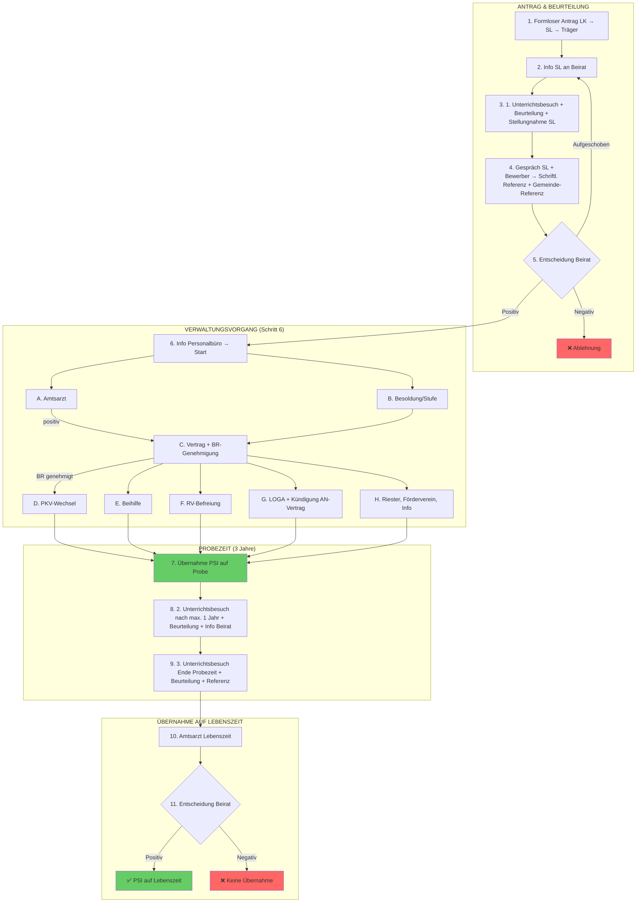

# Verbeamtung (PSI) an Ersatzschulen NRW — Vollständiger Prozessablauf

**Erstellt:** 2026-03-28 | **Aktualisiert:** 2026-03-28
**Zweck:** Digitalisierung des manuellen Verbeamtungsprozesses im HR-Portal
**Kontext:** CREDO Gruppe / Christlicher Schulverein Minden e.V. — Freie Evangelische Schulen NRW
**Quellen:** Ordner-Analyse (35 Vorlagen), Gesetzesrecherche, FES Minden Vorgehensweise (20240618)

---

## 1. Glossar und Definitionen

| Begriff | Definition |
|---------|-----------|
| **PSI** | Planstelleninhaber — Lehrkraft in beamtenähnlichem Verhältnis an Ersatzschule |
| **PSI auf Probe** | 3-jährige Probezeit, vergleichbar Beamter auf Probe |
| **PSI auf Lebenszeit** | Nach erfolgreicher Probezeit, vergleichbar Beamter auf Lebenszeit |
| **BR Detmold** | Bezirksregierung Detmold — Genehmigungsbehörde für OWL |
| **Dez. 48** | Dezernat 48 der BR — Schulaufsicht Ersatzschulen, genehmigt PSI-Verträge |
| **Dez. 23** | Dezernat 23 der BR — Beihilfestelle |
| **LOGA** | Lohn- und Gehaltsabrechnungssystem des Landes NRW |
| **FESchVO** | Ersatzschulfinanzierungsverordnung — regelt Refinanzierung |
| **SL** | Schulleitung |
| **LK** | Lehrkraft |
| **VEBS** | Verband Evangelischer Bekenntnisschulen |
| **OBAS** | Ordnung zur berufsbegleitenden Ausbildung von Seiteneinsteigerinnen und Seiteneinsteigern |
| **Erfüller** | Lehrkraft mit 2. Staatsexamen und 2 Fächern (Referendariat oder OBAS) |

---

## 2. Rechtsgrundlagen

### 2.1 Gesetzeshierarchie

```
SchulG NRW §§ 101-115 (Rahmengesetz Ersatzschulen)
├── § 102 SchulG — KERNBESTIMMUNG für PSI
│   └── PSI = beamtenähnliches Verhältnis an Ersatzschulen
├── § 106 SchulG — Finanzierung (Landeszuschuss)
│   └── FESchVO (Implementierungsverordnung, nicht das alte "EFG"!)
│       └── Anlagen 1, 2a, 2b — Abrechnungsformulare
├── BeamtStG § 9 — Gesundheitliche Eignung (Amtsarzt)
├── BeamtStG § 10 — Ernennung/Probezeit
├── LBG NRW § 13 — Probezeit (3 Jahre Regel, Min 1 / Max 5)
├── LBesG NRW § 29 — Erfahrungsstufen
├── LBesG NRW § 30 — Vordienstzeiten
├── BVO NRW — Beihilfeverordnung
├── SGB VI § 6 Abs. 1 Nr. 2 — RV-Befreiung
├── BASS 21-02 Nr. 2 — Dienstliche Beurteilungen
└── BASS 21-25 Nr. 1 — Versicherungsfreiheit PSI
```

**WICHTIG:** Das alte "Ersatzschulfinanzierungsgesetz" (EFG) von 1961 ist **aufgehoben**. Die gültige Rechtsgrundlage ist die FESchVO als Verordnung zu § 106 SchulG NRW.

### 2.2 Besonderheiten FES Minden

- **Vereidigung:** PSI sind formal keine Beamten → keine Vereidigungspflicht nach BBG § 64
- **A13-Angleichung 2026:** Ab 01.08.2026 werden Grundschul-/Sek-I-Lehrkräfte auf A13 angehoben. **Achtung:** Ob dies automatisch auch für PSI an Ersatzschulen gilt, ist über BASS 21-04 zu prüfen
- **Planstellen-Richtwert:** Bis zu **80%** der Grundstellen/Planstellen sollen als PSI besetzt werden. Darüber hinaus nur im Ausnahmefall als Einzelfallentscheidung

### 2.3 Besoldungsgruppen

| Schulform | Besoldung bis 07/2026 | Ab 08/2026 |
|-----------|----------------------|------------|
| Grundschule | A 12 | A 13 (prüfen für PSI!) |
| Hauptschule/Sekundarschule | A 12 | A 13 (prüfen für PSI!) |
| Realschule | A 12 | A 13 (prüfen für PSI!) |
| Gesamtschule (Sek I) | A 12 | A 13 (prüfen für PSI!) |
| Gymnasium | A 13 | A 13 |
| Berufskolleg | A 13 | A 13 |

---

## 3. Voraussetzungen für Verbeamtung (PSI) — FES Minden

> **Quelle:** FES Minden - Vorgehensweise bei Verbeamtung, 20240618

### 3.1 Transparente Kriterien (öffentlich kommunizierbar)

Diese Kriterien werden den Lehrkräften transparent kommuniziert:

| # | Kriterium | Typ | Prüfbar im Portal? |
|---|-----------|-----|-------------------|
| a | **Unbefristeter Arbeitsvertrag** | Formale Voraussetzung | ✅ Aus Stammdaten |
| b | **Langfristige Mitarbeit** (mind. weitere 10 Jahre beabsichtigt) an der FES | Absichtserklärung | ✅ Checkbox/Bestätigung |
| c | **Möglichst volle Stelle, aber mind. 75%** | Formale Voraussetzung | ✅ Aus Vertragsdaten |
| d | **Dienstliche Beurteilung besser als 3,0** — mind. ein Bereich soll Anforderungen übertreffen, kein Bereich schlechter als 3,0 | Leistungskriterium | ✅ Beurteilungssystem |
| e | **Aktive Gemeinde-/Kirchenmitgliedschaft** mit regelmäßigen Gottesdienstbesuchen und langfristiger Mitarbeit in einem Dienstbereich → **Schriftliche Referenz nach Rücksprache mit Gemeindeverantwortlichen** | Geistliches Kriterium | ✅ Upload + Formular |
| f | **Biblische Integration**: Bewusste Auseinandersetzung mit christlichem Welt-/Menschenbild und Umsetzung in eigenen Fächern und im Schulleben (Umgang mit Schülern, Kollegen, Eltern, in Andachten) | Geistliches Kriterium | ✅ SL-Beurteilung |
| g | **Teilnahme am VEBS-Grundlagenseminar** + weitere Seminare | Fortbildung | ✅ Nachweis-Upload |
| h | **Status Erfüller:** Zweites Staatsexamen mit 2 Fächern (Referendariat oder OBAS) | Formale Voraussetzung | ✅ Aus Qualifikationsdaten |
| i | **Notwendige Fächerkombination** nach Bedarf der jeweiligen Schule | Bedarfsprüfung | ✅ Abgleich mit Stellenplan |
| j | **Mitgliedschaft im Förderverein** der FES Minden samt Mitgliedsbeiträgen | Pflicht | ✅ Status prüfbar |
| k | **Empfehlung der jeweiligen Schulleitung** | Beurteilung | ✅ SL-Formular |
| l | **Amtsärztliche Gesundheitsuntersuchung positiv** | Gesetzliche Pflicht (§ 9 BeamtStG) | ✅ Upload + Status |

### 3.2 Interne Kriterien (nicht öffentlich, für SL + Träger)

Diese Kriterien werden intern bei der Entscheidung berücksichtigt, aber nicht offiziell als Voraussetzung kommuniziert:

| # | Kriterium | Beschreibung | Prüfbar im Portal? |
|---|-----------|-------------|-------------------|
| a | **Fehltage-Muster** | Auffälligkeiten (z.B. wiederkehrend rund ums Wochenende) | ✅ Fehlzeiten-Analyse |
| b | **Krankenstand insgesamt** | Gesamtübersicht | ✅ Fehlzeiten-Report |
| c | **Familienstand** | Bei mehr Bewerbern als Planstellen bedenken | ✅ Aus Stammdaten |
| d | **Engagement & Verantwortungsübernahme** | Verbandsarbeit, Fachschaftsvorsitz, Organisation Projekte, Mitarbeit Schulgottesdienste, Arbeitsgruppen | ✅ SL-Beurteilung |
| e | **Vertretungsbereitschaft** | Engagement in Engpässen / Flexibilität | ✅ SL-Beurteilung |
| f | **Identifikation FES-Grundsätze** | Pädagogisches Konzept, Geistliche Richtlinien, Leitbild | ✅ SL-Beurteilung |
| g | **Teilnahme Lehrerandachten** | Regelmäßig + aktive Beteiligung | ✅ SL-Beurteilung |
| h | **Positive Haltung im Kollegium** | Einfluss auf Teamklima | ✅ SL-Beurteilung |

### 3.3 Gatekeeper-Prüfung im Portal (automatisch)

Bevor ein Antrag in Phase 2 übergehen kann, müssen folgende Bedingungen erfüllt sein:

```typescript
interface PrerequisiteCheck {
  hasUnlimitedContract: boolean;       // 3.1.a
  intendedLongTermStay: boolean;       // 3.1.b — 10+ Jahre
  workloadMinimum75Percent: boolean;   // 3.1.c
  assessmentBetterThan3: boolean;      // 3.1.d — Schnitt < 3.0
  hasGemeindeReferenz: boolean;        // 3.1.e — Upload vorhanden
  hasVEBSSeminar: boolean;             // 3.1.g — Nachweis vorhanden
  isErfueller: boolean;               // 3.1.h — 2. Staatsexamen + 2 Fächer
  hasFaecherkombination: boolean;      // 3.1.i — Bedarf bestätigt
  isFoerdervereinMember: boolean;      // 3.1.j
  hasSchulleitungEmpfehlung: boolean;  // 3.1.k
}
```

---

## 4. Prozessablauf — 11-Schritte-Modell nach FES-Vorgehensweise

> **Quelle:** FES Minden - Vorgehensweise bei Verbeamtung, 20240618
> Die folgenden 11 Schritte bilden den offiziellen Ablauf des Trägers ab. Die Verwaltungsschritte (Phasen A-H) sind zwischen den Schritten 6-7 eingebettet.

### Übersicht

```
ANTRAG & BEURTEILUNG (Schritte 1-5)
│
├─ 1. Formloser Antrag LK → SL → Träger
├─ 2. Info SL an Beirat
├─ 3. 1. Unterrichtsbesuch + Beurteilung + Stellungnahme SL
├─ 4. Gespräch SL + Bewerber → Schriftliche Referenz SL
├─ 5. Entscheidung Beirat
│
VERWALTUNG (Schritt 6 = Phasen A-H)
│
├─ 6. Info Personalbüro → Start Verwaltungsvorgang
│   ├─ A. Amtsärztliches Zeugnis
│   ├─ B. Besoldung / Erfahrungsstufe
│   ├─ C. PSI-Vertrag auf Probe + BR-Genehmigung
│   ├─ D. Krankenversicherung (PKV-Wechsel)
│   ├─ E. Beihilfe
│   ├─ F. RV-Befreiung
│   ├─ G. LOGA-Umstellung + Kündigung Angestelltenvertrag
│   └─ H. Riester, Förderverein, interne Info
│
ÜBERNAHME AUF PROBE (Schritt 7)
│
├─ 7. Übernahme ins PSI-Verhältnis auf Probe (3 Jahre)
│
PROBEZEIT (Schritte 8-9)
│
├─ 8. 2. Unterrichtsbesuch nach spätestens 1 Jahr
│   → Beurteilung + Info an Beirat
├─ 9. 3. Unterrichtsbesuch zum Ende der Probezeit
│   → Beurteilung + Schriftliche Referenz (wie erste Referenz)
│
ÜBERNAHME AUF LEBENSZEIT (Schritte 10-11)
│
├─ 10. Amtsarztbesuch zur Übernahme auf Lebenszeit
└─ 11. Entscheidung Beirat → Übernahme auf Lebenszeit
```

---

### Schritt 1: Formloser Antrag

| Feld | Wert |
|------|------|
| **Wer** | Lehrkraft → über Schulleitung → an Träger |
| **Was** | Schriftlicher formloser Antrag zur Übernahme ins Planstelleninhaberverhältnis |
| **Wann** | Ca. 6 Monate vor geplantem Vertragsbeginn |
| **Vorlage** | _Kein Formular — formlos_ |
| **Portal** | ✅ Online-Formular (ersetzt formlosen Antrag) |
| **Dokument** | `1_Antwort Antrag auf PSI.docx` (Eingangsbestätigung) |

**Portal-Logik:**
- LK füllt Antragsformular aus
- System prüft automatisch Voraussetzungen (3.3 Gatekeeper)
- SL erhält Benachrichtigung
- Personalverwaltung sendet automatisch Eingangsbestätigung

---

### Schritt 2: Erste Information an Beirat

| Feld | Wert |
|------|------|
| **Wer** | Schulleitung → Beirat der jeweiligen Schule |
| **Was** | Erste Information zum eingegangenen Antrag |
| **Wann** | Im Rahmen des nächsten Beirats |
| **Ergebnis** | Positives Feedback → weiter zu Schritt 3 |
| **Portal** | ✅ Status-Update, Beirats-Protokoll-Upload |
| **Vorlage** | ❌ LÜCKE: Keine Beirats-Vorlage vorhanden |

---

### Schritt 3: 1. Unterrichtsbesuch + Dienstliche Beurteilung + Stellungnahme

| Feld | Wert |
|------|------|
| **Wer** | Schulleitung |
| **Was** | 1. Unterrichtsbesuch mit anschließendem Nachgespräch |
| **Ergebnis** | **Schriftliche Dienstliche Beurteilung** UND **Stellungnahme** der SL an den Träger |
| **Bedingung** | Beurteilung muss besser als 3,0 sein (Kriterium 3.1.d) |
| **Portal** | ✅ Beurteilungsformular (Magic Link für SL) + Upload |
| **Vorlage** | ❌ LÜCKE: Keine Beurteilungsvorlage / Unterrichtsbesuch-Protokoll |

**Beurteilungskriterien (müssen im Portal abgebildet werden):**
- Jeder Bereich wird benotet
- Mindestens ein Bereich muss Anforderungen übertreffen
- Kein Bereich darf schlechter als 3,0 sein
- Gesamtschnitt muss besser als 3,0 sein

---

### Schritt 4: Gespräch SL + Bewerber → Schriftliche Referenz

| Feld | Wert |
|------|------|
| **Wer** | Schulleitung + Bewerber (auf Wunsch des Vorstandes: Vorstandsmitglied) |
| **Was** | Persönliches Gespräch nach festgelegtem Kriterienkatalog |
| **Ergebnis** | **Schriftliche Referenz** der SL an den Träger |
| **Portal** | ✅ Strukturiertes Referenz-Formular |
| **Vorlage** | ❌ LÜCKE: Kein formaler Gesprächsleitfaden |

**Referenz-Kriterien (für Portal-Formular):**

| # | Prüfpunkt | Bewertung |
|---|-----------|-----------|
| 1 | Regelmäßiger Andachtsbesuch | ☐ Ja / ☐ Nein / ☐ Teilweise |
| 2 | Perspektive Vollzeit / mind. 75% | ☐ Ja / ☐ Nein |
| 3 | Belastbarkeit | ☐ Ja / ☐ Nein / ☐ Teilweise |
| 4 | Gutes Miteinander (Kollegium, Schüler, Eltern) | ☐ Ja / ☐ Nein / ☐ Teilweise |
| 5 | Bereitschaft besondere Aufgaben zu übernehmen | ☐ Ja / ☐ Nein |
| 6 | Klassenleitung übernommen | ☐ Ja / ☐ Nein |
| 7 | Engagement für Schule sichtbar | ☐ Ja / ☐ Nein / ☐ Teilweise |
| 8 | Identifikation mit Grundsätzen FES Minden | ☐ Ja / ☐ Nein / ☐ Teilweise |
| 9 | Grundsätze der FES werden gelebt | ☐ Ja / ☐ Nein / ☐ Teilweise |
| 10 | Zielvereinbarungen vereinbart | ☐ Ja / ☐ Nein / ☐ N/A |
| 11 | Aktive Gemeindemitgliedschaft | ☐ Ja / ☐ Nein |
| 12 | Mitarbeit in der Gemeinde — welcher Bereich? | _Freitext_ |

**Zusätzlich: Schriftliche Gemeinde-Referenz**
- SL spricht mit Gemeindeverantwortlichen
- Schriftliche Referenz wird eingeholt (Kriterium 3.1.e)
- Upload im Portal

---

### Schritt 5: Entscheidung im Beirat

| Feld | Wert |
|------|------|
| **Wer** | Beirat der jeweiligen Schule |
| **Was** | Formale Entscheidung über den Antrag |
| **Grundlage** | Dienstliche Beurteilung (Schritt 3) + Referenz (Schritt 4) + Gemeinde-Referenz |
| **Portal** | ✅ Abstimmungsergebnis + Datum |
| **Vorlage** | ❌ LÜCKE: Keine Beschlussvorlage |

**Mögliche Ergebnisse:**
- ✅ **Positiv** → Weiter zu Schritt 6 (Verwaltungsvorgang)
- ❌ **Negativ** → Prozess endet (Ablehnungsschreiben — ❌ LÜCKE)
- ⏸️ **Aufgeschoben** → Wiedervorlage im nächsten Beirat

**GATEKEEPER:** Nur bei positivem Beschluss geht es weiter.

---

### Schritt 6: Verwaltungsvorgang — Phasen A bis H

> Nach positiver Beiratsentscheidung startet der Verwaltungsvorgang. Die SL informiert das Personalbüro. Alle folgenden Phasen laufen teilweise parallel.

#### Phase A: Amtsärztliches Zeugnis

| # | Schritt | Akteur | Dokument | Digital? | Frist |
|---|---------|--------|----------|----------|-------|
| A.1 | Anforderung amtsärztliches Zeugnis an LK | **Personalverwaltung** → LK | `2_Aufforderung Amtsärtzliche Gesundheitszeugnis für PSI auf Probe.docx` | ✅ Auto-Generierung | Sofort |
| A.2 | Amtsärztliche Untersuchung | **LK** → Gesundheitsamt | _Externer Prozess_ | ❌ Physisch | — |
| A.3 | Ergebnis eintrifft | **Gesundheitsamt** → Verwaltung | _Amtsärztliches Zeugnis_ | ⚠️ Upload (Original physisch) | Max. 3 Mon. alt bei Vertragsbeginn |

**GATEKEEPER:** Amtsarzt positiv → Weiter. Negativ → Prozess endet.

#### Phase B: Besoldung und Erfahrungsstufen

| # | Schritt | Akteur | Dokument | Digital? |
|---|---------|--------|----------|----------|
| B.1 | Vordienstzeiten berechnen (§ 30 LBesG) | **Personalverwaltung** | `3a_!b-zeit2 BLANCO.doc` | ✅ Auto-Berechnung |
| B.2 | Erfahrungsstufe festsetzen (§ 29 LBesG) | **Personalverwaltung** | `3_Festsetzung der Erfahrungsstufe_ab 01.01.2017.xls` | ✅ Auto-Berechnung |
| B.3 | Bescheid an LK | **Personalverwaltung** → LK | _Generiert_ | ✅ Auto-Generierung |

**Berücksichtigungsfähige Zeiten (§ 30 LBesG):**
Kinderbetreuung (max. 3 Jahre/Kind), Pflegezeiten, hauptberufliche Tätigkeit im öffentlichen Dienst (überhälftig), Wehrdienst/Zivildienst/BFD/FSJ, Entwicklungsdienst.

#### Phase C: Vertrag und BR-Genehmigung

| # | Schritt | Akteur | Dokument | Digital? |
|---|---------|--------|----------|----------|
| C.1 | PSI-Vertrag auf Probe erstellen | **Personalverwaltung** | `12a_Mitarbeiter-Vertrag auf Probe.doc` | ✅ Auto-Generierung |
| C.2 | Vertrag zur Unterschrift an LK | **Personalverwaltung** → LK | `2a_AV PSI (Probe).docx` (Anschreiben) | ✅ Magic Link / Upload |
| C.3 | Unterschriebener Vertrag zurück | **LK** → Verwaltung | `12b AN Vertrag unterschrieben auf Probe.docx` | ⚠️ Upload (Original physisch) |
| C.4 | Schreiben an BR Dez. 48 zur Genehmigung | **Personalverwaltung** → BR | `12 BR-AV auf Probe.docx` | ⚠️ Auto-Generierung, Versand physisch |

**Beizufügende Unterlagen an BR Dez. 48:**
- Planstelleninhabervertrag auf Probe
- Stufenberechnung
- Kopie amtsärztliches Zeugnis
- Heiratsurkunde, Geburtsurkunden der Kinder (falls vorhanden)
- Dienstzeitbescheinigungen

**GATEKEEPER:** BR Dez. 48 genehmigt → Weiter. Ablehnung → Überarbeitung.

#### Phase D: Krankenversicherung

| # | Schritt | Akteur | Dokument | Digital? |
|---|---------|--------|----------|----------|
| D.1 | Info PKV-Pflicht an LK | **Personalverwaltung** → LK | `8_Bescheinigung für KK, Anschreiben an Lehrer.dotx.docx` | ✅ Auto-Generierung |
| D.2 | KK-Bescheinigung ausstellen | **Personalverwaltung** | `7_Bescheinigung für KK (VORLAGE).dotx.docx` | ✅ Auto-Generierung |
| D.3 | LK wechselt zu PKV | **LK** | _Externer Prozess_ | ❌ Extern |

#### Phase E: Beihilfe

| # | Schritt | Akteur | Dokument | Digital? |
|---|---------|--------|----------|----------|
| E.1 | Info-Brief Beihilfe an LK | **Personalverwaltung** → LK | `10_Brief Beihilfe.docx` | ✅ Auto-Generierung |
| E.2 | Beihilfe-Erstantrag + Info-Blatt mitgeben | **Personalverwaltung** → LK | `10a_Beihilfe_langer Antrag.pdf` + `10b_Info Beihilfe.pdf` | ⚠️ PDF-Download |
| E.3 | Datenschutz-Einwilligung | **LK** | `10C_Einverständniserkl. Beihilfe Datenschutz.doc` | ✅ Online-Formular |
| E.4 | Stammblatt Beihilfeakte | **Personalverwaltung** | `11a_Stammblatt 2016(1) Antrag für Beihilfe.docx` | ✅ Auto-Befüllung |
| E.5 | Mitteilung an Beihilfestelle BR Dez. 23 | **Personalverwaltung** → BR | `11 Mitteilung an die Beihilfe.doc.docx` | ✅ Auto-Generierung |

#### Phase F: Rentenversicherungsbefreiung

| # | Schritt | Akteur | Dokument | Digital? | Frist |
|---|---------|--------|----------|----------|-------|
| F.1 | RV-Befreiungsantrag vorbereiten | **Personalverwaltung** | `V2829-70_Antrag auf RV-Freiheit für BEAMTE.pdf` | ✅ Online-Formular | — |
| F.2 | Arbeitgeber-Erklärung (Abschnitt 4) | **Personalverwaltung** | V2829-70 | ✅ Auto-Befüllung | — |
| F.3 | LK unterschreibt Antrag (Abschnitt 6) | **LK** | V2829-70 | ⚠️ Upload (Original physisch) | — |
| F.4 | Antrag an DRV Bund senden | **Personalverwaltung** → DRV | V2829-70 komplett | ⚠️ Versand | **Max. 3 Monate nach Vertragsbeginn!** |

**KRITISCH:** Jeder PSI braucht einen **eigenen** RV-Befreiungsantrag. Kein Pauschalbescheid! Verspätung → Schulträger zahlt RV-Beiträge.

#### Phase G: Kündigung Angestelltenverhältnis und LOGA

| # | Schritt | Akteur | Dokument | Digital? |
|---|---------|--------|----------|----------|
| G.1 | Kündigungsbestätigung Angestelltenverhältnis | **Personalverwaltung** → LK | `AN_Kündigungsbestätigung und Freigabeerklärung.doc` | ✅ Auto-Generierung |
| G.2 | LOGA-Überführung: Angestellter → Beamter | **Personalverwaltung** | `13_LOGA_ÜBERFÜHRUNG.doc` | ⚠️ LOGA-System |
| G.3 | Erklärung Familienzuschläge | **LK** | `Erklärung Familienzuschläge (Beamte) 2020.doc` | ✅ Online-Formular |

#### Phase H: Riester, Förderverein, Info

| # | Schritt | Akteur | Dokument | Digital? |
|---|---------|--------|----------|----------|
| H.1 | Anschreiben Riester-Rente | **Personalverwaltung** → LK | `16_Anschr. wg. Riester-Rente.docx` | ✅ Auto-Generierung |
| H.2 | Einverständniserklärung Riester (ZfA) | **LK** | `16a_Formular Einverständniserklärung Riester.pdf` | ✅ Online-Formular |
| H.3 | Mitgliedsantrag Förderverein (falls noch nicht) | **LK** | `18_Mitgliedsantrag Förderverein - SEPA.pdf` | ✅ Online + SEPA |
| H.4 | Info an Sekretariat und Schulleitung | **Personalverwaltung** → intern | `14_Info an Sekretariat und SL.msg` | ✅ Automatisch |

---

### Schritt 7: Übernahme ins PSI-Verhältnis auf Probe

**Checkliste "Tag 1" — alle Punkte müssen erfüllt sein:**

| # | Prüfpunkt | Status |
|---|-----------|--------|
| 7.1 | Amtsärztliches Zeugnis liegt vor und ist positiv | ☐ |
| 7.2 | BR Dez. 48 hat PSI-Vertrag genehmigt | ☐ |
| 7.3 | PSI-Vertrag von beiden Seiten unterschrieben | ☐ |
| 7.4 | LK hat PKV abgeschlossen | ☐ |
| 7.5 | RV-Befreiungsantrag eingereicht (oder Frist läuft: max. +3 Mon.) | ☐ |
| 7.6 | Beihilfe-Meldung an BR Dez. 23 erfolgt | ☐ |
| 7.7 | LOGA-Umstellung durchgeführt | ☐ |
| 7.8 | Erfahrungsstufe festgesetzt und beschieden | ☐ |
| 7.9 | Förderverein-Mitgliedschaft aktiv | ☐ |

**Probezeit beginnt — Dauer: 3 Jahre.**

---

### Schritt 8: 2. Unterrichtsbesuch (nach spätestens 1 Jahr)

| Feld | Wert |
|------|------|
| **Wer** | Schulleitung |
| **Was** | 2. Unterrichtsbesuch mit Nachgespräch |
| **Wann** | Nach spätestens 1 Jahr (= 12 Monate nach Vertragsbeginn) |
| **Ergebnisse** | 1. **Schriftliche Dienstliche Beurteilung** der SL an den Träger |
| | 2. **Info der SL** zur Entwicklung des Bewerbers im **Beirat** der jeweiligen Schule |
| **Portal** | ✅ Beurteilungsformular (Magic Link) + Beirats-Info-Status |
| **Vorlage** | ❌ LÜCKE: Beurteilungsvorlage (Probezeit) |

**Automatische Erinnerungen:**
- T+9 Monate: "2. Unterrichtsbesuch für [Name] in 3 Monaten fällig"
- T+11 Monate: "2. Unterrichtsbesuch für [Name] in 1 Monat fällig!"
- T+12 Monate: "2. Unterrichtsbesuch für [Name] ÜBERFÄLLIG!"

---

### Schritt 9: 3. Unterrichtsbesuch (zum Ende der Probezeit)

| Feld | Wert |
|------|------|
| **Wer** | Schulleitung |
| **Was** | 3. Unterrichtsbesuch mit Nachgespräch |
| **Wann** | Zum Ende der Probezeit (ca. T+30 bis T+33 Monate) |
| **Ergebnisse** | 1. **Schriftliche Dienstliche Beurteilung** der SL an den Träger |
| | 2. **Schriftliche Referenz** der SL zum Ende der Probezeit an den Träger (gleicher Rahmen wie erste Referenz aus Schritt 4) |
| **Portal** | ✅ Beurteilungsformular + Referenz-Formular (Magic Link) |

**Referenz-Kriterien Schritt 9 = identisch mit Schritt 4:**
Andachtsbesuch, Vollzeit-Perspektive, Belastbarkeit, Miteinander, besondere Aufgaben, Klassenleitung, Engagement, Identifikation, Grundsätze, Zielvereinbarungen, Gemeindemitgliedschaft.

**Automatische Erinnerungen:**
- T+30 Monate: "3. Unterrichtsbesuch + Referenz für [Name] in 3-6 Monaten fällig"
- T+33 Monate: "Vorbereitung Übernahme auf Lebenszeit für [Name] starten!"

---

### Schritt 10: Amtsarztbesuch zur Übernahme auf Lebenszeit

| # | Schritt | Akteur | Dokument | Digital? |
|---|---------|--------|----------|----------|
| 10.1 | Anforderung neues amtsärztliches Zeugnis | **Personalverwaltung** → LK | `20_Anforderung Amtsärztliches Zeugnis (Beamte auf Lebenszeit).docx` | ✅ Auto-Generierung |
| 10.2 | Amtsärztliche Untersuchung | **LK** → Gesundheitsamt | _Externer Prozess_ | ❌ Physisch |
| 10.3 | Zeugnis eintrifft | **Gesundheitsamt** → Verwaltung | _Amtsärztliches Zeugnis_ | ⚠️ Upload |

**GATEKEEPER:** Neues amtsärztliches Zeugnis muss positiv sein!

---

### Schritt 11: Entscheidung Beirat → Übernahme auf Lebenszeit

| Feld | Wert |
|------|------|
| **Wer** | Beirat der jeweiligen Schule |
| **Was** | Entscheidung zur Übernahme ins PSI-Verhältnis auf Lebenszeit |
| **Grundlage** | 3. Beurteilung (Schritt 9) + Referenz (Schritt 9) + Amtsarzt (Schritt 10) |
| **Portal** | ✅ Abstimmungsergebnis |

**Bei positiver Entscheidung → Verwaltung Lebenszeit:**

| # | Schritt | Akteur | Dokument | Digital? |
|---|---------|--------|----------|----------|
| 11.1 | PSI-Vertrag auf Lebenszeit erstellen | **Personalverwaltung** | `12a_Mitarbeiter-Vertrag auf Lebenszeit.docx` | ✅ Auto-Generierung |
| 11.2 | Schreiben an BR Dez. 48 | **Personalverwaltung** → BR | `19 BR-AV auf Lebenszeit_.docx` | ✅ Auto-Generierung |
| 11.3 | BR genehmigt Lebenszeitvertrag | **BR Dez. 48** | _Genehmigungsbescheid_ | ⚠️ Eingang tracken |
| 11.4 | Vertrag an LK zur Unterschrift | **Personalverwaltung** → LK | Anschreiben + Vertrag | ✅ Magic Link |
| 11.5 | Änderungsmitteilung an Beihilfestelle | **Personalverwaltung** → BR Dez. 23 | `Änderungsmitteilung Beihilfestelle NEU.docx` | ✅ Auto-Generierung |
| 11.6 | LOGA-Update: Probe → Lebenszeit | **Personalverwaltung** | _LOGA-Systemeingabe_ | ⚠️ LOGA-System |
| 11.7 | Info an Sekretariat und SL | **Personalverwaltung** → intern | _Benachrichtigung_ | ✅ Automatisch |

---

## 5. Sonderprozesse

### 5.1 Probezeit-Sonderfälle

| Szenario | Aktion | Rechtsgrundlage |
|----------|--------|-----------------|
| Bewährung nicht festgestellt | Probezeit verlängern (max. 5 Jahre) oder Entlassung | LBG NRW § 13 |
| Gesundheitliche Probleme | Erneute amtsärztliche Untersuchung | BeamtStG § 9 |
| LK kündigt selbst | Rückführung ins Angestelltenverhältnis oder Ausscheiden | — |
| Schulwechsel innerhalb Träger | PSI-Verhältnis bleibt, Probezeit läuft weiter | — |

### 5.2 Nachversicherung (wenn PSI ausscheidet)

| # | Schritt | Akteur | Dokument | Frist |
|---|---------|--------|----------|-------|
| 5.2.1 | Nachversicherungsantrag an DRV | **Personalverwaltung** | — | Innerhalb 1 Jahr |
| 5.2.2 | Bescheinigung an LK | **Personalverwaltung** → LK | `AN_Bescheinigung über die Nachversicherung.docx` | — |
| 5.2.3 | Beiträge zahlen | **Schulträger** (!) | — | Nach Bescheid |

**WICHTIG:** Der **Schulträger** (nicht das Land) zahlt die Nachversicherungsbeiträge (AG + AN-Anteil).

### 5.3 Änderungsmitteilungen (laufend)

| Anlass | Dokument | An wen |
|--------|----------|--------|
| Familienstand | `Änderungsmitteilung Beihilfe 2023.docx` | BR Dez. 23 |
| Adresse/Bankverbindung | `Änderungsmitteilung Beihilfestelle NEU.docx` | BR Dez. 23 |
| Geburt eines Kindes | Familienzuschlag + Beihilfe | BR + LOGA |

---

## 6. Dokumente-Katalog

### 6.1 Vorhandene Dokumente (32 Stück)

| Nr. | Dateiname | Zweck | Schritt |
|-----|-----------|-------|---------|
| 1 | `1_Antwort Antrag auf PSI.docx` | Eingangsbestätigung | 1 |
| 2 | `2_Aufforderung Amtsärtzliche Gesundheitszeugnis für PSI auf Probe.docx` | Anforderung Amtsarzt (Probe) | 6.A |
| 3 | `2a_AV PSI (Probe).docx` | Anschreiben PSI-Vertrag auf Probe | 6.C |
| 4 | `3_Festsetzung der Erfahrungsstufe_ab 01.01.2017.xls` | Erfahrungsstufen-Berechnung | 6.B |
| 5 | `3a_!b-zeit2 BLANCO.doc` | Vordienstzeiten-Berechnung | 6.B |
| 6 | `7_Bescheinigung für KK (VORLAGE).dotx.docx` | KK-Bescheinigung PKV | 6.D |
| 7 | `8_Bescheinigung für KK, Anschreiben an Lehrer.dotx.docx` | Anschreiben PKV-Wechsel | 6.D |
| 8 | `10_Brief Beihilfe.docx` / `.pdf` | Info Beihilfeanspruch | 6.E |
| 9 | `10a_Beihilfe_langer Antrag für AN.pdf` | Erstantrag Beihilfe | 6.E |
| 10 | `10b_Wichtige Informationen für Beihilfeberechtigte.pdf` | Info-Blatt Beihilfe | 6.E |
| 11 | `10C_Einverständniserkl. f. Beihilfe Datenschutz.doc` | Datenschutz Beihilfe | 6.E |
| 12 | `11 Mitteilung an die Beihilfe.doc.docx` | Meldung an BR Dez. 23 | 6.E |
| 13 | `11a_Stammblatt 2016(1) Antrag für Beihilfe.docx` | Stammblatt Beihilfeakte | 6.E |
| 14 | `12 BR-AV auf Probe.docx` | Schreiben an BR Dez. 48 (Probe) | 6.C |
| 15 | `12a_Mitarbeiter-Vertrag auf Probe.doc` | PSI-Vertrag Probe | 6.C |
| 16 | `12a_Mitarbeiter-Vertrag auf Lebenszeit.docx` | PSI-Vertrag Lebenszeit | 11 |
| 17 | `12b AN Vertrag unterschrieben auf Probe.docx` | Versand unterschriebener Vertrag | 6.C |
| 18 | `13_LOGA_ÜBERFÜHRUNG.doc` | LOGA-Umstellung | 6.G |
| 19 | `14_Info an Sekretariat und SL.msg` | Interne Benachrichtigung | 6.H |
| 20 | `16_Anschr. wg. Riester-Rente.docx` | Riester-Rente | 6.H |
| 21 | `16a_Formular Einverständniserklärung Riester-Rente.pdf` | ZfA-Einverständnis | 6.H |
| 22 | `17_Personalfragebogen-intern Beamte.doc` | Interner Fragebogen | 6.A |
| 23 | `18_Mitgliedsantrag Förderverein - SEPA.pdf` | Förderverein | 6.H |
| 24 | `19 BR-AV auf Lebenszeit_.docx` | Schreiben BR Dez. 48 (Lebenszeit) | 11 |
| 25 | `20_Anforderung Amtsärztliches Zeugnis (Beamte auf Lebenszeit).docx` | Amtsarzt Lebenszeit | 10 |
| 26 | `V2829-70_Antrag auf RV-Freiheit für BEAMTE.pdf` | RV-Befreiung | 6.F |
| 27 | `AN_Kündigungsbestätigung und Freigabeerklärung.doc` | Kündigung Angestelltenverhältnis | 6.G |
| 28 | `AN_Bescheinigung über die Nachversicherung.docx` | Nachversicherung | 5.2 |
| 29 | `Erklärung Familienzuschläge (Beamte) 2020.doc` | Familienzuschläge | 6.G |
| 30 | `Änderungsmitteilung Beihilfe 2023.docx` | Beihilfe-Änderung | 5.3 |
| 31 | `Änderungsmitteilung Beihilfestelle NEU.docx` | Beihilfe-Änderung (neu) | 5.3 |
| 32 | `Checkliste Verbeamtung komplett.docx` | Hauptcheckliste | Übergreifend |
| 33 | `FES Minden - Vorgehensweise bei Verbeamtung 20240618.pdf` | Offizielle Vorgehensweise Träger | Übergreifend |

### 6.2 Fehlende Dokumente (LÜCKEN)

| Nr. | Beschreibung | Priorität | Schritt |
|-----|-------------|-----------|---------|
| L1 | **Beirats-Beschlussvorlage** (Probe + Lebenszeit) | KRITISCH | 5, 11 |
| L2 | **Beurteilungsvorlage Unterrichtsbesuch** (für alle 3 Besuche) | KRITISCH | 3, 8, 9 |
| L3 | **Referenz-Formular SL** (strukturiert, mit Kriterienkatalog) | HOCH | 4, 9 |
| L4 | **Gemeinde-Referenz-Vorlage** (für Rücksprache mit Gemeindeverantwortlichen) | HOCH | 4 |
| L5 | **Ablehnungsschreiben** (wenn Beirat negativ entscheidet) | HOCH | 5 |
| L6 | **Unterrichtsbesuch-Protokoll** | MITTEL | 3, 8, 9 |
| L7 | **Probezeit-Verlängerungsbescheid** | MITTEL | 5.1 |
| L8 | **VEBS-Seminar-Nachweisformular** | NIEDRIG | (Voraussetzung) |
| L9 | **PKV-Orientierungshilfe** für LK | NIEDRIG | 6.D |

---

## 7. Akteure und Zuständigkeiten (RACI-Matrix)

| Schritt | Lehrkraft | Schulleitung | Personalverwaltung | Beirat/Vorstand | BR Dez. 48 | BR Dez. 23 | Amtsarzt | DRV Bund |
|---------|-----------|-------------|-------------------|----------------|------------|------------|----------|----------|
| 1. Antrag | R | C | I | — | — | — | — | — |
| 2. Beirat-Info | — | R | I | A | — | — | — | — |
| 3. 1. U-Besuch | C | R/A | I | — | — | — | — | — |
| 4. Gespräch/Referenz | C | R/A | I | C | — | — | — | — |
| 5. Beirat-Entscheidung | — | C | I | R/A | — | — | — | — |
| 6.A Amtsarzt | R | — | A | — | — | — | R | — |
| 6.B Besoldung | I | — | R/A | — | — | — | — | — |
| 6.C Vertrag | C | — | R | — | A | — | — | — |
| 6.D-H Verwaltung | C | — | R/A | — | — | I | — | I |
| 7. Übernahme Probe | I | I | R/A | — | — | — | — | — |
| 8. 2. U-Besuch | C | R/A | I | I | — | — | — | — |
| 9. 3. U-Besuch | C | R/A | I | — | — | — | — | — |
| 10. Amtsarzt LZ | R | — | A | — | — | — | R | — |
| 11. Übernahme LZ | C | C | R | A | A | I | — | — |

R = Responsible, A = Accountable, C = Consulted, I = Informed

---

## 8. Datenmodell für HR-Portal

### 8.1 CivilServiceProcess (Verbeamtung)

```typescript
interface CivilServiceProcess {
  // === Basis ===
  id: string;
  employeeId: string;              // Verknüpfung zur Personalakte
  type: 'PROBE' | 'LIFETIME';
  status: CivilServiceStatus;
  currentStep: number;             // 1-11 (nach FES-Vorgehensweise)

  // === Voraussetzungen (3.1 Transparente Kriterien) ===
  prerequisites: {
    hasUnlimitedContract: boolean;
    intendedLongTermStay: boolean;      // 10+ Jahre
    workloadPercent: number;             // >= 75
    lastAssessmentScore: number | null;  // < 3.0
    hasGemeindeReferenz: boolean;
    gemeindeReferenzUploadId: string | null;
    hasBiblischeIntegration: boolean;
    hasVEBSSeminar: boolean;
    vebsSeminarUploadId: string | null;
    isErfueller: boolean;                // 2. Staatsexamen + 2 Fächer
    hasFaecherkombination: boolean;
    isFoerdervereinMember: boolean;
    hasSchulleitungEmpfehlung: boolean;
  };

  // === Schritt 1: Antrag ===
  applicationDate: Date | null;
  applicationConfirmationSentAt: Date | null;

  // === Schritt 2: Beirat-Info ===
  boardInfoDate: Date | null;
  boardInfoFeedback: 'POSITIVE' | 'NEGATIVE' | null;

  // === Schritt 3: 1. Unterrichtsbesuch ===
  classroomVisit1: ClassroomVisit | null;

  // === Schritt 4: Gespräch + Referenz ===
  interviewDate: Date | null;
  interviewParticipants: string[];       // SL + ggf. Vorstand
  referenceSubmittedAt: Date | null;
  referenceData: ReferenceAssessment | null;

  // === Schritt 5: Beirat-Entscheidung ===
  boardDecision: 'POSITIVE' | 'NEGATIVE' | 'DEFERRED' | null;
  boardDecisionDate: Date | null;

  // === Schritt 6: Verwaltungsvorgang ===
  adminStartDate: Date | null;          // Info an Personalbüro

  // Phase A: Amtsarzt
  medicalExamRequestedAt: Date | null;
  medicalExamDate: Date | null;
  medicalExamResult: 'POSITIVE' | 'NEGATIVE' | 'CONDITIONAL' | null;
  medicalCertificateUploadId: string | null;

  // Phase B: Besoldung
  salaryGroup: 'A12' | 'A13';
  experienceLevel: number;
  previousServiceYears: number;
  salaryCalculationId: string | null;

  // Phase C: Vertrag + BR
  contractCreatedAt: Date | null;
  contractSignedByEmployee: Date | null;
  contractSentToBR: Date | null;
  brApprovalDate: Date | null;
  brApprovalDocumentId: string | null;

  // Phase D: KV
  healthInsuranceSwitchConfirmed: boolean;

  // Phase E: Beihilfe
  beihilfeNotificationSentAt: Date | null;
  beihilfeStammblattCreatedAt: Date | null;

  // Phase F: RV
  rvExemptionApplicationDate: Date | null;
  rvExemptionApprovalDate: Date | null;
  rvExemptionDeadline: Date | null;     // contractStartDate + 3 Monate

  // Phase G: LOGA
  logaTransferDate: Date | null;
  previousContractTerminatedAt: Date | null;

  // Phase H: Weiteres
  riesterRenteChecked: boolean;
  internalNotificationsSent: boolean;

  // === Schritt 7: Vertragsbeginn ===
  contractStartDate: Date | null;

  // === Schritt 8: 2. Unterrichtsbesuch (nach max. 1 Jahr) ===
  classroomVisit2: ClassroomVisit | null;
  boardInfoAfterVisit2: Date | null;    // Info an Beirat

  // === Schritt 9: 3. Unterrichtsbesuch (Ende Probezeit) ===
  classroomVisit3: ClassroomVisit | null;
  finalReferenceData: ReferenceAssessment | null;

  // === Probezeit ===
  probationEndDate: Date | null;         // contractStartDate + 3 Jahre

  // === Schritt 10: Amtsarzt Lebenszeit ===
  lifetimeMedicalExamRequestedAt: Date | null;
  lifetimeMedicalExamDate: Date | null;
  lifetimeMedicalResult: 'POSITIVE' | 'NEGATIVE' | null;

  // === Schritt 11: Beirat Lebenszeit ===
  lifetimeBoardDecision: 'POSITIVE' | 'NEGATIVE' | null;
  lifetimeBoardDecisionDate: Date | null;
  lifetimeContractCreatedAt: Date | null;
  lifetimeContractSignedAt: Date | null;
  lifetimeBrApprovalDate: Date | null;

  // === Audit ===
  createdAt: Date;
  updatedAt: Date;
  createdBy: string;
  notes: Note[];
  documents: Document[];
  checklistItems: ChecklistItem[];
  auditLog: AuditEntry[];
}

// === Unterrichtsbesuch (3x im Prozess) ===
interface ClassroomVisit {
  date: Date;
  assessmentScore: number;             // Gesamtnote (muss < 3.0 sein)
  assessmentAreas: AssessmentArea[];
  assessmentUploadId: string | null;
  stellungnahmeUploadId: string | null; // Nur beim 1. Besuch
  nachgespraechNotes: string | null;
}

interface AssessmentArea {
  name: string;
  score: number;                       // Kein Bereich > 3.0!
  exceedsRequirements: boolean;        // Mind. 1 Bereich muss true sein
}

// === Referenz SL (2x: Schritt 4 + Schritt 9) ===
interface ReferenceAssessment {
  submittedAt: Date;
  submittedBy: string;
  andachtsbesuch: 'JA' | 'NEIN' | 'TEILWEISE';
  vollzeitPerspektive: 'JA' | 'NEIN';
  belastbarkeit: 'JA' | 'NEIN' | 'TEILWEISE';
  miteinander: 'JA' | 'NEIN' | 'TEILWEISE';
  besondereAufgaben: 'JA' | 'NEIN';
  klassenleitung: 'JA' | 'NEIN';
  engagementSichtbar: 'JA' | 'NEIN' | 'TEILWEISE';
  identifikationGrundsaetze: 'JA' | 'NEIN' | 'TEILWEISE';
  grundsaetzeGelebt: 'JA' | 'NEIN' | 'TEILWEISE';
  zielvereinbarungen: 'JA' | 'NEIN' | 'NA';
  aktiveMitgliedschaftGemeinde: 'JA' | 'NEIN';
  gemeindeBereich: string;             // Freitext
  freitextKommentar: string | null;
}

// === Status-Machine ===
type CivilServiceStatus =
  | 'DRAFT'                         // Antrag in Vorbereitung
  | 'APPLICATION_RECEIVED'          // Schritt 1: Antrag eingegangen
  | 'BOARD_INFO_PENDING'            // Schritt 2: Beirat-Info ausstehend
  | 'CLASSROOM_VISIT_1_PENDING'     // Schritt 3: 1. U-Besuch ausstehend
  | 'ASSESSMENT_1_PENDING'          // Schritt 3: Beurteilung ausstehend
  | 'INTERVIEW_PENDING'             // Schritt 4: Gespräch ausstehend
  | 'REFERENCE_PENDING'             // Schritt 4: Referenz ausstehend
  | 'BOARD_DECISION_PENDING'        // Schritt 5: Beirat-Entscheidung ausstehend
  | 'BOARD_APPROVED'                // Schritt 5: Beirat positiv
  | 'BOARD_REJECTED'                // Schritt 5: Beirat negativ
  | 'ADMIN_IN_PROGRESS'             // Schritt 6: Verwaltungsvorgang läuft
  | 'MEDICAL_EXAM_PENDING'          // Schritt 6.A: Amtsarzt ausstehend
  | 'MEDICAL_EXAM_FAILED'           // Amtsarzt negativ
  | 'CONTRACT_PREPARATION'          // Schritt 6.C: Vertrag wird erstellt
  | 'BR_APPROVAL_PENDING'           // Schritt 6.C: BR-Genehmigung ausstehend
  | 'READY_FOR_START'               // Schritt 7: Alles bereit
  | 'ACTIVE_PROBATION'              // Schritt 7: Probezeit läuft
  | 'VISIT_2_DUE'                   // Schritt 8: 2. U-Besuch fällig
  | 'VISIT_2_COMPLETED'             // Schritt 8: 2. U-Besuch abgeschlossen
  | 'VISIT_3_DUE'                   // Schritt 9: 3. U-Besuch fällig
  | 'VISIT_3_COMPLETED'             // Schritt 9: 3. U-Besuch abgeschlossen
  | 'LIFETIME_MEDICAL_PENDING'      // Schritt 10: Amtsarzt Lebenszeit
  | 'LIFETIME_BOARD_PENDING'        // Schritt 11: Beirat Lebenszeit
  | 'LIFETIME_BR_PENDING'           // Schritt 11: BR-Genehmigung Lebenszeit
  | 'LIFETIME_ACTIVE'               // PSI auf Lebenszeit aktiv
  | 'PROBATION_EXTENDED'            // Probezeit verlängert
  | 'TERMINATED'                    // Beendet
  | 'NACHVERSICHERUNG';             // Nachversicherung läuft
```

### 8.2 Status-Übergänge (State Machine)

```
DRAFT → APPLICATION_RECEIVED (LK reicht Antrag ein)

APPLICATION_RECEIVED → BOARD_INFO_PENDING (SL informiert Beirat)

BOARD_INFO_PENDING → CLASSROOM_VISIT_1_PENDING (positives Feedback)

CLASSROOM_VISIT_1_PENDING → ASSESSMENT_1_PENDING (U-Besuch durchgeführt)

ASSESSMENT_1_PENDING → INTERVIEW_PENDING (Beurteilung + Stellungnahme eingereicht)

INTERVIEW_PENDING → REFERENCE_PENDING (Gespräch geführt)

REFERENCE_PENDING → BOARD_DECISION_PENDING (Referenz + Gemeinde-Referenz eingereicht)

BOARD_DECISION_PENDING → BOARD_APPROVED / BOARD_REJECTED
BOARD_DECISION_PENDING → BOARD_DECISION_PENDING (aufgeschoben, Wiedervorlage)

BOARD_APPROVED → ADMIN_IN_PROGRESS (Info an Personalbüro)

ADMIN_IN_PROGRESS → MEDICAL_EXAM_PENDING → CONTRACT_PREPARATION → BR_APPROVAL_PENDING → READY_FOR_START

READY_FOR_START → ACTIVE_PROBATION (Vertragsbeginn)

ACTIVE_PROBATION → VISIT_2_DUE (nach 9 Monaten Erinnerung)
VISIT_2_DUE → VISIT_2_COMPLETED (2. U-Besuch + Beurteilung abgeschlossen)

VISIT_2_COMPLETED → VISIT_3_DUE (nach 30 Monaten)
VISIT_3_DUE → VISIT_3_COMPLETED (3. U-Besuch + Beurteilung + Referenz)

VISIT_3_COMPLETED → LIFETIME_MEDICAL_PENDING (Amtsarzt Lebenszeit angefordert)

LIFETIME_MEDICAL_PENDING → LIFETIME_BOARD_PENDING (Amtsarzt positiv)
LIFETIME_BOARD_PENDING → LIFETIME_BR_PENDING (Beirat positiv)
LIFETIME_BR_PENDING → LIFETIME_ACTIVE (BR genehmigt)

Jeder Status → TERMINATED (bei Abbruch/Kündigung)
TERMINATED → NACHVERSICHERUNG (bei Ausscheiden ohne Pension)
ACTIVE_PROBATION → PROBATION_EXTENDED (Verlängerung bis max. 5 Jahre)
```

---

## 9. Automatisierungen (n8n-Workflows)

### 9.1 Dokument-Generierung

| Trigger | Template | Ausgabe |
|---------|----------|---------|
| Antrag eingegangen (Schritt 1) | `1_Antwort Antrag auf PSI` | Brief an LK |
| Beirat positiv (Schritt 5) | `2_Aufforderung Amtsarzt` | Brief an LK |
| Amtsarzt positiv (6.A) | Vertrag + `2a_AV PSI` | Vertragspaket |
| Vertrag erstellt (6.C) | `12 BR-AV auf Probe` | Brief an BR |
| BR genehmigt (6.C) | `7_KK-Bescheinigung` + `8_Anschreiben KK` | KK-Paket |
| Vertragsbeginn (Schritt 7) | `10_Beihilfe` + `11_Mitteilung` + `11a_Stammblatt` | Beihilfe-Paket |
| Vertragsbeginn (Schritt 7) | `16_Riester` + `18_Förderverein` | Weitere Dokumente |
| Übernahme LZ (Schritt 10) | `20_Anforderung Amtsarzt LZ` | Brief an LK |
| LZ genehmigt (Schritt 11) | `19 BR-AV LZ` + `Änderungsmitteilung` | LZ-Paket |

### 9.2 Automatische Erinnerungen

| Zeitpunkt | Empfänger | Nachricht |
|-----------|-----------|-----------|
| T+9 Mon. | Schulleitung | "2. Unterrichtsbesuch für [Name] in 3 Monaten fällig" |
| T+11 Mon. | SL + HR | "2. Unterrichtsbesuch für [Name] in 1 Monat fällig!" |
| T+12 Mon. | HR-Leitung | "2. Unterrichtsbesuch für [Name] ÜBERFÄLLIG!" |
| T+30 Mon. | Schulleitung | "3. Unterrichtsbesuch für [Name] bald fällig" |
| T+33 Mon. | SL + HR | "Übernahme-Vorbereitung für [Name] starten!" |
| Vertragsbeginn +2 Mon. | HR | "RV-Befreiungsantrag für [Name] in 1 Monat fällig!" |
| Vertragsbeginn +3 Mon. | HR-Leitung | "RV-Befreiungsantrag ÜBERFÄLLIG! Kostenrisiko!" |

### 9.3 Gatekeeper-Prüfungen (automatische Blockade)

| Gatekeeper | Blockiert | Prüfung |
|------------|-----------|---------|
| Voraussetzungen erfüllt | Schritt 2+ | `prerequisites` alle true |
| Beurteilung < 3.0 | Schritt 4+ | `classroomVisit1.assessmentScore < 3.0` |
| Beirat-Entscheidung positiv | Schritt 6+ | `boardDecision === 'POSITIVE'` |
| Amtsarzt positiv | Schritt 6.C+ | `medicalExamResult === 'POSITIVE'` |
| BR-Genehmigung | Vertragsbeginn | `brApprovalDate !== null` |
| PKV-Bestätigung | Vertragsbeginn | `healthInsuranceSwitchConfirmed` |
| 2. U-Besuch abgeschlossen | Schritt 9 | `classroomVisit2 !== null` |
| 3. U-Besuch + Referenz | Schritt 10 | `classroomVisit3 !== null && finalReferenceData !== null` |
| Amtsarzt Lebenszeit | Schritt 11 | `lifetimeMedicalResult === 'POSITIVE'` |
| Beirat Lebenszeit | Vertrag LZ | `lifetimeBoardDecision === 'POSITIVE'` |

---

## 10. Refinanzierung — Übersicht

| Kostenart | Zahlt | Rechtsgrundlage |
|-----------|-------|-----------------|
| Brutto-Besoldung PSI | Land NRW (über FESchVO) | § 106 SchulG |
| Beihilfe-Kosten | Land NRW (BR Dez. 23) | BVO NRW |
| Versorgung (Pension) | Land NRW | § 106 SchulG |
| Nachversicherung | **Schulträger** | SGB VI |
| RV-Beiträge (bei Verspätung) | **Schulträger** | BASS 21-25 Nr. 1 |

**Stellenplan:** Jährliche Einreichung bei BR Dez. 48 (Anlage 2a FESchVO). PSI-Stellen müssen im genehmigten Stellenplan stehen. Richtwert: max. 80% der Stellen als PSI.

---

## 11. Prozess-Diagramm (Mermaid)



---

## 12. Kritische Fristen

| Frist | Was | Konsequenz bei Versäumnis |
|-------|-----|--------------------------|
| T-6 Monate | Antrag + Beurteilung abschließen | Verzögerung |
| T-3 Monate | Verwaltungsvorgang starten | Vertragsbeginn verschiebt sich |
| Max. 3 Monate | Amtsärztliches Zeugnis Gültigkeit | Neues Zeugnis nötig |
| +3 Monate | RV-Befreiungsantrag nach Vertragsbeginn | **Schulträger zahlt RV-Beiträge!** |
| +12 Monate | 2. Unterrichtsbesuch (spätestens!) | Probezeit-Compliance |
| Ende Probezeit -3 Mon. | 3. Unterrichtsbesuch + Referenz | Übernahme-Entscheidung verzögert |
| 3 Jahre | Probezeit (Standard) | Max. 5 Jahre Verlängerung |
| +1 Jahr nach Ausscheiden | Nachversicherungsantrag | Verjährung |

---

## 13. Review-Ergebnisse und Korrekturen

| Punkt | Korrektur | Quelle |
|-------|-----------|--------|
| Rechtsgrundlage | EFG aufgehoben → FESchVO zu § 106 SchulG ist gültig | recht.nrw.de |
| RV-Befreiung | Einzelantrag pro Person, kein Pauschalbescheid | BASS 21-25 Nr. 1 |
| Nachversicherung | Schulträger zahlt (nicht das Land) | SGB VI |
| A13 ab 2026 | Für PSI an Ersatzschulen über BASS 21-04 prüfen | Offen |
| Vereidigung | Keine Pflicht für PSI | BBG § 64 |
| MAV/Betriebsrat | **Entfällt** bei FES Minden (nicht relevant lt. Träger) | — |
| Beurteilungen | 3 Unterrichtsbesuche mit Beurteilungen (FES-Standard) | FES-Vorgehensweise 20240618 |
| Voraussetzungen | Erweitert um VEBS-Seminar, Erfüller-Status, Gemeinde-Referenz, Beurteilung < 3.0 | FES-Vorgehensweise 20240618 |
| 80%-Richtwert | Max. 80% der Stellen als PSI, darüber Einzelfallentscheidung | FES-Vorgehensweise 20240618 |

---

## 14. Nächste Schritte für HR-Portal-Implementierung

### 14.1 Sprint-Planung

| Aufgabe | Aufwand | Abhängigkeit |
|---------|---------|-------------|
| DB-Schema `CivilServiceProcess` | 2 Tage | Sprint 2 (generisches Modell) |
| Status-Machine (26 Status) | 2 Tage | Schema |
| Voraussetzungen-Checker (12 Kriterien) | 1 Tag | Schema |
| Checklisten-Engine für 11 Schritte + 8 Phasen | 3 Tage | Sprint 2.3 |
| Beurteilungsformular (3x Unterrichtsbesuch) | 2 Tage | — |
| Referenz-Formular (12 Kriterien, Magic Link) | 2 Tage | Magic-Link-System |
| Dokument-Templates (Auto-Generierung) | 3 Tage | Sprint 3.1 |
| Probezeit-Tracking mit Erinnerungen | 2 Tage | Sprint 3.3 |
| Erfahrungsstufen-Rechner (§ 30 LBesG) | 2 Tage | — |
| n8n-Workflows (Briefe + Erinnerungen) | 3 Tage | n8n-Integration |
| Dashboard "Verbeamtung" | 2 Tage | Sprint 2.2 |

**Gesamt: ca. 24 Arbeitstage (≈ 5 Wochen)**

### 14.2 Offene Klärungspunkte

1. **A13-Angleichung 2026 für PSI:** Gilt automatisch? BASS 21-04 prüfen
2. **Förderverein-Mitgliedschaft:** VOR Antrag oder VOR Vertragsbeginn Pflicht?
3. **LOGA-Schnittstelle:** Welche Datenfelder für LOGA-Überführung? Genaues Format?
4. **Interne Kriterien (3.2):** Sollen Fehltage-Analysen automatisch im Portal angezeigt werden?
5. **Gemeinde-Referenz:** Standardisiertes Formular oder formlos?
