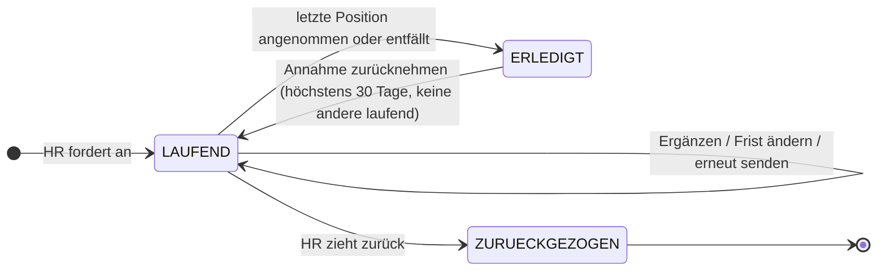
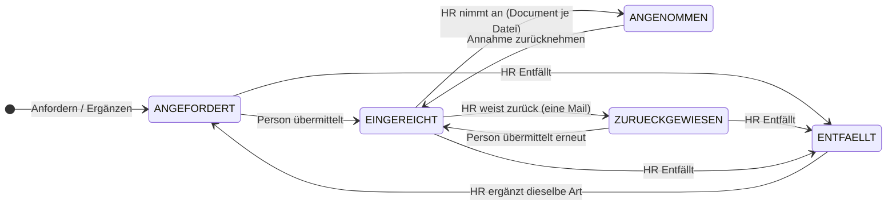

# Paket 4 „Unterlagen nachfordern“: Feinplanung Stufe 1 (Onboarding)

- **Stand:** 25.09.2026
- **Status:** **Stufe 1 umgesetzt (Branch `paket-4-unterlagen-nachfordern`, Stand 25.09.2026)** — nicht nach `main` gemergt, nicht deployt. Stufe 2 ist offen. Ablaufplan für den Deploy: `docs/historie/deploy-paket4-stufe1.md`; die Regeln für Änderungen stehen in CLAUDE.md, Abschnitt „Unterlagen nachfordern (Paket 4)“.
- **Freigabe:** am 25.09.2026: „Feinplanung als Grundlage, hier umsetzen, alle Empfehlungen übernehmen“. E-1 bis E-8 sind wie empfohlen entschieden (16.1). Ergänzungen aus der Gegenprüfung und die Abweichungen bei der Umsetzung stehen in Abschnitt 18.
- **Grundlage:** Änderungsplan Fassung 6 vom 24.09.2026, Abschnitt 4 „Unterlagen nachfordern“ und die Entscheidungen in Abschnitt 10 (`docs/module/onboarding/aenderungsplan-2026-09.html`). Codestand `main` = `origin/main` = `ce1888e`. Die Produktion läuft seit dem 24.09.2026 auf `7bc91ec`.
- **Prüfung:** Der Entwurf wurde am 24.09.2026 zweimal gegengeprüft (Sicherheit und Datenschutz, Korrektheit). Alle MUSS- und SOLLTE-Befunde sind eingearbeitet. Was ich anders entschieden habe, steht in Abschnitt 17, die Zuordnung aller Befunde im Anhang.
- **Belege:**
  - **P** steht für `docs/module/onboarding/aenderungsplan-2026-09.html`, **CL** für `CLAUDE.md`.
  - Alle anderen Pfade sind relativ zum Repo.
- **Kennzeichen:**
  - **EP-n:** Der Plan lässt die Stelle offen. Ich habe sie entschieden und begründe das.
  - **E-n:** Diese Entscheidung muss der Nutzer bestätigen. Die acht Punkte stehen gesammelt in Abschnitt 16.1.

---

## 1. Ziel und Umfang

**Ziel.** HR fordert fehlende oder verlängerte Nachweise über einen persönlichen Link an. Die Person lädt zu jeder Unterlage eine oder mehrere Dateien hoch und klickt „Übermitteln“. HR prüft jede Unterlage einzeln. Erst eine angenommene Unterlage wird zum `Document` des Vorgangs (P:1259-1262, P:1463).

Heute gibt es dafür keinen Weg:
- Der Fragebogen ist nach der Abgabe schreibgeschützt (P:1480).
- HR kann im Onboarding nichts hochladen (P:1245).
- Trotzdem verspricht der Fragebogen der Person, die Personalabteilung komme auf sie zu (`src/lib/required-documents.ts:448-454`).

### Stufe 1

Alles in dieser Liste nennt P:1485:
- die Vorarbeiten (Abschnitt 14, Schritt 1),
- vier Tabellen,
- die öffentliche Upload-Seite,
- die HR-Karte, den Dialog und die Prüf-Dialoge, einschließlich „Annahme zurücknehmen“,
- fünf Mails,
- den täglichen Lauf `/api/cron/unterlagen-fristen`,
- den Einbau in den Kasten „Offene Nachweise“ und in den Warnbalken.

Neu dazu kommt aus der Prüfung die Härtung der bestehenden Download-Route für Onboarding-Dokumente (Abschnitt 6.2). Paket 4 leitet Nachweise nach Art. 9 und 10 DSGVO genau in diese Route.

### Nicht in Stufe 1

- die übrigen fünf Vorgangsarten,
- die Spalte „Unterlagen“ in den Listen, auch in der Onboarding-Liste (P:1485). Das weicht von P:641 ab („Teilstände … in der Liste“) und ist E-6.
- der Zuschnitt der Mails für den Mutterschutz. Das Feld `reduziert` und die Blöcke `mit_details`/`ohne_details` stehen dafür schon bereit.
- das Pseudonymisieren alter Nachforderungen (E-7). Es wird frühestens 12 Monate nach dem Rollout fällig und kommt deshalb mit Stufe 2.
- „Vorher behoben“ (Raster der Verbeamtung, Geburtsurkunde der Elternzeit, P:1475-1479) und Befund 8i (P:2818). Alle drei betreffen Module der Stufe 2.
- Virenscan, Entfernen der EXIF-Daten und Verschlüsseln der Dateien. Das ist ein bewusstes Restrisiko (Abschnitt 16.2).

### Abhängigkeiten

| Abhängigkeit | Art | Beleg |
|---|---|---|
| Paket 1: Fragebogen nach der Abgabe schreibgeschützt | erfüllt, am 24.09. ausgerollt | P:2653 |
| n8n-Läufe reparieren (`hr.credo-schulen.de` → `hr.fes-credo.de`) und den neuen Lauf einplanen | **harte Voraussetzung für den Deploy**, nicht für die Umsetzung. Ohne sie gibt es keine Erinnerungen und keine Löschung nach 30 Tagen. Auch die 90-Tage-Löschung des `EmailLog` hängt am n8n-Lauf `reminders` (`src/app/api/cron/reminders/route.ts:330-337`), sonst geschieht sie nur beim Öffnen des Protokolls (`src/app/api/settings/email-log/route.ts:31-35`). | `n8n/CREDO_Reminder_Cron_Workflow.json:24`, `n8n/CREDO_Offboarding_Reminder_Workflow.json:24`, P:2740-2741 |
| SMTP-Antwortadresse (= HR-Postfach) gesetzt | Voraussetzung für die Kopie der HR-Mails und die Antwortadresse der Mails an die Person | `prisma/schema.prisma:1506` (Standard `""`) |
| Freigabeliste `allowedRecipientDomains` | **keine** Voraussetzung. Eine leere Liste schränkt nichts ein, die Adresse aus dem Vorgang ist immer erlaubt. Empfehlung: vor dem Deploy pflegen, weil der Dialog eine abweichende Adresse zulässt. | CL:221, `src/lib/empfaenger-freigabe.ts:191-204` |
| Paket 6 | **keine** Voraussetzung. Den „gemeinsamen Kalendertag-Helfer“ (P:2658) legt Paket 4 als `src/lib/kalendertag.ts` an, Paket 6 übernimmt ihn. | heute nur `src/lib/minijob-fristen.ts:40-183, 607` und `src/lib/dokument-fristen.ts:117-148` |
| Paket 3 | unabhängig. Die neue Gruppe „Unterlagen“ kommt hinter „Mutterschutz“. | `src/lib/events.ts:20-27, 1549` |
| DSB | vor dem Deploy: Art.-13-Text der Upload-Seite mit Art. 9, Verarbeitungsverzeichnis, Führungszeugnis bei Kitas, Aufbewahrung (E-1, E-7) | — |

---

## 2. Begriffe und Zustandsmodell

### Begriffe

- **Nachforderung:** die Anforderung an eine Person zu einem Vorgang, mit Empfängeradresse, *einer* Frist und einer optionalen Nachricht. Je Vorgang läuft höchstens eine (P:1472).
- **Position:** eine angeforderte Unterlage. Das ist entweder eine Dokumentart aus dem Katalog des Moduls oder eine frei benannte Zeile.
- **Datei:** eine hochgeladene Datei zu einer Position. Eine Position kann mehrere Dateien haben, etwa Vorder- und Rückseite.
- **Link:** Jede Mail an die Person bekommt einen eigenen Token. Gespeichert werden nur sein SHA-256-Hash (P:1466) und sein Ablauftag `gueltigBis`. Die Link-Zeilen sind zugleich der Mailverlauf (P:1406).
- **Frist:** ein Kalendertag in deutscher Zeit (`@db.Date`), jederzeit verlängerbar (P:644).
- **Linkende:** `min(link.gueltigBis, Frist + 14)`, einschließlich dieses Tages (P:1466). Beim Anlegen gilt `link.gueltigBis = Frist + 14`. Ändert HR die Frist, werden nur die noch gültigen Links fortgeschrieben (Abschnitt 5.1). Ein abgelaufener Link lebt also nicht wieder auf.
- **„Wartet auf die Person“:** Die Position steht auf `ANGEFORDERT` oder `ZURUECKGEWIESEN`.
- **„Zu prüfen“:** Die Position steht auf `EINGEREICHT`.

### 2.1 Nachforderung

| Zustand | gespeichert? | Bedeutung |
|---|---|---|
| `LAUFEND` | ja | angelegt, noch nicht fertig |
| „Frist verstrichen“ | abgeleitet | `LAUFEND`, heute > Frist, mindestens eine Position wartet auf die Person |
| „Link abgelaufen“ | abgeleitet | heute > Frist + 14. Die Nachforderung bleibt `LAUFEND`, HR kann die Frist ändern oder zurückziehen. |
| „vollständig eingegangen“ | abgeleitet | nichts wartet auf die Person, mindestens eine Position ist zu prüfen. Der Merker `vollstaendigSeit` dient nur der HR-Mail (Tabelle unten). |
| `ERLEDIGT` | ja | jede Position ist `ANGENOMMEN` oder `ENTFAELLT` (P:1259) |
| `ZURUECKGEZOGEN` | ja | HR hat abgebrochen. Endzustand, keine Rücknahme mehr möglich. |

| Übergang | Auslöser | Wer | Bedingung |
|---|---|---|---|
| — → `LAUFEND` | „Anfordern und E-Mail senden“ | HR | `verfuegbar(v)`, keine andere laufende Nachforderung (Unique-Index, sonst 409) |
| `LAUFEND` → `LAUFEND` | Ergänzen, Frist ändern, Link erneut senden | HR | Vorgang nicht `EXPIRED` (EP-3) |
| `LAUFEND` → `ERLEDIGT` | die letzte Entscheidung (Annehmen oder Entfällt) | automatisch, in derselben Transaktion | keine Position `ANGEFORDERT`, `EINGEREICHT` oder `ZURUECKGEWIESEN` |
| `LAUFEND` → `ZURUECKGEZOGEN` | „Zurückziehen…“ | HR | — |
| `ERLEDIGT` → `LAUFEND` | „Annahme zurücknehmen“ | HR | höchstens 30 Tage nach der Annahme **und** keine andere laufende Nachforderung (P2002 → 409), E-3 |

**Merker „vollständig“ (EP-17).** Die reine Funktion `vollstaendigMerker(ereignis, stand)` in `src/lib/unterlagen.ts` setzt die beiden Felder nach einer festen Tabelle:

| Ereignis | `vollstaendigSeit` | `vollstaendigGemeldetAm` |
|---|---|---|
| Die Person übermittelt, danach wartet nichts mehr auf sie | `jetzt` | `null` |
| Die Person übermittelt, es wartet noch etwas | unverändert (`null`) | unverändert |
| Zurückweisen, Ergänzen, Reaktivieren über „Ergänzen“ | `null` | `null` |
| Annehmen oder Entfällt ohne Abschluss, Frist ändern, erneut senden | unverändert | unverändert |
| `ERLEDIGT` (automatisch), Zurückziehen | `null` | `null` |
| Annahme zurücknehmen | unverändert, nach `ERLEDIGT` also `null` | unverändert |

- Nur die Übermittlung der Person löst eine HR-Mail aus. Aktionen von HR tun das nie: Wird die Nachforderung durch „Entfällt“ oder eine Rücknahme „vollständig“, bekommt HR keine Mail über die eigene Aktion.
- Gemeldet wird über einen **bedingten Anspruch** (Abschnitt 7).
- Folge: In der zweiten Runde nach einer Zurückweisung geht die Mail erneut hinaus, dann mit `erneut_eingereicht`.

**Vorgangsstatus (EP-3).**
- `nachweiseAbgegeben(v) = mitarbeiterAbgesendet(v) || status ∈ {REVIEWED, COMPLETED}` ist das unveränderte Tor des Kastens „Offene Nachweise“ (`src/app/(portal)/dashboard/[id]/detail-content.tsx:1982, 2037-2038`). Es zieht nach `src/lib/onboarding-spuren.ts`, neben `mitarbeiterAbgesendet` (`:128-130`).
- Die Nachforderung ist möglich, wenn `nachweiseAbgegeben(v) && v.status !== "EXPIRED"` gilt. Das prüft der Modul-Baustein in `verfuegbar(v)`.
- Der Unterschied ist nötig: `mitarbeiterAbgesendet` bleibt bei `EXPIRED` wahr, und HR kann `EXPIRED` jederzeit setzen, auch nach einem Abschluss (`src/app/api/onboarding/[id]/route.ts:248, 269-275`).
- Die Onboarding-Regeln gehören nicht in das modulneutrale `unterlagen.ts`. Vorbild ist `abteilungsaufgaben.ts` (CL:231-235).
- Nachfordern lässt sich auch nach dem Abschluss (P:1446).

### 2.2 Position

| Zustand | Sicht der Person | Sicht von HR |
|---|---|---|
| `ANGEFORDERT` ohne Entwurf | „offen“, „Datei hinzufügen“ | „offen“ |
| `ANGEFORDERT`/`ZURUECKGEWIESEN` mit Entwurf | „n Dateien bereit, noch nicht übermittelt“ | unverändert „offen“ bzw. „zurückgewiesen“. HR sieht Entwürfe nie (P:1468). |
| `EINGEREICHT` | „Übermittelt am …, wird geprüft“, kein Upload | „Zu prüfen“, nach 14 Tagen mit dem Hinweis „seit … ungeprüft“ |
| `ANGENOMMEN` | „Angenommen“ | „Angenommen am … von …, in die Dokumente des Vorgangs übernommen“ |
| `ZURUECKGEWIESEN` | rot, „Bitte erneut hochladen“, dazu die Begründung (bei sensiblen Positionen nur auf der Seite, E-2) | „Zurückgewiesen, erneut angefordert“ · „n. Einreichung“ |
| `ENTFAELLT` | „Wird nicht mehr benötigt“ | „Entfällt“ |

| Übergang | Auslöser | Wer |
|---|---|---|
| `ANGEFORDERT`/`ZURUECKGEWIESEN` → `EINGEREICHT` | „Unterlagen übermitteln“, mindestens eine Entwurfsdatei, `einreichungen + 1` | Person |
| `EINGEREICHT` → `ANGENOMMEN` | „Annehmen“, je Datei ein `Document` | HR |
| `EINGEREICHT` → `ZURUECKGEWIESEN` | „Zurückweisen…“ mit Pflicht-Begründung und genau **einer** Mail (P:1260) | HR |
| `ANGEFORDERT`/`ZURUECKGEWIESEN`/`EINGEREICHT` → `ENTFAELLT` | „Entfällt…“ (EP-2) | HR |
| `ENTFAELLT` → `ANGEFORDERT` | „Ergänzen…“ mit derselben Dokumentart: Die Zeile wird wieder aktiv, statt neu zu entstehen | HR |
| `ANGENOMMEN` → `EINGEREICHT` | „Annahme zurücknehmen“, nur wenn die Nachforderung `LAUFEND` oder `ERLEDIGT` ist (E-3) | HR |

Bei `ZURUECKGEZOGEN` bleiben die Positionen stehen, wie sie sind. Pille, Kurzstand und `nachweisStandText` werten eine zurückgezogene Nachforderung nie aus.

### 2.3 Datei

| Zustand | Entstehung | Datei und Zeile |
|---|---|---|
| `ENTWURF` | Hochladen | Entfernt die Person die Datei, verschwinden Zeile und Datei sofort. Das gilt auch beim **Zurückziehen und bei „Entfällt“**: Entwürfe hat HR nie gesehen, und sie werden auch nicht mehr sichtbar. 30 Tage nach dem Linkende löscht der Lauf übrig gebliebene Entwürfe. |
| `EINGEREICHT` | Übermitteln | bleibt |
| `ANGENOMMEN` | Annehmen | Die Datei zieht in den Vorgangsordner um (4.4), die Zeile verweist auf das `Document`. |
| `ZURUECKGEWIESEN` | Zurückweisen | Die Datei wird nach 30 Tagen gelöscht. Die Zeile bleibt mit Name, Prüfsumme und Begründung (P:1463). |
| `VERWORFEN` | Entfällt oder Zurückziehen, **nur** für eingereichte Dateien | wie zurückgewiesen |

HR-Oberfläche und HR-Dateiroute zeigen nur Zeilen mit `uebermitteltAm != null`.

### 2.4 Link

Ein Link ist gültig, wenn alle Bedingungen zugleich erfüllt sind:
- `entwertetAm` ist leer,
- die Nachforderung ist `LAUFEND` oder `ERLEDIGT` (bei `ERLEDIGT` nur lesend),
- der Vorgang ist nicht `EXPIRED`,
- heute ≤ `min(link.gueltigBis, Frist + 14)`, gerechnet in Berliner Kalendertagen.

| Fall | Antwort | Text (5.5) |
|---|---|---|
| Format falsch, Hash unbekannt, **entwertet wegen Adresswechsel** | 404 | „ungültig“. Wer die Mail an eine falsche Adresse bekam, erfährt so nicht, dass es den Vorgang gibt. |
| entwertet über „frühere Links sperren“ | 410 | „durch einen neueren ersetzt“ |
| Linkende überschritten, zurückgezogen, Vorgang `EXPIRED` | 410 | je eigener Text |
| `ERLEDIGT` und innerhalb des Linkendes | 200 mit `readOnly` | „Alle Unterlagen sind eingegangen und geprüft.“ |

- Eine 410-Antwort enthält nur die Meldung, bei „Linkende“ noch das Datum. Name, Einrichtung und Vorgangsnummer stehen nie darin.





### 2.5 Entscheidungen zum Zustandsmodell

- **EP-1, Frist im Zurückweisen-Dialog.**
  - Das Feld „Frist für die erneute Einreichung“ (P:1420) setzt die **eine** Frist der Nachforderung (P:644, P:2759).
  - Vorbelegt ist die bisherige Frist, wenn sie mindestens 7 Tage entfernt liegt, sonst heute + 7.
  - Ist der Link schon tot (heute > Frist + 14), ist eine neue Frist Pflicht, sonst enthielte die Mail einen toten Link.
  - Es geht genau **eine** Mail hinaus, die Zurückweisung. Eine zusätzliche Mail zur Friständerung entfällt.
- **EP-2, „Entfällt…“.**
  - Die interne Notiz ist optional, die Person bekommt keine Mail.
  - Die Position zählt als erledigt.
  - Rückgängig macht man sie über „Ergänzen“ mit derselben Art.
  - Entfällt alles, ist die Nachforderung `ERLEDIGT`.
  - Entwürfe der Position werden gelöscht, eingereichte Dateien werden `VERWORFEN`.
- **EP-3, Vorgang `EXPIRED`.**
  - Gesperrt (409) sind: Anlegen, Ergänzen, Frist ändern, erneut senden, Zurückweisen. Jede dieser Aktionen erzeugte eine Mail mit totem Link.
  - Erlaubt bleiben: Annehmen, Entfällt, Annahme zurücknehmen, Zurückziehen.
  - Der Link antwortet mit 410 (wie Abteilungsaufgaben, CL:249).
  - Der Lauf versendet für diesen Vorgang nichts, räumt aber auf.
  - Den Status liest die Transaktion unter der Sperre des Vorgangs erneut (Reihenfolge Vorgang → Nachforderung, Abschnitt 3.1). So gewinnt ein gleichzeitiges `EXPIRED` sauber.
- **EP-4, Abschluss des Vorgangs.**
  - Eine laufende Nachforderung sperrt `REVIEWED` und `COMPLETED` nicht.
  - Der Abschluss-Schritt trägt schon einen Satz zu den Abteilungsaufgaben (`src/app/(portal)/dashboard/[id]/uebersicht-schritte.ts:435-440`). Beide Sätze werden zu einem zusammengeführt, etwa „Offene Aufgaben von Abteilungen und eine laufende Nachforderung verhindern den Abschluss nicht.“
- **EP-5, Grenzen der Frist.**
  - Die Frist liegt zwischen morgen und heute + 90, Vorschlag ist heute + 14.
  - Wochenenden sind erlaubt, der Dialog zeigt dazu einen Hinweis. Der Wochentag wird immer berechnet: Das Mockup-Datum 26.09.2026 ist ein Samstag, kein Freitag (P:1342, P:1358, P:1387).
  - Eine Obergrenze für die Gesamtlaufzeit gibt es nicht, weil die Frist „jederzeit verlängerbar“ ist (P:644).
- **EP-15, Anzahl der Positionen.**
  - Freie Zeilen sind nicht eigens begrenzt, wie „beliebig viele freie Zeilen“ (P:639) verlangt.
  - Technisch gilt eine Obergrenze von 30 Positionen je Nachforderung, auch nach „Ergänzen“.
- **EP-16, „Link erneut senden“ nach der Frist.**
  - Erlaubt, solange das Linkende nicht überschritten ist. So passt es zu P:1262 und zur HR-Mail „Frist verstrichen“.
  - Die Mail trägt dann den Block `frist_verstrichen` mit dem Satz: „Die Frist ist am … abgelaufen. Sie können die Unterlagen noch bis … hochladen.“
  - Für das Nachholen im Lauf gilt dieselbe Regel.
  - Nach dem Linkende gibt es 409 „Bitte zuerst die Frist ändern“. Die Friständerung versendet selbst eine Mail mit neuem Link.

---

## 3. Datenmodell

### 3.1 Wie der Vorgang angebunden wird: Modul plus typisierter Fremdschlüssel

Es gab zwei Muster:
- **(A)** je Modul ein nullbarer Fremdschlüssel, wie bei `AuditLog` (`prisma/schema.prisma:1100-1115`) und `OffboardingDepartmentLink` (CL:254),
- **(B)** `modul` plus `refId` als Zeichenketten, wie bei `DokumentenVersand` (`schema.prisma:1277-1284`).

**Gewählt ist (A), ergänzt um die Spalte `modul`.** Die Gründe:

- **Der Bezug ist abgesichert.** Die Datenbank schützt ihn, und Prisma liefert Einrichtung, Name und Status in einem Zugriff.
- **Löschen wirkt mit.** Mit `onDelete: Cascade` verschwinden Nachforderung, Positionen, Dateizeilen und Links zusammen mit dem Vorgang.
  - Heute löscht kein Code einen Vorgang: In `src/` und `prisma/` gibt es kein `onboardingProcess.delete*`.
  - Cascade greift also bei einer Löschung von Hand oder einer künftigen Löschroutine. Genau dann soll die Nachforderung mit Adresse, Dateinamen und Begründungen mitgehen.
  - `DokumentenVersand` darf den Vorgang dagegen überleben, weil er ein Versandnachweis ist.
- **Stufe 2 fügt nur hinzu.** Sie ergänzt fünf nullbare Spalten an **einer** Tabelle. Die Kindtabellen hängen nur am Kopf.
  - Eine Abfrage benennt den Vorgang immer über `nachforderungBereichWhere` (Muster `linkBereichWhere`, CL:254).
  - Einziger Schreiber des Kopfes ist `nachforderungAnlegen`. Prisma kennt keine CHECK-Constraints.
- **`modul` als Unterscheider** macht den Lauf, das AuditLog (`processType`) und den Unique-Schlüssel modulneutral.

**Höchstens eine laufende Nachforderung je Vorgang.**
- `laufendSchluessel String? @unique` trägt `"<MODUL>:<vorgangId>"`, solange die Nachforderung `LAUFEND` ist, sonst `null`.
- Postgres behandelt mehrere `NULL` als verschieden (Muster `schema.prisma:1262-1263`). Der Unique-Index wirkt deshalb wie ein Teilindex.
- Ein Doppelklick, eine gleichzeitige Anlage oder ein Wiederöffnen neben einer neuen Nachforderung endet mit P2002, und das wird zu 409.

**Zustände als `String`, nicht als Enum** (Muster `ablaufErinnertStufe`, `schema.prisma:937-942`). Der Entrypoint ruft `db push --accept-data-loss` auf, und ein umbenannter Enum-Wert ginge ohne Rückfrage hinaus (CL:80-97). Welche Werte gelten, legen TS-Konstanten und Zod fest.

**Sperren und Reihenfolge.**
- **Vorgang:** Eine HR-Aktion, die eine Mail an die Person auslöst, sperrt zuerst den Vorgang mit `onboardingProcess.updateMany({ where: { id, status: { not: "EXPIRED" } }, data: { updatedAt } })`. Bei 0 Treffern folgt 409. Das ist das Muster von `letztenArbeitstagSperren` (`src/lib/abteilungsaufgaben-dienst.ts:1360-1374`).
- **Nachforderung:** `updateMany` auf `updatedAt`, mit Bedingung wie `status: "LAUFEND"`. Das ist das Muster von `linksSperrenIn` (`src/lib/abteilungsaufgaben-uebergaenge.ts:200-211`).
- **Reihenfolge überall:** Vorgang → Nachforderung → Position → Datei → `Document` (vgl. CL:245).

### 3.2 Prisma (rein additiv)

```prisma
// Paket 4 · Unterlagen nachfordern. Kopf; alle Kinder haengen nur hier.
model UnterlagenNachforderung {
  id    String @id @default(uuid())
  modul String // "ONBOARDING" (Stufe 1)
  // GENAU EINES gesetzt, passend zu `modul`; einziger Schreiber nachforderungAnlegen.
  // Stufe 2: offboardingId, civilServiceId, contractEndId, elternzeitId,
  // mutterschutzId (je String? + Relation, onDelete Cascade).
  onboardingId String?
  onboarding   OnboardingProcess? @relation(fields: [onboardingId], references: [id], onDelete: Cascade)

  status            String  @default("LAUFEND") // LAUFEND | ERLEDIGT | ZURUECKGEZOGEN
  laufendSchluessel String? @unique // "<MODUL>:<vorgangId>" solange LAUFEND, sonst null

  empfaenger           String  // alle Mails an die Person gehen NUR hierhin (overrideTo)
  empfaengerVorgang    String? // Adresse im Vorgang beim Anlegen/letzten Wechsel (Nachweis)
  empfaengerAbweichend Boolean @default(false)

  frist     DateTime @db.Date // Kalendertag Berlin
  nachricht String?  // max 1000; Mail + Upload-Seite; im AuditLog nur Laenge
  reduziert Boolean  @default(false) // Stufe 2 (Mutterschutz)

  angefordertVonId String?
  angefordertVon   User?    @relation("UnterlagenAngefordert", fields: [angefordertVonId], references: [id], onDelete: SetNull)
  angefordertAm    DateTime @default(now())

  // Merker (Hausregel: bei SENT und SKIPPED gesetzt, bei FAILED nicht)
  erinnertFuerFrist      DateTime? @db.Date // Fristwert der letzten Erinnerung
  erinnertStufe          String?   // VORAB | FRISTTAG
  fristGemeldetFuer      DateTime? @db.Date // "Frist verstrichen" an HR fuer diesen Fristwert
  vollstaendigSeit       DateTime? // Tabelle "Merker vollstaendig" (2.1)
  vollstaendigGemeldetAm DateTime? // bedingter Anspruch der HR-Meldung, bei FAILED zurueck auf null

  uploadsGesamt Int @default(0) // Obergrenze 200 ueber die ganze Laufzeit

  erledigtAm          DateTime?
  zurueckgezogenAm    DateTime?
  zurueckgezogenVonId String? // nur Protokoll, ohne Relation

  positionen UnterlagenPosition[]
  dateien    UnterlagenDatei[]
  links      UnterlagenLink[]

  createdAt DateTime @default(now())
  updatedAt DateTime @updatedAt // Sperranker

  @@index([onboardingId])
  @@index([status])
  @@map("unterlagen_nachforderungen")
}

model UnterlagenPosition {
  id              String                  @id @default(uuid())
  nachforderungId String
  nachforderung   UnterlagenNachforderung @relation(fields: [nachforderungId], references: [id], onDelete: Cascade)
  reihenfolge     Int

  typ                  String? // Katalogschluessel (Onboarding: DocumentType, nie SONSTIGES); null = freie Zeile
  bezeichnung          String  // Katalog: Label-Kopie; frei: Eingabe HR (max 120)
  hinweis              String? // max 500; Mail + Upload-Seite
  originalErforderlich Boolean @default(false) // Schriftform (P:1457)
  sensibel             Boolean @default(false) // Kopie beim Anlegen (E-1); steuert die neutrale Nennung (E-2)
  fristpflichtig       Boolean @default(false) // istFristpflichtig(typ): "Gueltig bis" abfragen

  status           String    @default("ANGEFORDERT") // ANGEFORDERT|EINGEREICHT|ANGENOMMEN|ZURUECKGEWIESEN|ENTFAELLT
  einreichungen    Int       @default(0)
  gueltigBisAngabe DateTime? @db.Date // Angabe der Person; NIE nach PersonalData
  angefordertAm    DateTime  @default(now()) // "(neu)" nach Ergaenzen
  uebermitteltAm   DateTime?
  begruendung      String?   // letzte Zurueckweisung (max 1000)
  entfaelltNotiz   String?   // intern, max 500
  entschiedenAm    DateTime?
  entschiedenVonId String?
  entschiedenVon   User?     @relation("UnterlagenEntschieden", fields: [entschiedenVonId], references: [id], onDelete: SetNull)

  dateien UnterlagenDatei[]

  createdAt DateTime @default(now())
  updatedAt DateTime @updatedAt

  // Jeder Katalogtyp hoechstens einmal je Nachforderung (freie Zeilen: NULL kollidiert nicht)
  @@unique([nachforderungId, typ])
  @@map("unterlagen_positionen")
}

model UnterlagenDatei {
  id              String                  @id // = Speichername; randomUUID() VOR dem Schreiben der Datei
  positionId      String
  position        UnterlagenPosition      @relation(fields: [positionId], references: [id], onDelete: Cascade)
  nachforderungId String // aus der gesperrten Positionszeile, nie aus dem Link
  nachforderung   UnterlagenNachforderung @relation(fields: [nachforderungId], references: [id], onDelete: Cascade)

  status        String  // ENTWURF|EINGEREICHT|ANGENOMMEN|ZURUECKGEWIESEN|VERWORFEN
  anzeigeName   String  // bereinigt, Endung = erkannter Typ; nie in Pfad, Mail, AuditLog, Konsole
  speicherPfad  String? // relativ "uploads/unterlagen/<nfId>/<id>.<ext>"; null = geloescht/umgezogen
  mimeType      String  // aus den Bytes erkannt, nie vom Client
  groesse       Int
  sha256        String  @db.Char(64)
  pdfHinweise   String? // "VERSCHLUESSELT,AKTIVE_INHALTE" - nur Hinweis fuer HR
  einreichungNr Int?

  hochgeladenAm  DateTime  @default(now())
  uebermitteltAm DateTime? // HR sieht nur Zeilen mit Wert
  entschiedenAm  DateTime?
  begruendung    String?   // Kopie der Zurueckweisung (Nachweis nach dem Loeschen, P:1463)

  uebernahmeZiel String?   // "DOCUMENT" (Stufe 1); Stufe 2 z. B. "IN_KARTE" (P:1449)
  uebernommenId  String?   // Id der Zielzeile, bewusst OHNE FK
  uebernommenAm  DateTime?

  loeschenAb       DateTime? // ab wann der Lauf die Datei loeschen darf
  dateiGeloeschtAm DateTime?

  createdAt DateTime @default(now())
  updatedAt DateTime @updatedAt

  @@index([nachforderungId, status])
  @@index([positionId])
  @@index([loeschenAb])
  @@map("unterlagen_dateien")
}

model UnterlagenLink {
  id              String                  @id @default(uuid())
  nachforderungId String
  nachforderung   UnterlagenNachforderung @relation(fields: [nachforderungId], references: [id], onDelete: Cascade)

  tokenHash      String    @unique @db.Char(64) // hashToken(); Klartext NIE gespeichert
  gueltigBis     DateTime  @db.Date // beim Anlegen Frist + 14; nur lebende Links werden fortgeschrieben
  anlass         String    // ANFORDERUNG|ERGAENZUNG|ERNEUT|FRISTAENDERUNG|ZURUECKWEISUNG|ERINNERUNG_VORAB|ERINNERUNG_FRISTTAG
  positionId     String?   // bei ZURUECKWEISUNG
  empfaenger     String

  mailStatus      String    @default("AUSSTEHEND") // AUSSTEHEND|SENT|FAILED|SKIPPED
  mailDetail      String?   // gekuerzt (300)
  messageId       String?
  gesendetAm      DateTime?
  nachholVersuche Int       @default(0) // Nachholen durch den Lauf, max 3
  entwertetAm     DateTime?
  entwertetGrund  String?   // ADRESSE (-> 404) | GESPERRT (-> 410)
  erstelltVonId   String?   // null = taeglicher Lauf; Grundlage der Mail-Bremse (5.2)

  createdAt DateTime @default(now())

  @@index([nachforderungId, createdAt])
  @@map("unterlagen_links")
}
```

Ergänzungen an bestehenden Modellen, alle rein additiv:
- **`OnboardingProcess`:** `unterlagenNachforderungen UnterlagenNachforderung[]`. Das ist nur die Gegenrichtung der Relation, keine Spalte.
- **`User`:** zwei Gegenrichtungen, `@relation("UnterlagenAngefordert")` und `@relation("UnterlagenEntschieden")`.
- **`Document.bezeichnung String?` (EP-6):**
  - Eine freie Zeile wie „Unterschriebener RV-Antrag“ behält damit ihren Namen, auch wenn sie als `SONSTIGES` übernommen wird. Die Dokumentenliste zeigt ihn an.
  - Das Feld ist nullbar, bestehende Zeilen bleiben unberührt. `Document` hat bisher kein solches Feld (`schema.prisma:901-913`).

**Aufbewahrung (korrigiert).**
- Die Zeilen bleiben so lange wie der Vorgang. Weil der Code heute keinen Vorgang löscht, heißt das: unbefristet, samt Empfängeradresse, Anzeigenamen und Begründungen.
- Die Tabellen sind trotzdem der dauerhafte Nachweis. CLAUDE.md verbietet, sich auf das AuditLog zu verlassen (CL:125), auch wenn es der Code heute nirgends aufräumt: In `src/` und `prisma/` gibt es kein `auditLog.delete*`. Das `EmailLog` wird nach 90 Tagen gelöscht.
- **E-7:** 12 Monate nach `ERLEDIGT` oder `ZURUECKGEZOGEN` werden die Zeilen pseudonymisiert.
  - Betroffen: `anzeigeName` wird zu „Datei“; `nachricht`, `hinweis`, `begruendung`, `entfaelltNotiz` und `mailDetail` werden `null`; die Adressen werden `""`.
  - Hash, Status, Daten und Größen bleiben.
  - Umsetzung mit Stufe 2, ohne Schemaänderung. Die IP der Person wird gar nicht erst gespeichert (Abschnitt 11).

---

## 4. Dateien

### 4.1 Speicherort und Wurzeln

| Phase | Ort | Beleg |
|---|---|---|
| bis zur Entscheidung | `uploads/unterlagen/<nachforderungId>/<dateiId>.<ext>`, **nicht** der Ordner des Vorgangs (P:1463) | Volume `uploads_data` (`docker-compose.yml:31`), gehört `nextjs` (`Dockerfile:79`); kein `chown`-Problem wie bei `./backups` |
| nach dem Annehmen | `uploads/<onboardingId>/<dateiId>.<ext>`, dieselbe Form wie die Fragebogen-Uploads | `src/app/api/fragebogen/[token]/documents/route.ts:219` |

- **Pfade immer relativ.** `speicherPfad` und `Document.filePath` werden relativ geschrieben.
  - `saveUploadedFile` liefert dagegen einen absoluten Pfad (`src/lib/file-upload.ts:109-133`).
  - Das Löschen im Fragebogen rechnet mit `path.join(cwd, filePath)` (`documents/route.ts:502`).
- **Wurzeln je Operation, nie `uploads` als Ganzes.** Unter `uploads` liegt auch `uploads/bem/…` (`src/app/api/bem/[id]/dokumente/upload/route.ts:73`). Dieselbe Lehre steht schon in `src/lib/dokumentenpaket.ts:400-406`.
  - Lesen und Löschen einer Paket-4-Datei: nur unter `uploads/unterlagen/<nachforderungId>`.
  - Ziel der Übernahme und Löschen der Vorgangskopie: nur unter `uploads/<onboardingId>`.
- **Werkzeuge.**
  - `pfadInWurzeln` zieht aus `dokumentenpaket.ts:379-394` nach `file-upload.ts`: `realpath` plus `path.relative`, das Dokumentenpaket importiert es um.
  - Weil `realpath` bei einer fehlenden Datei wirft, prüft die neue Funktion `zielVerzeichnisPruefen(wurzel, id)` Ziele über das Verzeichnis. Sie verlangt die UUID-Form der `id`, legt das Verzeichnis per `mkdir` an und fordert `realpath(dir) === path.join(realpath(uploads), …)`.
  - Die `startsWith`-Prüfung ohne Trenner wird **nicht** übernommen (`documents/route.ts:203`).

### 4.2 Namen

- **Speichername:** `<dateiId>.<ext>`.
  - `dateiId` ist `randomUUID()` und zugleich der Primärschlüssel der Zeile. So lässt sich jede Datei ohne Zeile als Waise erkennen (4.5).
  - Die Endung kommt aus dem **erkannten** Typ (`.pdf`, `.jpg`, `.png`, `.webp`).
  - Kein Teil des Originalnamens gelangt in den Pfad. `sanitizeFilename` lässt `..` stehen (`file-upload.ts:55`), und `saveUploadedFile` wirft dann (`:115`).
- **Anzeigename, nur in der Datenbank:**
  - NFC-Normalform, nur der Basisname, ohne Steuerzeichen (U+0000–001F, U+007F) und ohne Bidi-Zeichen (U+200E/F, U+202A–202E, U+2066–2069), höchstens 150 Zeichen.
  - **Die Endung ist immer die des erkannten Typs.** Die letzte Endung des Originals fällt weg. Endet der Rest schon auf die richtige Endung, wird sie nicht doppelt angehängt.
  - Beispiele: `x.hta` mit JPEG-Bytes wird `x.jpg`, `x.pdf.html` wird `x.pdf`, `x.` wird `x.pdf`. Ein leerer Name wird „Datei“ plus Endung.
  - Grund: Beim Annehmen wird der Anzeigename zu `Document.fileName`, und die Download-Route liefert ihn als `attachment` aus (`src/app/api/onboarding/[id]/documents/[docId]/route.ts:130`). Eine JPEG/HTA-Polyglot-Datei landete sonst mit `.hta` auf dem Windows-Rechner von HR.

### 4.3 Prüfung beim Hochladen

**Die Middleware läuft für `/api/unterlagen/*` nicht (5.3).** Nur wenn die Middleware greift, klont Next.js den Body, schneidet ihn bei 10 MiB ab und schreibt dabei die URL samt Token ins Log (`node_modules/next/dist/server/body-streams.js:30, 85-96`; Matcher-Prüfung vor dem Klonen in `…/router-utils/resolve-routes.js:308-313`). Ohne Middleware setzt Next.js für Route-Handler keine Grenze. Deshalb liegt die Grenze in der Route selbst, und die Reihenfolge ist verbindlich:

1. IP-Bremse (`tokenRateLimiter`, `src/lib/rate-limit.ts:213`). Ist sie überschritten, folgt 429.
2. Tokenformat (UUID v4, Kleinbuchstaben). Ist es falsch, folgt 404 ohne Datenbankzugriff.
3. `Content-Type` muss `multipart/form-data` sein, sonst 415.
4. `Content-Length` über 10 485 760 ergibt sofort 413. **Fehlt** der Header, gibt es kein 411. Ob er über Caddy und HTTP/2 vom Handy ankommt, ist nicht belegt, und Schritt 5 greift ohnehin.
5. Den Link über den Hash suchen und die Gültigkeit prüfen (404/410). Danach die Bremse je Nachforderung (429). Danach muss die Position zu **dieser** Nachforderung gehören (404) und auf `ANGEFORDERT` oder `ZURUECKGEWIESEN` stehen (409). Zuletzt die Kontingente ohne Sperre vorprüfen (409).
6. **Body begrenzt lesen:** `leseBodyBegrenzt(request, 10 485 760)` in `file-upload.ts` zählt die Bytes des Streams und bricht über der Grenze mit 413 ab. Erst danach kommt `new Response(buffer, { headers: { "content-type": … } }).formData()`. Scheitert das, folgt 400.
7. Es muss genau ein Eintrag `datei` vom Typ `File` da sein. Eine leere Datei ergibt 400, mehr als 9 961 472 B (9,5 MiB, P:1467) ergeben 413.
8. **Typ allein aus den Bytes** über `erkenneDateityp(buffer)`:
   - PDF: `%PDF-` ab Byte 0 **und** `%%EOF` in den letzten 1024 Bytes. Fehlt das Ende, folgt 400 mit Handlungsanweisung.
   - JPEG: `FF D8 FF`.
   - PNG: die volle 8-Byte-Signatur.
   - WebP: `RIFF`, dazu `WEBP` ab Byte 8.
   - Alles andere ergibt 415.
   - `file.type` und die Endung zählen nicht. `validateUpload` entscheidet nach `file.type` (`file-upload.ts:195-225`) und taugt deshalb nicht. Die Fragebogen-Route ist ausdrücklich **keine** Vorlage, weil sie DOC/DOCX zulässt (`documents/route.ts:29-42`).
9. **PDF-Merkmale** dienen nur als Hinweis für HR, nie als Ablehnungsgrund:
   - `/Encrypt` ergibt „kennwortgeschützt“.
   - `/JavaScript`, `/JS`, `/Launch`, `/EmbeddedFile`, `/OpenAction`, `/AA` und `/XFA` ergeben „aktive Inhalte gefunden“. Vorher werden `#xx`-Maskierungen aufgelöst.
   - Formuliert wird nur positiv, nie „keine aktiven Inhalte“, denn Namen in komprimierten Objektströmen findet die Suche nicht.
10. SHA-256 über `sha256Hex` (`file-upload.ts:99-101`).
11. Erst die Datei schreiben, dann die Transaktion. Scheitert diese, wird die Datei gelöscht. Muster: `src/app/api/elternzeit-antrag-endg/[token]/upload/route.ts:62-124`.
12. **In der Transaktion:**
    - die Nachforderung sperren (`LAUFEND`),
    - die Position erneut prüfen, weil HR sie inzwischen auf „Entfällt“ gesetzt haben kann (dann 409),
    - die Kontingente zählen: höchstens 10 aktive Dateien je Position, 40 Dateien und 150 MiB je Nachforderung, 200 Uploads über die ganze Laufzeit,
    - die Dateizeile mit `nachforderungId` aus der gesperrten Positionszeile anlegen,
    - `uploadsGesamt + 1`.

### 4.4 Übernahme beim Annehmen (ONBOARDING → `Document`)

**Die Datei existiert immer an mindestens einer Stelle, auf die eine Zeile zeigt.** Deshalb erst verknüpfen, dann umschalten, dann die Quelle löschen:

1. Zuerst die Berechtigung (`HR_EDIT_ROLES`, dann `canAccessProcess`, sonst 404), danach die Sperre je Vorgang (Abschnitt 7).
2. Außerhalb der Transaktion, je Datei:
   - die Quelle über `pfadInWurzeln(speicherPfad, [uploads/unterlagen/<nfId>])` lesen,
   - den SHA-256 vergleichen; weicht er ab, folgt 409 „Datei verändert“,
   - `zielVerzeichnisPruefen(uploads, onboardingId)`,
   - `fs.link(quelle, uploads/<onboardingId>/<dateiId>.<ext>)`. Das ist ein Hardlink, das Volume ist dasselbe.
   - Gibt es das Ziel schon (`EEXIST`) mit gleichem Hash, geht es weiter; das ist ein wiederholter Versuch nach einem Absturz. Mit anderem Hash folgt 409.
   - Bei `EXDEV` oder `EPERM` wird stattdessen per `copyFile` kopiert und der Hash verglichen.
3. **Die Transaktion:**
   - die Nachforderung sperren (`LAUFEND`),
   - die Position per `updateMany` von `EINGEREICHT` auf `ANGENOMMEN` setzen; bei 0 Treffern folgt 409,
   - je Datei ein `Document` anlegen,
   - die Dateizeilen auf `ANGENOMMEN` setzen, mit `uebernahmeZiel`, `uebernommenId` und `speicherPfad = null`,
   - gegebenenfalls `ERLEDIGT` setzen, `laufendSchluessel` auf `null` und den Merker nach 2.1,
   - das AuditLog schreiben.
4. **Nach dem Commit:** `unlink(quelle)`. Scheitert das, bleibt eine Waise, die der Lauf entfernt (4.5).
5. **Scheitert die Transaktion:** `unlink(ziel)`.

Für Stufe 2 liefert der Baustein `uebernehmen(tx, ctx) → { ziel, id, neuerPfad: string | null }`. Mit `null` bleibt die Datei bei der Nachforderung, etwa bei der Vertragsverlängerung „in der Karte selbst“ (P:1449). Datei-Route und Aufräumen entscheiden deshalb nach `uebernahmeZiel` und `speicherPfad`, nicht nach dem Status.

| `Document`-Feld | Wert |
|---|---|
| `onboardingId` | Vorgang der Nachforderung |
| `type` | Katalogposition: `typ`. Freie Zeile: die Art, die HR beim Annehmen wählt, sonst `SONSTIGES`. Nie still zurückfallen wie `documents/route.ts:121-122`. Sensible Arten nur, wenn `sensibelAnforderbar` sie zulässt (Abschnitt 11). |
| `bezeichnung` (neu) | nur bei freier Zeile: `position.bezeichnung` |
| `fileName` | `anzeigeName` (Endung = erkannter Typ) |
| `filePath` | relativ `uploads/<onboardingId>/<dateiId>.<ext>` |
| `fileSize`, `mimeType` | `groesse`, erkannter Typ |
| `gueltigBis` | nur bei `istFristpflichtig(type)` (`src/lib/dokument-fristen.ts:98`), auch wenn eine freie Zeile eine fristpflichtige Art bekommt. Geprüft mit `pruefeGueltigBis` (`:414`), vorbelegt mit `gueltigBisAngabe`, leer erlaubt (unbefristet). Bei anderen Arten ergibt ein Datum 400. |
| `ablaufErinnertAm`/`-Stufe` | `null`, damit ein neuer Zyklus beginnt |
| `status` | **`APPROVED`** (EP-7). Die Beschriftung „Genehmigt“ gibt es schon (`src/lib/constants.ts:340`). Nie `REJECTED` oder `EXPIRED`; `EXPIRED` setzt nur der Lauf (`schema.prisma:999-1008`). Liegt das Datum schon zurück, warnt der Dialog über `ablaufAmpel`. |
| `reviewedAt`/`reviewedById` | jetzt bzw. die HR-Person. Bisher beschreibt kein Code diese Felder (`schema.prisma:946-948`). |
| `uploadedAt` | `uebermitteltAm` der Datei |

- **`PersonalData.rvAntragEingangAm` wird nicht gesetzt.** Das Eingangsdatum stellt der Arbeitgeber fest (`schema.prisma:483-498`). Der Dialog weist nur darauf hin.
- **Frist-Korrektur im bestehenden PATCH:** Die Frist-Korrektur setzt `EXPIRED` heute zurück auf `UPLOADED` (`src/app/api/onboarding/[id]/documents/[docId]/route.ts:289-293`). Künftig wird daraus `APPROVED`, wenn `reviewedAt` gesetzt ist, sonst weiter `UPLOADED`. Nur Paket 4 schreibt `reviewedAt`, und zwar immer zusammen mit `APPROVED`. Der Kommentar `:180-187` und der Schema-Kommentar werden angepasst.

### 4.5 Rücknahme und Löschung

**„Annahme zurücknehmen“** folgt demselben Muster rückwärts:
1. `fs.link(Document.filePath, uploads/unterlagen/<nfId>/<dateiId>.<ext>)`, beide Pfade über `pfadInWurzeln`.
2. **Die Transaktion:**
   - den Kopf sperren (`status in [LAUFEND, ERLEDIGT]`, sonst 409),
   - `document.deleteMany({ id, onboardingId })`; stimmt die Anzahl nicht, folgt 409,
   - die Dateien auf `EINGEREICHT` setzen, mit `speicherPfad` gesetzt und `uebernommenId = null`,
   - die Position auf `EINGEREICHT`,
   - bei `ERLEDIGT` wieder `LAUFEND` samt `laufendSchluessel` (P2002 → 409),
   - das AuditLog schreiben.
3. Nach dem Commit wird die Vorgangskopie mit `unlink` entfernt. Scheitert die Transaktion, wird stattdessen die Kopie unter `uploads/unterlagen/…` entfernt.

**Löschhelfer.** Neu ist `dateiLoeschen(pfad, wurzeln) → "geloescht" | "fehlte" | "fehler"` in `file-upload.ts`.
- `deleteUploadedFile` liefert bei ENOENT und bei jedem anderen Fehler gleichermaßen `false` (`file-upload.ts:154-166`).
- `dokumente-aufbewahrung` löscht die Zeile deshalb auch dann, wenn die Datei liegen bleibt (`src/app/api/cron/dokumente-aufbewahrung/route.ts:69-79`). Diese Stelle ist **keine** Vorlage.
- `dateiGeloeschtAm` wird nur bei `geloescht` oder `fehlte` gesetzt. `fehler` zählt als `aufgeraeumt.fehler`, und der nächste Lauf versucht es erneut.

| Zustand | Datei weg | Zeile |
|---|---|---|
| `ENTWURF`, von der Person entfernt, oder beim Zurückziehen/Entfällt | Zeile in der Transaktion löschen, danach die Datei | gelöscht |
| `ENTWURF`, nie übermittelt | 30 Tage nach dem Linkende, jeweils neu berechnet (eine verlängerte Frist rettet die Entwürfe). Zuerst **bedingt die Zeile** löschen (`deleteMany({ id, status: "ENTWURF" })`), dann die Datei. Übermittelt die Person gleichzeitig, gibt es 0 Treffer und nichts wird gelöscht. | gelöscht |
| `ZURUECKGEWIESEN` | `loeschenAb` = Zurückweisung + 30 Tage | bleibt mit Name, SHA-256, Größe, Begründung und `dateiGeloeschtAm` |
| `VERWORFEN` (eingereicht, dann Entfällt oder Zurückziehen) | `loeschenAb` = Ereignis + 30 Tage (EP-8) | wie zurückgewiesen |
| `ANGENOMMEN` | umgezogen; ab dann gelten die Regeln des Moduls (P:1463) | Verweis `uebernommenId` |

**Waisen.** Der Lauf sucht je Nachforderung, **unter der Sperre des Vorgangs**, nach verwaisten Dateien:
- **Unter `uploads/unterlagen/<nfId>/`:** eine Datei, auf die keine `UnterlagenDatei.speicherPfad` zeigt, mit `mtime` älter als 24 h. Die 24 h schützen einen Upload, dessen Transaktion gerade läuft, denn öffentliche Routen nehmen keine Prozesssperre.
- **Im Vorgangsordner:** eine Datei `<dateiId>.<ext>`, deren `dateiId` zu einer Datei dieser Nachforderung gehört und auf die kein `Document.filePath` zeigt. Alle Schreiber dort sind HR-Aktionen unter derselben Sperre.
- **Ordner unter `uploads/unterlagen/` ohne Nachforderungszeile:** Das kommt nach einer Löschung von Hand über Cascade vor. Es gilt die 24-h-Regel.
- Danach folgt `deleteUploadedDirIfEmpty` (`file-upload.ts:174`).
- Der Lauf `dokumente-aufbewahrung` fasst weder `Document` noch Paket-4-Dateien an (`:44-47`).

---

## 5. Tokens und öffentliche Seite

### 5.1 Token

| Punkt | Festlegung | Beleg |
|---|---|---|
| Format | `randomUUID()`, 122 Bit | `src/lib/auth.ts:284-287` |
| Speicherung | nur `hashToken()` (SHA-256 hex) in `tokenHash @unique`, dazu `gueltigBis`. Der Klartext steht nur in URL und Mail. | `src/lib/token-hash.ts:20-22` |
| Prüfung | IP-Bremse, dann das Format (sonst 404 ohne DB), dann die Suche über den Hash-Index | — |
| Gültigkeit | wie in 2.4: `entwertetAm` leer und heute ≤ `min(link.gueltigBis, Frist + 14)` | `minijob-fristen.ts:98, 161` |
| Friständerung | schreibt `gueltigBis = neueFrist + 14` nur für Links fort, die heute noch gültig sind. Abgelaufene bleiben tot, auch nach einer Verlängerung oder einer Rücknahme. | — |
| je Mail | ein eigener Link (P:1466). Eine neue Mail entwertet ältere nicht (E-5). | — |
| Entwertung | (a) bei Adresswechsel sofort, in derselben Transaktion wie der neue Link, vor dem Versand (`entwertetGrund = ADRESSE`); (b) bei „frühere Links sperren“ erst **nach SENT** der neuen Mail (`GESPERRT`), wie CL:243. Kein Entwerten bei FAILED oder SKIPPED: Ein SMTP-Timeout meldet FAILED auch dann, wenn der Server die Mail schon angenommen hat (`src/lib/mailer.ts:87-89`), und wer keinen Link hat, kann ihn auch nicht nutzen. | — |
| Öffnen | verbraucht nichts. Ein GET schreibt nichts, deshalb verbrauchen Mailscanner den Link nicht. | — |
| HR sieht den Link | nie, es gibt kein „Link kopieren“ (E-5) | anders als `src/components/abteilungsaufgaben/abteilungen-karte.tsx:549-558` |
| URL | `${getBaseUrl()}/unterlagen/<token>` aus `APP_URL` | `src/lib/url.ts:26` |

### 5.2 Bremsen

Die Bremsen im Speicher des Prozesses tragen nur bei **einem** Container (CL:251).

| Bremse | Schlüssel | Wert | Stelle |
|---|---|---|---|
| IP, alle Token-Routen | `getClientIp` | bestehend 20/min, **vor** der Suche | `rate-limit.ts:213, 284` |
| Hochladen | `nachforderungId` | 30 je 10 min | nach der Suche |
| übrige Schreibwege (Entfernen, Gültig bis, Übermitteln) | `nachforderungId` | 60/min, wie `linkAenderungsLimiter` | `abteilungsaufgaben-uebergaenge.ts:90` |
| **Mails an die Person durch HR** (Anfordern, Ergänzen, Frist, erneut senden, Zurückweisen) | Nachforderung | höchstens 6 je Stunde und 20 je Tag. Gezählt wird aus `UnterlagenLink` (`erstelltVonId` gesetzt, `createdAt`), das übersteht einen Neustart. Darüber folgt 429 mit `Retry-After`. | Muster `src/app/api/dokumentenpaket/versenden/route.ts:65-72` |
| „Link erneut senden“ | Nachforderung | zusätzlich 10 Minuten nach der letzten SENT-Mail des Anlasses ERNEUT, gelesen aus `UnterlagenLink` | CL:246 |

- Der Schlüssel ist die Nachforderung, nicht der Link. Jede Mail bringt einen neuen Link, ein Schlüssel je Link vervielfachte also das Budget.
- Bei 429 schickt der Server `Retry-After`. Die Seite lädt Dateien nacheinander hoch und wartet diese Zeit ab.

### 5.3 Datenzuschnitt und Kopfzeilen (`GET /api/unterlagen/[token]`)

**Enthalten:**
- `readOnly`
- Name der Person (`mitarbeiterName`, sonst keiner), Einrichtung und Vorgangsnummer
- `frist` und `fristLang` (Wochentag berechnet). Das **Linkende nur nach der Frist**: „Die Frist ist abgelaufen. Sie können die Unterlagen noch bis … hochladen.“
- `nachricht`
- je Position: `id`, `bezeichnung`, `hinweis`, `originalErforderlich`, `fristpflichtig`, `gueltigBisAngabe`, der Status für die Person, `begruendung` (nur wenn zurückgewiesen), `uebermitteltAm` und **nur die eigenen Entwürfe** mit Name und Größe
- die verantwortliche Stelle (`formatVerantwortlicheStelle`, `src/lib/dsgvo.ts:43`; P:1469)
- die Grenzen (Bytes, Anzahl, `accept`)

**Nie enthalten:** E-Mail-Adresse, Name der HR-Kraft, andere Dokumente, Angaben aus dem Fragebogen, Notizen, Prüfsummen, `tokenHash`, die Namen eingereichter Dateien. Die Seite ist eine Einbahnstraße ohne Download und ohne Vorschau.

**Middleware und Kopfzeilen:**
- **Der Matcher schließt `api/unterlagen/` aus** (`src/middleware.ts:183`): `"/((?!_next/static|_next/image|favicon.ico|api/unterlagen/|.*\\.(?:svg|png|jpg|jpeg|gif|webp)$).*)"`. Das bringt zwei Dinge:
  - Next.js klont den Body nicht mehr und schreibt keine URL samt Token ins Log (4.3).
  - Mandantenrollen und `BEM_BEAUFTRAGTER` mit Sitzung bekommen auf diesen Routen keine 403 mehr vom Gate (`middleware.ts:89-111`).
- Die **Seite** `/unterlagen/[token]` bleibt unter der Middleware und behält CSP, `X-Frame-Options` und `nosniff`.
- Die öffentlichen API-Antworten setzen ihre Kopfzeilen selbst, über `oeffentlicheAntwort()`: `Cache-Control: no-store`, `X-Content-Type-Options: nosniff`, `Referrer-Policy: no-referrer`, `X-Robots-Tag: noindex`.
- Die Seite setzt `robots: noindex` und `referrer: no-referrer`. `public/robots.txt` bekommt `Disallow: /unterlagen/`.
- Freitexte von HR werden nur als Text gerendert, weil die CSP `unsafe-inline` erlaubt (`middleware.ts:42`).

### 5.4 Handy und Barrierefreiheit

- Je Position eine `<section aria-labelledby>`.
- Das Dateifeld:
  - ein sichtbares Label „Datei hinzufügen: <Unterlage>“,
  - `multiple`,
  - `accept="application/pdf,image/jpeg,image/png,image/webp"`,
  - **kein** `capture`, damit Kamera und Dateiauswahl angeboten werden.
- Die Größe wird vor dem Senden geprüft.
- Eingaben mit `text-base sm:text-sm` (Muster `src/components/abteilungsaufgaben/aufgaben-seite.tsx:537`), Tippflächen mindestens 44 px.
- Fehler je Position mit `role="alert"`, der Stand im unten fixierten Balken mit `aria-live="polite"`. Nach „Übermitteln“ springt der Fokus auf die Bestätigung.
- Der Knopf zum Entfernen heißt „<Dateiname> entfernen“.
- Ob iOS HEIC-Fotos beim Hochladen in JPEG umwandelt, wird auf einem echten Gerät geprüft (Schritt 8).

### 5.5 Meldungen (`MELDUNGEN` in `unterlagen.ts`)

| Code | Text |
|---|---|
| 404 | „Dieser Link ist ungültig. Bitte verwenden Sie den Link aus Ihrer letzten E-Mail der Personalabteilung.“ |
| 410, ersetzt | „Dieser Link wurde durch einen neueren ersetzt. Bitte verwenden Sie den Link aus Ihrer letzten E-Mail der Personalabteilung.“ |
| 410, Linkende | „Dieser Link war bis <Datum> gültig. Bitte wenden Sie sich an die Personalabteilung.“ |
| 410, zurückgezogen | „Die Personalabteilung hat diese Anforderung zurückgezogen. Sie müssen nichts mehr hochladen.“ |
| 410, Vorgang `EXPIRED` | „Dieser Vorgang wird nicht mehr bearbeitet. Bitte wenden Sie sich an die Personalabteilung.“ (`EXPIRED` heißt „von HR zurückgezogen“, `route.ts:248`) |
| 200 `readOnly` | „Alle Unterlagen sind eingegangen und geprüft. Vielen Dank.“ |
| 413 | „Die Datei ist größer als 9,5 MB. Bitte teilen Sie das Dokument auf mehrere Dateien auf oder scannen Sie es mit geringerer Auflösung.“ |
| 415 | „Bitte laden Sie nur PDF-, JPG-, PNG- oder WebP-Dateien hoch.“ |
| 400 | „Die Datei ist leer oder unvollständig. Bitte speichern oder scannen Sie das Dokument erneut und laden Sie es noch einmal hoch.“ |
| 409 | je nach Fall: „Diese Unterlage wird nicht mehr benötigt“, „höchstens 10 Dateien je Unterlage“, „Gesamtgrenze erreicht“ |
| 429 | „Zu viele Anfragen, bitte warten Sie einen Moment.“ Die Seite versucht es nach `Retry-After` selbst erneut. |

---

## 6. Routen

**Regeln für alle Routen:**
- **HR-Routen sind dünn:** Sitzung, Body, **eine** Dienstfunktion, Antwort 1:1 (CL:236).
- **Rolle:** `HR_EDIT_ROLES` (`src/lib/permissions.ts:33`), sonst 403.
- **Mandant:** über `canAccessProcess` (`permissions.ts:218`). Ein unbekannter **oder** fremder Vorgang ergibt 404 mit demselben Text „Vorgang nicht gefunden“.
- **Kinder hängen am Vorgang bzw. am Token.**
  - Jede HR-Abfrage einer Nachforderung, Position oder Datei lautet `where: { id: kindId, nachforderung: { onboardingId: id } }` bzw. `{ id, onboardingId: id }`.
  - Jede öffentliche Abfrage lautet `{ id, nachforderungId: link.nachforderungId }`.
  - 0 Treffer ergeben 404 mit demselben Text. Die bestehende Download-Route antwortet dagegen mit 403 und eigenem Text und verrät damit, dass das Dokument existiert (`documents/[docId]/route.ts:54-58`).
- **Kaputtes JSON** ergibt 400, nie eine Standardaktion (Muster `src/app/api/onboarding/[id]/abteilungen/route.ts`).
- **Die Übersicht** hat keine eigene GET-Route. Sie hängt an `GET /api/onboarding/[id]` wie `abteilungen` (`src/app/api/onboarding/[id]/route.ts:150-157`). `loadData(true)` (`detail-content.tsx:661`) aktualisiert so Kasten, Warnbalken, Liste und Reiter zugleich.

### 6.1 Neue Routen

| Pfad · Methode | Body (Zod, `src/lib/validations/unterlagen.ts`) | Antwort · Codes | Transaktion · AuditLog |
|---|---|---|---|
| `GET /api/onboarding/[id]` (bestehend) | — | zusätzlich `unterlagen: UnterlagenUebersicht`. Datei-URLs und Aktionen nur mit `HR_EDIT_ROLES`. | liest nur |
| `POST /api/onboarding/[id]/unterlagen` | `{aktion:"anfordern", empfaenger, adresseBestaetigt?, frist, nachricht?, positionen[1..30]}`. Eine Position ist `{typ, hinweis?}` (nie `SONSTIGES`, sonst 400) oder `{typ:null, bezeichnung 1..120, hinweis? ≤500, originalErforderlich}`. | 201 `{nachforderungId, mail, meldung, warnung?}` · 400 · 403 · 404 · 409 (nicht verfügbar, läuft schon, sensibel nicht erlaubt, Empfänger nicht freigegeben, **abweichende Adresse ohne `adresseBestaetigt`**, Duplikat) · 429 | Sperre Vorgang; Kopf, Positionen und Link (AUSSTEHEND) in einer Transaktion; Mail nach dem Commit · `UNTERLAGEN_ANGEFORDERT` |
| dieselbe Route | `{aktion:"ergaenzen", nachforderungId, positionen[1..], frist?, nachricht?}` | 200 · 409 (nicht laufend, heute > Frist ohne neue Frist, mehr als 30 Positionen) · 429 | Merker nach 2.1 · `UNTERLAGEN_ERGAENZT` |
| dieselbe Route | `{aktion:"frist-aendern", nachforderungId, frist}` | 200 · 409 · 429 | lebende Links fortschreiben (5.1); eine Mail nur, wenn noch etwas auf die Person wartet · `UNTERLAGEN_FRIST_GEAENDERT` |
| dieselbe Route | `{aktion:"erneut-senden", nachforderungId, empfaenger?, adresseBestaetigt?, fruehereSperren?}` | **201 SENT / 502 FAILED / 409 SKIPPED**, weil die Mail hier die Hauptsache ist (CL:244) · 409 (Sperrzeit, Linkende überschritten: „Bitte zuerst die Frist ändern“, Empfänger nicht freigegeben, ohne Bestätigung) · 429 | Neue Adresse: `empfaengerFreigegeben({ empfaenger, empfaengerVorgang: <aktuelle OnboardingProcess.email>, domains })` **vor** dem Schreiben des Links; `empfaenger`, `empfaengerVorgang` und `empfaengerAbweichend` neu setzen; ältere Links als `ADRESSE` entwerten · `UNTERLAGEN_LINK_ERNEUT_GESENDET` |
| dieselbe Route | `{aktion:"zurueckziehen", nachforderungId}` | 200 · 409 | Entwürfe löschen, eingereichte Dateien → `VERWORFEN` (+30 Tage), Merker `null` · `UNTERLAGEN_ZURUECKGEZOGEN`, keine Mail (EP-9) |
| `POST /api/onboarding/[id]/unterlagen/positionen/[positionId]` | `{aktion:"annehmen", gueltigBis?: "YYYY-MM-DD"\|null, dokumentTyp?}` | 200 · 400 (Datum bei nicht fristpflichtiger Art, mehr als 20 Jahre voraus) · 409 (nicht `EINGEREICHT`, Datei verändert, Art nicht erlaubt) | 4.4 · `UNTERLAGE_ANGENOMMEN` (+ `UNTERLAGEN_ERLEDIGT`) |
| dieselbe Route | `{aktion:"zurueckweisen", begruendung 1..1000, frist?}` | 200 · 409 · 429 | Sperre Vorgang; Link ZURUECKWEISUNG; eine Mail nach dem Commit · `UNTERLAGE_ZURUECKGEWIESEN` (Begründung nur als Länge) |
| dieselbe Route | `{aktion:"entfaellt", notiz? ≤500}` | 200 · 409 | Entwürfe löschen, eingereichte → `VERWORFEN` · `UNTERLAGE_ENTFAELLT` (+ ERLEDIGT) |
| dieselbe Route | `{aktion:"annahme-zuruecknehmen"}` | 200 · 409 (mehr als 30 Tage, andere laufende Nachforderung, Kopf `ZURUECKGEZOGEN`, `Document` fehlt) | 4.5 · `UNTERLAGE_ANNAHME_ZURUECKGENOMMEN` |
| `GET /api/onboarding/[id]/unterlagen/dateien/[dateiId]` | — | 200 `inline`, Typ aus der Datenbank, `no-store`, `Cross-Origin-Resource-Policy: same-origin`, bei Bildern zusätzlich `Content-Security-Policy: sandbox`; Name über `asciiFilename` · 404, wenn `uebermitteltAm` fehlt (also auch bei Entwürfen), die Datei gelöscht ist oder `speicherPfad` leer ist (übernommen → Dokumentroute) | `UNTERLAGEN_DATEI_GEOEFFNET` (EP-10) |
| Seite `/unterlagen/[token]` | — | öffentlich, keine Prüfung durch die Middleware (`middleware.ts:119-126`) | — |
| `GET /api/unterlagen/[token]` | — | 200 / 404 / 410 | liest nur |
| `POST /api/unterlagen/[token]/positionen/[positionId]/dateien` | multipart, genau ein `datei` | 201 mit der Position · 400/404/409/410/413/415/429 | Reihenfolge 4.3 · kein AuditLog (Entwurf) |
| `DELETE /api/unterlagen/[token]/dateien/[dateiId]` | — | 200 · 404 · 409 (nicht `ENTWURF`) | Zeile löschen, nach dem Commit die Datei |
| `PATCH /api/unterlagen/[token]/positionen/[positionId]` | `{gueltigBis: "YYYY-MM-DD"\|null}` über `pruefeGueltigBis` | 200 · 400 · 409 (nicht fristpflichtig, nicht offen) | Zwischenspeichern beim Verlassen des Feldes |
| `POST /api/unterlagen/[token]/uebermitteln` | `{gueltigBis?: {[positionId]: "YYYY-MM-DD"\|null}}` | 200 mit dem neuen Stand. Ist nichts bereit, weil schon übermittelt (Doppelklick), kommt ebenfalls 200 mit dem aktuellen Stand. 409 nur, wenn nie etwas bereit war. | Die Daten „Gültig bis“ werden **in derselben Transaktion** gespeichert, danach Positionen mit Entwürfen → `EINGEREICHT` und der Merker nach 2.1 · `UNTERLAGEN_UEBERMITTELT` (IDs, Größen, Typ, SHA-256, **ohne IP**). Die HR-Meldung geht über `after()` **nach** der Antwort (P:1473). |
| `POST /api/cron/unterlagen-fristen[?dryRun=1]` | — | 200 / 401 / 409 (Lauf läuft) / 500 | Abschnitt 9 |

**EP-11: Statuscodes der HR-Aktionen mit Mail an die Person.** Anfordern, Ergänzen, Frist ändern und Zurückweisen antworten mit 2xx, sobald der Zustand gespeichert ist. Das Ergebnis der Mail steht in `mail.status`, bei FAILED oder SKIPPED mit `warnung`: „Die E-Mail konnte nicht zugestellt werden; der tägliche Lauf versucht es erneut“ bzw. „Vorlage deaktiviert“.
- Bei Paket 1b **ist** die Mail die Aktion, hier ist sie die Folge einer gespeicherten Entscheidung.
- Eine 502 auf „Anfordern“ verleitete zum zweiten Klick, und der endete in 409 „läuft bereits“.
- Nur „erneut senden“ antwortet mit 201/502/409.

Stufe 2 legt je Modul dieselben dünnen Hüllen unter der eigenen `apiBasis` an. Die öffentlichen Routen sind modulneutral.

### 6.2 Härtung der bestehenden Download-Route (Teil von Schritt 6)

`GET /api/onboarding/[id]/documents/[docId]` prüft heute nur die Sitzung (`route.ts:25-59`):
- keine Rolle,
- kein `canAccessProcess`,
- kein `no-store` (`:126-133`),
- kein Protokoll beim Lesen.

`getSession()` akzeptiert zudem den n8n-API-Key als Rolle `SERVICE` (`src/lib/auth.ts:111-128`), und `SERVICE` steht nicht in `PORTAL_ROLES` (`permissions.ts:48`). Nach Paket 4 liegen dort angenommene Nachweise nach Art. 9 und 10. Deshalb:

- Rolle `PORTAL_ROLES`, dann `canAccessProcess`. Ein fremdes oder unbekanntes Dokument ergibt 404 mit demselben Text, statt 403 (`:54-58`).
- `Cache-Control: no-store`.
- AuditLog `DOKUMENT_GEOEFFNET` für `SENSIBLE_DOKUMENTTYPEN`.
- **Die Endung des Download-Namens kommt aus `mimeType`** (`.pdf`, `.jpg`, `.png`, `.webp`, `.doc`, `.docx`). Das schließt auch die Lücke im Fragebogen: Dort steht der Originalname ungeprüft in `fileName` (`src/app/api/fragebogen/[token]/documents/route.ts:218`).
- **Vor dem Deploy nur lesend prüfen,** ob `N8N_API_KEY` auf dem Server gesetzt ist (`.env.production.example:30` ist leer). Kein Workflow im Repo ruft die Route auf (`n8n/`).

---

## 7. Server-Bibliothek

Der Aufbau folgt `abteilungsaufgaben.ts` / `-dienst.ts` / `-uebergaenge.ts` (CL:231-235). Client-Code importiert Werte nur aus reinen Dateien, aus Serverdateien nur `import type`.

| Datei | Art | Inhalt |
|---|---|---|
| `src/lib/kalendertag.ts` | rein, neu | neutrale Fassade: `heuteInBerlin`, `tageSpaeter`, `wochentagVon`, `istKalendertag` (`minijob-fristen.ts:40-183`), `tageZwischen` (`:607`), `ablaufKalendertag`/`kalendertagAlsDatum` (`dokument-fristen.ts:117-148`), neu `formatKalendertagLang` („Freitag, 25.09.2026“, ohne `Intl`). Paket 6 übernimmt sie. |
| `src/lib/file-upload.ts` | Server, erweitert | `erkenneDateityp`, `pdfMerkmale`, `anzeigeNameBereinigen(name, erkannterTyp)`, `pfadInWurzeln` (umgezogen), `zielVerzeichnisPruefen`, `dateiLoeschen` (drei Ergebnisse), `leseBodyBegrenzt` |
| `src/lib/onboarding-spuren.ts` | rein, erweitert | `nachweiseAbgegeben(v)` (das Tor des Kastens, 2.1) |
| `src/lib/required-documents.ts` | rein, erweitert | `pflichtEingabenAusVorgang` (eine Quelle für Kasten und Server, dieselben Eingaben wie `src/app/api/fragebogen/[token]/route.ts:844-855`), `offeneNachweise`, `SENSIBLE_DOKUMENTTYPEN`, `SCHRIFTFORM_DOKUMENTTYPEN`, `sensibelAnforderbar` (Abschnitt 11), **`NACHFORDERUNG_HINWEISE`**, neuer Text für `NACHREICHEN_FOLGEN_HINWEIS` |
| `src/lib/unterlagen.ts` | rein, ohne Uhr | Konstanten (`GUELTIG_NACH_FRIST_TAGE=14`, `LOESCHEN_NACH_TAGEN=30`, `RUECKNAHME_MAX_TAGE=30`, `FRIST_MAX_TAGE=90`, `MAX_POSITIONEN=30`, `SPERRZEIT_MINUTEN=10`, `UNGEPRUEFT_HINWEIS_TAGE=14`, Kontingente), Übergänge, `vollstaendigMerker`, `linkGueltig`, `erlaubteAktionen`, `uebersichtBauen` (Muster `abteilungsZeilenBauen`, `src/lib/abteilungsaufgaben.ts:1254-1292`), `laufWaechter`, `unterlagenPille` (zu prüfen > Frist verstrichen > x/y), `fristText`, `dialogErinnerungsSatz(frist, heute)`, `nachweisStandText`, `eingabePruefen`, `tokenFormatGueltig`, `MELDUNGEN`, `UNTERLAGEN_AUDIT` + `_LABELS`, Typen |
| `src/lib/unterlagen-fristen.ts` | rein, ohne Uhr | `erinnerungFaellig`, `fristMeldungFaellig`, `vollstaendigMeldungFaellig`, `personenMailNachholen`, `aufraeumKandidaten`, `laufPlanen` (auch für `dryRun`) |
| `src/lib/unterlagen-mail.ts` | rein | Bausteine der Payloads (Abschnitt 8), `unterlagenlisteText/Html` mit neutraler Nennung sensibler Positionen, Beispielgeschichte. Muster `src/lib/onboarding-abteilung-mail.ts` |
| `src/lib/validations/unterlagen.ts` | rein | Zod-Schemas (Abschnitt 6) |
| `src/lib/unterlagen-dateien.ts` | Server | speichern, `verknuepfenInVorgang`, `zurueckVerknuepfen`, löschen, Waisen suchen, alles über Wurzeln je Operation |
| `src/lib/unterlagen-onboarding.ts` | Server | Baustein ONBOARDING |
| `src/lib/unterlagen-dienst.ts` | Server | HR-Aktionen, Übersicht, Datei öffnen, Mail-Bremse, `personenMailSenden` (Link vor dem Versand schreiben, dann `sendEventEmail` mit `overrideTo`, dann Status), `hrMeldungSenden` (`triggerWebhooks`), Sperre je Vorgang `laufendeUnterlagenAktionen` (Muster `abteilungsaufgaben-dienst.ts:731-752`) |
| `src/lib/unterlagen-upload.ts` | Server | öffentliche Seite: laden, hochladen, entfernen, Gültig bis, übermitteln, Bremsen, `oeffentlicheAntwort` |
| `src/lib/unterlagen-lauf.ts` | Server | täglicher Lauf, Laufsperre, SMTP-Bremse |

Der Modul-Baustein trägt Stufe 2 ohne Umbau:

```ts
interface UnterlagenModulBaustein {
  modul: UnterlagenModul;                       // "ONBOARDING" | …
  vorgangLaden(id: string): Promise<UnterlagenVorgang | null>; // orgId, Nr., Name, Adresse, Status, Einrichtung, Organisationstyp
  verfuegbar(v): { ok: true } | { ok: false; grund: string }; // Onboarding: nachweiseAbgegeben && !EXPIRED
  vorgangSperren(tx, id): Promise<boolean>;     // Onboarding: updateMany … status not EXPIRED
  empfaengerVorschlaege(v): string[];           // Vorgang zuerst; Onboarding zusätzlich Employee.email, falls abweichend
  auswahl(v): AuswahlEintrag[];                 // vorgeschlagen/weitere, sensibel, erlaubt + Grund, original, fristpflichtig
  uebernehmen(tx, ctx): Promise<{ ziel: string; id: string; neuerPfad: string | null }>;
  uebernahmeZuruecknehmen(tx, ctx): Promise<void>;
  nachwirkung?(tx, ctx): Promise<void>;         // Stufe 2: Checklistenpunkt (Verbeamtung), Elternzeit-Frist
  mitDetails(v): boolean;                       // Stufe 2: Mutterschutz false
  bereichWhere(id): Prisma.UnterlagenNachforderungWhereInput;
  audit(id): { processType: string; fk: Record<string, string> };
  portalPfad(id): string; apiBasis(id): string;
}
```

**Sperren und HR-Meldung.**
- HR-Aktionen und der Lauf nehmen dieselbe prozesslokale Sperre `MODUL:vorgangId`.
  - Ist sie belegt, bekommt eine HR-Aktion 409 „Gerade läuft eine andere Aktion …“.
  - Der Lauf überspringt den Vorgang und versucht ihn am Ende des Laufs noch einmal.
- Die öffentlichen Routen nehmen keine Prozesssperre. Es genügt die Zeilensperre der Nachforderung.
- **Die HR-Meldung „vollständig“ nimmt keine Prozesssperre, sondern einen bedingten Anspruch.** Das gilt für `after()` ebenso wie für den Lauf:
  - `updateMany({ where: { id, status: "LAUFEND", vollstaendigSeit: gelesen, vollstaendigGemeldetAm: null }, data: { vollstaendigGemeldetAm: jetzt } })`. Bei 0 Treffern gibt es nichts zu tun.
  - Danach `triggerWebhooks`.
  - Bei FAILED wird der Anspruch zurückgesetzt, bedingt auf den eigenen Zeitstempel. Bei SENT und SKIPPED bleibt er.
  - So geht die Mail höchstens einmal hinaus, und eine gescheiterte holt der nächste Lauf nach.
- Mails gehen immer **nach dem Commit** hinaus. Fehler werden geloggt und nie zu einer 500 (Muster `nachDemCommit`, `abteilungsaufgaben-uebergaenge.ts:356`).

---

## 8. Mails und Events

### 8.1 Katalog

- Die neue Gruppe `"Unterlagen"` steht im Typ `EventGroup` und in `EVENT_GROUP_ORDER` (`src/lib/events.ts:20-27, 1549`).
- Die fünf Events tragen `wired: true` und modulneutrale Namen (P:2505-2509).

| Event | Name (= Vorlage) | An / CC | Weg | Auslöser | Merker |
|---|---|---|---|---|---|
| `unterlagen-angefordert` | Unterlagen angefordert | `{{email}}`, erzwungen per `overrideTo` = `empfaenger` | `sendEventEmail` **direkt** | Anfordern, Ergänzen, Frist ändern, erneut senden, Nachholen | `UnterlagenLink.mailStatus` |
| `unterlagen-erinnerung` | Erinnerung: Unterlagen | wie oben | direkt | Lauf: 7 Tage vorher und am Fristtag | `erinnertFuerFrist` + `erinnertStufe` |
| `unterlage-zurueckgewiesen` | Unterlage zurückgewiesen | wie oben | direkt | Zurückweisen, Nachholen | Link |
| `unterlagen-vollstaendig` | Unterlagen vollständig eingegangen (HR) | An `{{anfordernde_email}}`, CC `{{hr_postfach}}` | `triggerWebhooks` | Übermitteln (`after()`), Lauf | `vollstaendigGemeldetAm` (Anspruch) |
| `unterlagen-frist-verstrichen` | Frist für Unterlagen verstrichen (HR) | wie oben | `triggerWebhooks` | Lauf, einmal je Fristwert | `fristGemeldetFuer` |

**Webhooks.**
- Die drei Mails an die Person laufen **nicht** über den Dispatcher. `triggerWebhooks` reichte die Payload samt Link an jeden Webhook weiter (`src/lib/webhooks.ts:82-97`), und der Link ist ein Zugang zur Personalakte (P:1470).
- Das ist die **zweite begründete Ausnahme** neben dem Dokumentenpaket (CL:215). Sie wird in CLAUDE.md eingetragen und in `EVENTS_OHNE_WEBHOOK` (`src/lib/ereignis-liste.ts:41-46`) mit dem Hinweis „Webhooks feuern nicht: Die Mail enthält den persönlichen Upload-Link.“
- `overrideTo` verwirft An, CC und BCC der Vorlage (`src/lib/mailer.ts:515`). Ein Verteiler in der Vorlage bekommt den Link also nie.
- Die HR-Mails dürfen an Webhooks gehen (EP-12). Ihre Payload enthält keinen Link, keine Adresse der Person und keine Namen von Unterlagen.

**HR-Postfach in CC (P:2761).**
- `hr_postfach` ist `SmtpConfig.replyToEmail`. Der Dienst setzt den Wert in die Payload, am Mailer ändert sich nichts.
- Stimmt er mit `anfordernde_email` überein, wird er zu `""`, weil der Mailer nur innerhalb eines Feldes entdoppelt (`mailer.ts:365`).
- Die anfordernde Person bleibt dieselbe, auch wenn eine andere HR-Kraft ergänzt.
- Ist ihr Konto inaktiv (`User.isActive`, `schema.prisma:1025`) oder gelöscht, geht die Mail an `anfordernde_email = hr_postfach`.
- Ist auch das Postfach leer, ergibt das SKIPPED mit Grund, und die Karte zeigt „HR-Meldung nicht zugestellt (kein Empfänger)“.
- Die Ampel „Versand-Status“ (`src/app/api/settings/email-status/route.ts:54-61`) warnt, wenn eine Vorlage `{{hr_postfach}}` nutzt und die Antwortadresse leer ist.

### 8.2 Payload (`unterlagen-mail.ts`)

Jede Variable steht in **jeder** Payload, notfalls als `""`, weil `renderTemplate` unbekannte Platzhalter stehen lässt (`mailer.ts:349`). Merker sind Zeichenketten (`"ja"`/`""`, CL:194).

- **Gemeinsam:**
  - `nachforderungId`, `modul`, `refId`, `onboardingId`, `vorgangsart` („Onboarding“)
  - `einrichtung`/`organization`
  - `frist` (TT.MM.JJJJ), `frist_lang` (mit Wochentag), `anzahl_unterlagen`
  - `mit_details`/`ohne_details`: in Stufe 1 immer „ja“/„“. Der Block steht trotzdem schon in der Vorlage, weil eine gespeicherte Vorlage den Standardtext vollständig verdrängt (P:2445).
  - **`vorgang_zusatz`** = `" " + displayId` bei Details, sonst `""`, und **`vorgang_kurz`** = `"Vorgang " + displayId` bzw. `"Vorgang"`. `displayId` ist nullbar (`schema.prisma:238`). Ohne diese Felder entstünden doppelte Leerzeichen im Betreff.
- **An die Person:**
  - `email` = `empfaenger`
  - `link` (nur der eigene Link dieser Mail, kein `token` oder `magicLink`)
  - `vorname`, `nachname` und ausdrücklich `mitarbeiter_name`, sonst fiele der Name auf die Adresse zurück (`mailer.ts:774-779`)
  - `unterlagenliste`/`unterlagenliste_html`: alle Positionen, die auf die Person warten, mit Hinweis. Neue Positionen tragen „(neu)“, Positionen mit Schriftform den Zusatz „– bitte zusätzlich das unterschriebene Original abgeben“.
    - **Sensible Positionen** (`sensibel = true`) erscheinen nur als „Eine vertrauliche Unterlage – Einzelheiten sehen Sie nach dem Öffnen des Links“ (E-2).
    - Ohne Details bleibt die Liste leer.
  - `nachricht`/`nachricht_html`, `original_erforderlich`
  - genau einer der Anlass-Merker: `ist_erstmalig`, `ist_ergaenzung`, `ist_erneut`, `ist_fristaenderung`, `ist_nachgeholt`
  - `frist_verstrichen` und `link_gueltig_bis` nur, wenn heute > Frist (EP-16)
  - nur in der Erinnerung: `ist_vorab`/`ist_fristtag`, `entwurf_vorhanden`
  - nur in der Zurückweisung: `unterlage`, `begruendung`/`begruendung_html`, `einreichung_nr`. Ist die Position sensibel, bleiben `unterlage` und `begruendung` leer. Beides steht dann nur auf der Seite (E-2).
  - **Nicht enthalten:** `expiresAt`. Das Linkende steht nicht in der regulären Mail (8.4), `{{ablaufdatum}}` bleibt also leer.
- **An HR:**
  - `anfordernde_email`, `hr_postfach`, `angefordert_von`, `angefordert_am`
  - `mitarbeiter_name` (sonst `MITARBEITER_NEUTRAL`, `src/lib/onboarding-spuren.ts:367`)
  - `portalLink` (`/dashboard/<id>`)
  - die Zähler `anzahl_zu_pruefen`, `anzahl_angenommen`, `anzahl_offen`
  - bei „Frist verstrichen“ zusätzlich `link_gueltig_bis` und `nie_zugestellt`
  - bei „vollständig“ zusätzlich `uebermittelt_am` und `erneut_eingereicht`
  - **Nicht enthalten:** `email`, `link`, Namen von Unterlagen
- **`mailer.ts`:**
  - `FREITEXT_VARIABLEN` (`:472-478`) bekommt `unterlagenliste`, `unterlage`, `begruendung` und `nachricht`.
  - `NAMENS_VARIABLEN` (`:441-450`) bekommt `angefordert_von`.
  - `alsHtmlAbsaetze` zieht von `dokumentenpaket.ts:449` nach `src/lib/email-layout.ts` und wird re-exportiert.
- **Beispiel-Link** in `samplePayload`: die bestehende Konstante `BEISPIEL_LINK` (`events.ts:55`), die keine UUID-Form hat.

### 8.3 Betreff ohne Unterlagennamen und ohne Link (P:1348, P:2526)

Das `EmailLog` speichert Betreff, An und CC 90 Tage lang (`schema.prisma:1553-1570`, `mailer.ts:566`). Deshalb:
- `EventDefinition` bekommt das Datenfeld `betreffOhne?: string[]`. `events.ts` bleibt dabei ohne Importe (`src/__tests__/lib/ereignis-liste.test.ts:147`).
- Alle fünf Events verbieten dort `unterlage`, `unterlagenliste(_html)`, `begruendung(_html)`, `nachricht(_html)` **sowie `link`, `magicLink`, `magicUrl`**. Ein `{{link}}` im Betreff legte sonst einen gültigen Zugang 90 Tage ins Protokoll (`mailer.ts:780`).
- `PUT /api/settings/email-templates/[id]` weist einen solchen Betreff mit 400 ab, direkt neben der Pflichtprüfung (`route.ts:45`). Die Meldung nennt den Grund: 90 Tage im Versandprotokoll.

| Mail | Betreff |
|---|---|
| Aufforderung | `{{#ist_ergaenzung}}Ergänzung: {{/ist_ergaenzung}}Unterlagen zu Ihrem Vorgang{{vorgang_zusatz}} – {{einrichtung}}` |
| Erinnerung | `{{#ist_fristtag}}Heute: {{/ist_fristtag}}Erinnerung: Unterlagen zu Ihrem Vorgang{{vorgang_zusatz}} – Frist {{frist}}` |
| Zurückweisung | `Bitte erneut hochladen: Unterlage zu Ihrem Vorgang{{vorgang_zusatz}}` |
| HR vollständig | `Unterlagen eingegangen: {{vorgang_kurz}} für {{mitarbeiter_name}}` (Akkusativ nach „für“, CL:194) |
| HR Frist verstrichen | `Frist verstrichen ({{frist}}): Unterlagen für {{vorgang_kurz}}` |

### 8.4 Vorlagen in `default-email-templates.ts`

Grundlage ist das Gerüst mit `applyCredoCi` (`:4402-4417`), jede Vorlage mit Textteil und Variablenliste. Blöcke werden nicht verschachtelt.

- **Aufforderung** (Mockup P:1333-1345):
  - Kopf mit Einrichtung und „Personalabteilung“, dazu die Anrede.
  - `unterlagenliste_html`, dann der Fristkasten „bis {{frist_lang}}“, der Knopf „Unterlagen hochladen“ und ein Ersatzlink.
  - Hinweis auf die Dateitypen, auf mehrere Dateien je Unterlage und auf 9,5 MB.
  - **Nur ein Datum:** die Frist. Das Linkende erscheint nur im Block `frist_verstrichen`.
  - „Der Link ist persönlich, bitte nicht weiterleiten.“
  - **„Bitte senden Sie Unterlagen nicht per E-Mail, sondern nur über den Link.“** Die Antwortadresse ist das HR-Postfach, und ein Anhang dort landete unverschlüsselt und außerhalb des Portals.
  - Blöcke `nachricht`, `original_erforderlich`, `ist_ergaenzung`, `ist_erneut`, `ist_fristaenderung` und `frist_verstrichen`.
- **Erinnerung:**
  - `ist_vorab` → „Die Frist endet am {{frist_lang}}“, `ist_fristtag` → „Heute endet die Frist“.
  - die Liste, der Knopf, derselbe Satz zur E-Mail.
  - `entwurf_vorhanden` → „Sie haben bereits Dateien hochgeladen, aber noch nicht auf ‚Unterlagen übermitteln‘ geklickt.“
- **Zurückweisung:** „Die Personalabteilung konnte eine Unterlage nicht annehmen.“
  - Mit `unterlage`: deren Name und der Kasten „Begründung“.
  - Ohne (sensibel): „Einzelheiten sehen Sie nach dem Öffnen des Links.“
  - Dazu der Knopf „Unterlage erneut hochladen“ und die Frist.
- **HR vollständig:** Plakette „Eingegangen“, die Zähler, der Block `erneut_eingereicht`, „Angefordert am … von …“ und der Knopf „Im Portal prüfen“.
- **HR Frist verstrichen:**
  - Zähler und Handlungsoptionen: Frist ändern, Link erneut senden (bis {{link_gueltig_bis}}), zurückziehen.
  - Block `nie_zugestellt` → „Die Aufforderung wurde der Person nie zugestellt – bitte Adresse prüfen.“
- **`samplePayload` und Testversand** erzählen eine Geschichte mit echten Wochentagen (Adressen `@example.org`, `events-catalog.test.ts:66-74`):
  - angefordert Mo 14.09.2026, Zurückweisung Mi 16.09.,
  - Vorab-Erinnerung Fr 18.09., vollständig Mo 21.09.,
  - Frist Fr 25.09., Frist verstrichen Sa 26.09.,
  - Link gültig bis Fr 09.10.2026.

**Merker-Regel für Mails außerhalb des Laufs:**
- Die Link-Zeile wird **vor** dem Versand geschrieben (AUSSTEHEND).
- SENT → `gesendetAm` und `messageId`.
- FAILED → der Lauf holt nach (höchstens 3-mal, EP-16).
- SKIPPED wird nie nachgeholt.
- Entwertet wird nur nach 5.1.

---

## 9. Täglicher Lauf `POST /api/cron/unterlagen-fristen`

**Rahmen des Laufs:**
- **Anmeldung:** Bearer `CRON_SECRET` mit mindestens 24 Zeichen, zeitkonstant verglichen. Sonst 500 (Konfiguration) bzw. 401 (`src/app/api/cron/dokumente-aufbewahrung/route.ts:24-39`).
- **Laufsperre:** ein prozesslokales Flag. Ein zweiter gleichzeitiger Aufruf bekommt 409.
- **Stichtag:** `heute = heuteInBerlin(now)`. Gerechnet wird nur in Kalendertagen, die Zeitumstellung am 25.10.2026 spielt also keine Rolle.
- **Kandidaten:** die IDs aller `LAUFEND`-Nachforderungen, sortiert nach `angefordertAm`. Je Kandidat:
  1. die Sperre des Vorgangs nehmen; ist sie belegt, den Vorgang vormerken,
  2. frisch lesen,
  3. bei `EXPIRED` keine Mails,
  4. planen (rein),
  5. handeln,
  6. `finally` gibt die Sperre frei.
  - Vorgemerkte Vorgänge versucht der Lauf am Ende **einmal** erneut. Sonst fiele eine Fristtag-Erinnerung endgültig aus.
- Je Nachforderung und Lauf geht **höchstens eine Mail an die Person**.

**Schritte je Nachforderung:**

1. **„Vollständig“ nachholen:** `vollstaendigSeit` ist gesetzt, `vollstaendigGemeldetAm` fehlt. Dann folgt der bedingte Anspruch nach Abschnitt 7. Ein laufendes `after()` hat den Anspruch schon und wird nicht verdoppelt.
2. **Mail an die Person nachholen.** Bedingungen:
   - Die jüngste Mail an die Person ist FAILED oder steht seit über 1 h auf AUSSTEHEND (Absturz zwischen Link und Versand).
   - Ihr Anlass ist ANFORDERUNG, ERGAENZUNG, ERNEUT, FRISTAENDERUNG oder ZURUECKWEISUNG.
   - `nachholVersuche < 3`.
   - Die Person hat noch etwas zu tun (bei der Zurückweisung: diese Position ist noch `ZURUECKGEWIESEN`).
   - heute ≤ Frist + 14.
   - Versand: neuer Link, gleicher Anlass, `ist_nachgeholt`, bei Bedarf `frist_verstrichen`.
   - Nach 3 Versuchen zeigt die Karte „nicht zustellbar – Adresse prüfen“.
3. **Erinnerung an die Person.** Voraussetzungen: mindestens eine SENT-Mail an die Person, mindestens eine Position wartet auf sie, heute ≤ Frist.
   - **Vorab:**
     - `Frist − 7 ≤ heute < Frist`,
     - `erinnertFuerFrist ≠ Frist`,
     - die letzte SENT-Mail an die Person liegt vor `Frist − 7`. Wer die Aufforderung erst in der Woche vor der Frist bekam, braucht keine Vorab-Mail.
   - **Fristtag:**
     - `heute = Frist`,
     - für diese Frist gab es noch keine Fristtag-Erinnerung,
     - heute ging noch keine SENT-Mail an die Person.
     - Ist der Tag verpasst, entfällt die Erinnerung.
   - Eine neue Frist startet über `erinnertFuerFrist` von selbst einen neuen Zyklus.
4. **„Frist verstrichen“ an HR:**
   - heute > Frist,
   - mindestens eine Position wartet auf die Person,
   - `fristGemeldetFuer ≠ Frist`.
   - Das geschieht einmal **je Fristwert**. Ist nur noch die Prüfung durch HR offen, geht keine Mail. Wurde nie etwas zugestellt, geht sie trotzdem, mit `nie_zugestellt`.
5. **Aufräumen** über alle Nachforderungen, auch `ERLEDIGT` und `ZURUECKGEZOGEN`, unter der Sperre des Vorgangs: die Tabelle aus 4.5, dazu die Waisen.

**Merker und Idempotenz.**
- SENT oder SKIPPED setzt den Merker, FAILED nicht. Merker und AuditLog stehen bei SENT in **einer** Transaktion.
- Jeder Merker wird per `updateMany` nur geschrieben, solange `frist` bzw. `vollstaendigSeit` dem gelesenen Wert entsprechen. So überschreibt der Lauf keine Friständerung (Muster `src/app/api/cron/dokument-ablauf/route.ts:283-293`).
- Neue AuditLog-Aktionen: `UNTERLAGEN_ERINNERT`, `UNTERLAGEN_HR_GEMELDET`, `UNTERLAGEN_MAIL_NACHGEHOLT`, `UNTERLAGEN_DATEIEN_GELOESCHT`.

**SMTP-Bremse:** Nach drei FAILED in Folge sendet der Lauf nichts mehr. Der Rest zählt als `nichtZugestellt`, das Aufräumen läuft weiter. Jede Mail kann bis zu etwa 40 s brauchen (`mailer.ts:87-89`).

**`?dryRun=1`:** dieselbe Planung über `laufPlanen`, aber ohne Mail, ohne Link, ohne Schreibzugriff, ohne Löschung und ohne Sperre. Die Antwort hat dieselbe Form, mit `dryRun: true` und `details[].status = "GEPLANT"`.

**Antwort** ohne Personendaten, weil n8n Ausführungsdaten speichert:

```json
{ "success": true, "timestamp": "…", "heute": "2026-09-26", "dryRun": false,
  "erinnerungen": { "vorab": 0, "fristtag": 0 },
  "hrMeldungen": { "vollstaendigNachgeholt": 0, "fristVerstrichen": 0 },
  "nachgeholt": 0, "nichtZugestellt": 0, "mailUebersprungen": 0, "uebersprungen": 0,
  "aufgeraeumt": { "dateien": 0, "entwuerfe": 0, "waisen": 0, "fehler": 0 }, "errors": 0, "total": 0,
  "details": [{ "nachforderungId": "…", "modul": "ONBOARDING", "schritt": "ERINNERUNG", "anlass": "VORAB", "status": "SENT" }] }
```

Statuscodes: 200 auch bei Teilfehlern (Zähler `errors`), sonst 409, 401 oder 500.

**n8n:**
- Neue Datei `n8n/CREDO_Unterlagen_Fristen_Workflow.json` als Kopie von `CREDO_Reminder_Cron_Workflow.json`:
  - täglich 07:00, Europe/Berlin,
  - POST `https://hr.fes-credo.de/api/cron/unterlagen-fristen`,
  - Credential für Header-Auth statt Klartext,
  - Timeout 300 000 ms, „Retry on fail“ aus,
  - Bericht an HR bei `errors > 0` oder `nichtZugestellt > 0`.
- Einführung: 1 bis 3 Tage nur mit `?dryRun=1`, die Zahlen mit den Karten vergleichen, dann scharf schalten.

**Lauf-Wächter ohne neue Tabelle (EP-13).** `laufWaechter(stand, heute)` in `unterlagen.ts` meldet zwei Fälle:
- **Erinnerung ausgeblieben:**
  - `erinnerungFaellig(stand, gestern) === "VORAB"`, mit **derselben** reinen Funktion wie im Lauf, und seit dem Fensterbeginn gibt es keine Link-Zeile `ERINNERUNG_VORAB` (gleich welcher Status).
  - Eine Vorab-Mail, die regelgerecht entfällt, weil die letzte Mail im Fenster lag, löst so keinen Fehlalarm aus. Dasselbe gilt für eine FAILED-Erinnerung, die ja versucht wurde, und für einen Vorgang auf `EXPIRED`, der ausgenommen ist.
- **Löschung überfällig:** Eine Datei hat `loeschenAb < heute − 1` und kein `dateiGeloeschtAm`, oder ein Entwurf liegt über das Linkende + 31 Tage hinaus.

Die Karte zeigt dann: „Der tägliche Lauf erreicht das Portal vermutlich nicht (Erinnerung vom … nicht versendet / Löschung seit … überfällig). Bitte die IT informieren.“ Anlass: Die Erinnerungen standen mindestens 60 Tage still, ohne dass es auffiel (P:2740).

---

## 10. Oberfläche

### 10.1 Bausteine (neu, modulneutral unter `src/components/unterlagen/`)

- **`dialog-rahmen.tsx`:** das Hausmuster aus `abteilungen-dialog.tsx:86-118`, einmal zentral:
  - `role=dialog`, `aria-modal`, `aria-labelledby`,
  - Fokus zuerst auf „Abbrechen“, einfacher Fokusfang,
  - kein Escape während des Sendens,
  - auf dem Handy stehen die Knöpfe untereinander.
- **`nachforderung-karte.tsx`** (gelb, P:1382-1406). Die Karte rechnet nichts selbst: Zeilen, Pillen, Texte, Aktionen und Datei-URLs kommen fertig aus `unterlagen`. Datei-URLs und Knöpfe gibt es nur bei `darfAktionen`.
  - **Kopf:** die Pille, **Metazeilen:** „Angefordert am … von … · an …“ und „Frist: Freitag, 25.09.2026 · noch 5 Tage“, dazu **Fortschritt:** Balken und „x von y angenommen · n zu prüfen · m offen“.
  - **Je Position:**
    - Pille;
    - Dateien mit Größe und „Öffnen“ (neuer Tab, `inline`; kein iframe wegen `X-Frame-Options: DENY`, `middleware.ts:22, 56`);
    - PDF-Hinweise;
    - bei Fristpflicht „Gültig bis (Angabe der Person)“;
    - die Knöpfe nach `aktionen`;
    - bei Zurückgewiesenem die Begründung, „n. Einreichung“ und die alte Datei durchgestrichen;
    - ab 14 Tagen ungeprüft der Hinweis „seit … ungeprüft“.
  - **Fuß:** „Unterlagen ergänzen…“, „Frist ändern…“, „Link erneut senden“, „Zurückziehen…“.
  - **Mailverlauf:** „E-Mails an die Person: …“, FAILED in Rot, SKIPPED in Gelb. Nach drei Fehlversuchen steht dort „nicht zustellbar – Adresse prüfen“.
  - **Lauf-Wächter:** der Hinweis aus Abschnitt 9.
  - **Ohne laufende Nachforderung:**
    - der Knopf „Unterlagen nachfordern…“,
    - vor der Abgabe oder bei `EXPIRED` stattdessen der Grund im Klartext (wie `abteilungen-karte.tsx:376-385`),
    - eingeklappt die letzte erledigte Nachforderung, solange eine Rücknahme möglich ist.
  - **Wiederverwendet:** `AktionsMeldungen` (`:224-276`), `PILL_FARBEN` (`:158-164`), der Doppelklick-Schutz per Ref (`:297-325`) und das Muster `LinkErneuernDialog` (`:748-807`).
- **`nachforderung-dialog.tsx`** (P:1298-1322), Modus „neu“ oder „ergänzen“:
  - **Empfänger:** vorbelegt mit `OnboardingProcess.email`. Ist eine Personalakte verknüpft und `Employee.email` weicht ab (`schema.prisma:138`), wird sie als zweiter Vorschlag „aus der Personalakte“ angeboten. Das ist der Fall eines verlängerten Titels nach Jahren.
    - Eine abweichende Adresse erscheint gelb, zusammen mit dem Pflicht-Kästchen „Adresse geprüft“ (der Server verlangt `adresseBestaetigt`).
    - Ist sie nicht freigegeben, erscheint sie rot, und der Knopf ist gesperrt (`empfaengerFreigegeben`, nur zur Anzeige).
  - **„Vorgeschlagen (offene Nachweise)“:** vorangekreuzt, mit einem Hinweis aus **`NACHFORDERUNG_HINWEISE`**. Das sind eigene Texte ohne Fragebogen- und Nachreich-Satz und ohne den Satz zum Gesundheitsamt. Die Texte aus `PFLICHT_HINWEISE` sprechen dagegen vom Absenden des Fragebogens (`required-documents.ts:365-367, 382-383, 398, 411-412`). Beispiele:
    - Masernschutz: „Bitte laden Sie nur die Seite Ihres Impfpasses mit den Masern-Impfungen hoch, ein ärztliches Zeugnis über Ihre Immunität oder eine ärztliche Bescheinigung, dass Sie nicht geimpft werden können.“
    - Aufenthaltstitel: „Bitte laden Sie Vorder- und Rückseite hoch und tragen Sie das Ablaufdatum ein. Damit erinnern wir Sie rechtzeitig vor Ablauf an die Verlängerung.“
    - PKV: „Bitte nur die Bescheinigung über den bestehenden Versicherungsschutz, keine Beitragsübersicht und nicht den Vertrag.“
  - **„Weitere“:** die Dokumentarten des Moduls ohne `SONSTIGES`.
    - Sensible Arten, die nicht erlaubt sind, erscheinen ausgegraut mit Grund.
    - Schriftform-Arten tragen das Kennzeichen „Original“.
    - Ist eine Art schon angenommen, nennt der Dialog den Weg: „Annahme zurücknehmen, dann zurückweisen“.
  - **„Weitere Unterlagen“:** freie Zeilen mit Bezeichnung, Hinweis und Schalter „Original erforderlich“, dazu der Hinweis „Bitte keine Gesundheitsdaten über freie Zeilen anfordern.“
  - **Frist:** `type=date`, morgen bis heute + 90, Vorschlag heute + 14. Der Wochentag wird angezeigt. Bei Samstag oder Sonntag erscheint ein Hinweis, der nicht sperrt (EP-5).
  - **Nachricht:** optional, bis 1000 Zeichen.
  - **Info-Satz aus `dialogErinnerungsSatz(frist, heute)`:** Bei einer Frist unter 8 Tagen entfällt „7 Tage vorher“. Also etwa „Die Person wird am Fristtag automatisch erinnert. Ist die Frist verstrichen, erhalten Sie eine E-Mail. Der Link bleibt danach noch 14 Tage nutzbar.“
  - **Summenzeile** und der Knopf „Anfordern und E-Mail senden“.
  - **Modus „ergänzen“:** Der Empfänger ist nur lesbar. Schon angeforderte Arten sind nicht wählbar, außer `ENTFAELLT` („wieder anfordern“). Die Frist ist optional, nach Fristablauf Pflicht.
- **`pruef-dialoge.tsx`:**
  - **Annehmen:**
    - bei Fristpflicht ein Datum, vorbelegt aus `gueltigBisAngabe` ohne Verschiebung durch die Zeitzone, dazu „Unbefristet“ (Muster `AblaufAbzeichen`, `detail-content.tsx:2294-2338`),
    - eine Warnung über `ablaufAmpel`,
    - bei freien Zeilen die Wahl der Art (Standard `SONSTIGES`). Ist die gewählte Art fristpflichtig, erscheint das Datumsfeld,
    - bei `RV_BEFREIUNG` der Hinweis „Eingangsdatum bitte selbst erfassen“.
  - **Zurückweisen:** Begründung für die Person (Pflicht, bis 1000), die Frist nach EP-1, bei sensiblen Positionen der Hinweis „Die Begründung erscheint nur auf der Upload-Seite, nicht in der E-Mail“, dazu der Knopf „Zurückweisen und E-Mail senden“.
  - **Entfällt:** eine interne Notiz und die Folgen, darunter „nicht übermittelte Entwürfe der Person werden gelöscht“.
  - **Annahme zurücknehmen:** die Folgen, also dass das Dokument aus dem Reiter verschwindet, auch mit geändertem Ablaufdatum.
  - **Frist ändern:** mit dem Satz, dass die Person eine Mail mit neuem Link bekommt.
  - **Link erneut senden:** Die Adresse ist änderbar (mit Freigabe und Bestätigung), dazu das Kästchen „frühere Links sperren“ und nach der Frist der Hinweis auf das Linkende.
  - **Zurückziehen:** die Folgen. Der Link ist tot, die Person bekommt keine Mail, Entwürfe werden sofort und ungeprüfte Dateien nach 30 Tagen gelöscht.
- **`upload-seite.tsx`** (P:1352-1375) mit der Hülle `src/app/unterlagen/[token]/page.tsx`:
  - **Kopf:** Vorgangsnummer, Titel „Unterlagen nachreichen“, darunter Name · Einrichtung.
  - **Fristkasten:** „Bitte laden Sie die Unterlagen bis <Wochentag, Datum> hoch.“ Nach der Frist steht dort der Satz mit dem Linkende (5.3).
  - **Je Position eine Kachel:**
    - offen, zurückgewiesen (rot, mit Begründung), bereit (mit „Entfernen“) oder übermittelt (blau),
    - bei Fristpflicht das Feld „Gültig bis (Ablaufdatum)“ mit dem Hinweis „Leer lassen, wenn Ihr Nachweis unbefristet ist (z. B. Niederlassungserlaubnis).“ Das Feld speichert beim Verlassen und wird **beim Übermitteln mitgeschickt**.
  - **Fester Balken unten:** „n Unterlage(n) bereit zum Übermitteln“ und „Unterlagen übermitteln“. Teilweises Übermitteln ist möglich (P:1371).
  - **Fuß:** verantwortliche Stelle, Datenschutztext (Wortlaut vom DSB), „Link persönlich, bitte nicht weiterleiten“ und „Bitte keine Unterlagen per E-Mail senden“.
  - **Übernommen aus `aufgaben-seite.tsx`:** Ladezustand (`:361-370`), Fehlerseite (`:373-406`), `CredoLinie` (`:570-584`), nur ein GET auch im StrictMode (`:191, 213-217`), `tageBis` in Berliner Tagen (`:121-135`).

### 10.2 Einbaupunkte in Bestehendes

| Datei:Zeile | Änderung |
|---|---|
| `src/middleware.ts:183` | Matcher schließt `api/unterlagen/` aus (5.3) |
| `src/app/api/onboarding/[id]/route.ts:150-157` | `...(await unterlagenUebersichtLaden(onboarding, session))` neben der Übersicht der Abteilungen |
| `src/app/api/onboarding/[id]/documents/[docId]/route.ts:25-133` | Härtung nach 6.2; im PATCH `:289-293` gilt `APPROVED`, wenn `reviewedAt` gesetzt ist (4.4); Kommentar `:180-187` |
| `src/lib/onboarding-spuren.ts:128` | `nachweiseAbgegeben` daneben |
| `src/app/(portal)/dashboard/[id]/detail-content.tsx:14-84` | Importe |
| `…/detail-content.tsx:398` | `DetailData.unterlagen?: UnterlagenUebersicht` |
| `…/detail-content.tsx:573-581` | Zustand des Dialogs `{modus, vorauswahl} \| null` und `unterlagenMeldung` |
| `…/detail-content.tsx:1035-1039` | Reiter „Dokumente“: Pille `unterlagenPille()` |
| `…/detail-content.tsx:1056-1077` | Warnbalken und Kasten bekommen `unterlagen`, `onNachfordern(vorauswahl)` (nur mit `HR_EDIT_ROLES`) und `onZurNachforderung`. Der Wechsel funktioniert wie `dokumenteVersenden` (`:1241-1244`). |
| `…/detail-content.tsx:1116-1123` | `TabDocuments` bekommt `unterlagen`, den Zustand des Dialogs, `onAktualisiert={() => loadData(true)}` und `darfAktionen` |
| `…/detail-content.tsx:1437ff` | Mini-Karte „Dokumente“ in der „Status-Übersicht“: Kurzstand |
| `…/detail-content.tsx:1982, 2037-2038` | `ABGEGEBENE_STATUS` und die Abgaberegel werden durch `nachweiseAbgegeben` ersetzt, das Verhalten bleibt gleich |
| `…/detail-content.tsx:2029-2131` (`OffeneNachweiseKasten`) | Rechnung über `offeneNachweise(pflichtEingabenAusVorgang(...))`, ohne Änderung im Verhalten. Der Text `:2079-2082` wird durch den Satz aus P:1285 ersetzt. Die Zeilen bekommen `nachweisStandText`. Die Knöpfe heißen „Unterlagen nachfordern…“, „Zur Nachforderung“ oder „Ergänzen…“. Die zweite Hälfte (`:2102-2117`) bleibt. |
| `…/detail-content.tsx:2146-2194` (`NachweisFristenWarnung`, wird exportiert) | Knopf „Verlängerten Nachweis anfordern…“ mit Vorauswahl ABGELAUFEN/KRITISCH; Satz `:2181` angepasst |
| `…/detail-content.tsx:2605` | `TabDocuments` wird exportiert |
| `…/detail-content.tsx:2635-2651` | `DOC_TYPE_COLORS` um AUFENTHALTSTITEL, ARBEITSERLAUBNIS und PKV_NACHWEIS ergänzt |
| `…/detail-content.tsx:2688-2690` | Die Karte steht nach „Dokumente versenden“ und vor „Hochgeladene Dokumente“ |
| `…/detail-content.tsx` (Liste ab `:2690`) | `Document.bezeichnung` und „aus Nachforderung angenommen am …“, dazu die PDF-Hinweise der Übernahme (aus `unterlagen.dokumentHerkunft`) |
| `src/app/(portal)/dashboard/[id]/uebersicht-schritte.ts:50-76, 435-440` | `SchritteStand.unterlagen?` und **ein** zusammengeführter Info-Satz (EP-4) |
| `src/app/(portal)/audit-log/audit-log-content.tsx:79` | `...UNTERLAGEN_AUDIT_LABELS`, dazu `DOKUMENT_GEOEFFNET` |
| `src/lib/required-documents.ts:448-454` | neuer `NACHREICHEN_FOLGEN_HINWEIS`: „… die Personalabteilung schickt Ihnen dann einen persönlichen Link, über den Sie die Unterlage hochladen …“ |
| `public/robots.txt` | `Disallow: /unterlagen/` |

---

## 11. Rechte, Datenschutz, Protokoll

### Rechte (EP-14)

- Alle HR-Aktionen und das Öffnen von Dateien verlangen `HR_EDIT_ROLES` und `canAccessProcess`. Ein fremder Mandant ergibt 404.
- Die Übersicht in `GET /api/onboarding/[id]` gilt für `PORTAL_ROLES` (`route.ts:45`). Dateinamen-Links, Datei-URLs und Aktionen enthält sie nur mit `HR_EDIT_ROLES` (`darfAktionen`).
- Mandantenbeschränkte Rollen erreichen `/api/onboarding/*` heute nicht (`src/lib/mandanten-gate.ts:37, 50-53`).
- Die öffentliche Seite braucht nur den Token. Die Kinder sind an ihn gebunden (Abschnitt 6).

### Sensible Unterlagen (E-1)

- **`SENSIBLE_DOKUMENTTYPEN`:**
  - `MASERNSCHUTZ` und `SB_AUSWEIS` (Art. 9),
  - `FUEHRUNGSZEUGNIS` (Art. 10),
  - `AUFENTHALTSTITEL` und `ARBEITSERLAUBNIS` (Aufenthaltsstatus, `required-documents.ts:203-212`).
- **`sensibelAnforderbar(typ, { pflicht, vorhanden, severelyDisabled, organisationstyp })`**, geprüft auf dem Server (409) beim Anfordern, Ergänzen und bei der Wahl der Art beim Annehmen, nach dem Muster von CL:218:
  - Nicht sensible Arten sind immer anforderbar.
  - `FUEHRUNGSZEUGNIS` ist bei `organisationstyp === "KITA"` in Stufe 1 **gesperrt**, bis der DSB entschieden hat. Freie Träger der Jugendhilfe dürfen nach § 72a Abs. 5 SGB VIII nur Einsichtnahme, Datum und Ergebnis erheben, keine Kopie. Kita-Mandanten gibt es (`prisma/seed.ts:91-102`, `schema.prisma:222-231`).
  - `SB_AUSWEIS` ist nur anforderbar, wenn er schon vorliegt oder `PersonalData.severelyDisabled === true` ist (`schema.prisma:376`). Die Pflicht allein genügt nicht: Der Typ ist in Vorlagen frei anhakbar (`required-documents.ts:43`), und `effektivePflichtDokumente` kennt für ihn keine Regel (`:231-257`).
  - Alle übrigen sensiblen Arten sind nur anforderbar, wenn sie in `effektivePflichtDokumente` stehen oder schon als `Document` vorliegen (verlängerter Nachweis).
- Freie Zeilen lassen sich nicht prüfen. Dagegen helfen nur der Hinweis im Dialog und die Klärung mit dem DSB.

### Schriftform (E-4)

- `SCHRIFTFORM_DOKUMENTTYPEN` = `ARBEITSVERTRAG`, `RV_BEFREIUNG`, `VL_VERTRAG`, `BAV_VERTRAG`. Diese Arten setzen `originalErforderlich` fest. Für `RV_BEFREIUNG` steht die Schriftform schon im Code (`required-documents.ts:193-196`).
- Freie Zeilen bekommen einen Schalter.
- Ein angenommener Scan setzt keinen Original-Merker (P:1457).

### Was nie gezeigt oder geloggt wird

| Angabe | Wo nie |
|---|---|
| Token im Klartext | Datenbank (auch nicht im Betreff des `EmailLog`, 8.3), AuditLog, Konsole, Webhook, HR-Oberfläche, Next.js-Log (5.3) |
| `tokenHash` | in keiner Antwort |
| Anzeigename einer Datei | AuditLog, Mail, Webhook, Konsole, Speicherpfad |
| Nachricht, Begründung, Hinweis, Notiz | im AuditLog nur als Länge (CL:250) |
| Namen von Unterlagen | in keinem Betreff, nicht in der Payload der HR-Mails; sensible auch nicht im Mailtext (E-2) |
| Adresse der Person | in der Payload der HR-Mails |
| IP der Person | nirgends. Für das Hochladen gibt es anders als bei der Wahrheitsversicherung des Fragebogens keinen Zweck. |
| Entwürfe | in der HR-Sicht, auch nach Zurückziehen oder „Entfällt“ nicht |

- Die Konsole enthält nur ein Präfix, IDs und `error.code ?? error.name`.

### AuditLog (`processType: "ONBOARDING"`, `onboardingId`, im selben Commit)

- **Aktionen:**
  - `UNTERLAGEN_ANGEFORDERT`, `UNTERLAGEN_ERGAENZT`, `UNTERLAGEN_FRIST_GEAENDERT`, `UNTERLAGEN_LINK_ERNEUT_GESENDET`, `UNTERLAGEN_ZURUECKGEZOGEN`
  - `UNTERLAGEN_UEBERMITTELT`
  - `UNTERLAGE_ANGENOMMEN`, `UNTERLAGE_ZURUECKGEWIESEN`, `UNTERLAGE_ENTFAELLT`, `UNTERLAGE_ANNAHME_ZURUECKGENOMMEN`, `UNTERLAGEN_ERLEDIGT`
  - `UNTERLAGEN_DATEI_GEOEFFNET`, `DOKUMENT_GEOEFFNET` (6.2)
  - die vier Aktionen des Laufs
- **`details`** enthält nur IDs, Katalogschlüssel, Größen, Typ, SHA-256, Fristen, Längen und bei abweichender Adresse `adresseBestaetigt: true`.
- Die **Beschriftungen** hält `src/__tests__/components/audit-log-labels.test.tsx:41-45` fest.

### Für den DSB (vor dem Deploy)

- Art.-13-Text der Upload-Seite (mit Art. 9) und der Eintrag im Verarbeitungsverzeichnis.
- Das Führungszeugnis: Kopie oder nur Vermerk der Einsichtnahme? Bei Kitas ist es bis zur Entscheidung gesperrt, siehe oben. Der Fragebogen speichert heute die Kopie, Paket 4 ändert daran nichts.
- Die Aufbewahrung und Pseudonymisierung (E-7).
- Restrisiken:
  - Die Dateien liegen unverschlüsselt ab, wie heute schon beim Fragebogen (`documents/route.ts:211`; `src/lib/encryption.ts` verschlüsselt nur Textfelder).
  - EXIF- und GPS-Daten bleiben erhalten.
  - Es gibt keinen Virenscan.

---

## 12. Nebenwirkungen auf Bestehendes

| Bereich | Wirkung |
|---|---|
| Kasten „Offene Nachweise“ | gleiche Rechnung und gleiches Tor, jetzt aus `required-documents.ts` bzw. `onboarding-spuren.ts`. Ein angenommenes `Document` räumt ihn ab (`detail-content.tsx:2040-2052`). Neu sind Texte, Stand je Nachweis und Knöpfe. |
| Ablauf-Ampel und Warnbalken | Der angenommene Titel mit `gueltigBis` wird maßgeblich (`dokument-fristen.ts:303-327`). Ein Titel ohne Datum landet in der zweiten Hälfte des Kastens. |
| Lauf `dokument-ablauf` | überwacht die neuen Dokumente, auch nach dem Abschluss. Vorder- und Rückseite mahnen nur einmal. **Er ist in n8n heute nicht eingeplant (P:2741)**, das kommt mit derselben Umstellung. |
| Download-Route der Dokumente | **Verhalten ändert sich** (6.2): `SERVICE` bekommt 403, ein fremdes Dokument 404 statt 403, die Endung des Download-Namens kommt aus `mimeType`, `no-store`, Protokoll bei sensiblen Arten |
| Frist-Korrektur `PATCH documents/[docId]` | `EXPIRED` wird zu `APPROVED`, wenn `reviewedAt` gesetzt ist, sonst weiter zu `UPLOADED`. Altbestand ist nicht betroffen, weil dort `reviewedAt` leer ist. |
| Middleware | `/api/unterlagen/*` läuft nicht mehr durch sie. Alle übrigen Pfade bleiben unverändert. |
| Fragebogen | bleibt schreibgeschützt. Die schreibgeschützte Ansicht zeigt übernommene Dokumente mit an (`src/app/api/fragebogen/[token]/documents/route.ts:266-281`). Das ist unkritisch, es sind die eigenen Unterlagen der Person. Der Text `NACHREICHEN_FOLGEN_HINWEIS` wird angepasst. |
| PDF-Export | Übernommene Dokumente erscheinen als „Genehmigt“. |
| Dokumentenpaket | `pfadInWurzeln` wird importiert statt lokal definiert. Durch `nachricht` in `FREITEXT_VARIABLEN` wird `{{nachricht}}` nur maskiert, wenn jemand die Variable ins HTML schreibt. Die Standardvorlagen nutzen `nachricht_html` (`default-email-templates.ts:3764, 3803`), dort ändert sich also nichts. |
| Ereignisliste und Webhook-Einstellungen | drei neue Events ohne Webhook, mit Hinweis. Der Test `ereignis-liste.test.ts:112-120` wird umgebaut. |
| **Unverändert** | `gesamtStatus` und die Spuren, die Gates des Fragebogens, Abteilungsaufgaben, Checkliste (L-19, `schema.prisma:1433-1465`), `dokumente-aufbewahrung`, alle bestehenden Mailvorlagen außer den beiden genannten Texten, die Logik der n8n-Workflows (nur die Adresse ändert sich) |

**Nebenbefunde außerhalb von Paket 4.** Sie werden hier nur notiert:
- `dokumente-aufbewahrung` löscht die `GeneratedDocument`-Zeile auch dann, wenn die Datei liegen bleibt (`route.ts:69-79`). Behebbar mit `dateiLoeschen` aus Schritt 1.
- Der Fragebogen speichert `fileName: file.name` ungeprüft (`documents/route.ts:218`). Die Download-Endung behebt 6.2, der gespeicherte Name bleibt.
- `Caddyfile.hr-portal` im Repo zeigt auf `credo-hr-app:3000` (`:19`), laut CLAUDE.md heißt der Container `hr-portal-app`. Die Datei belegt also nicht den Live-Stand.

---

## 13. Tests

**Rahmen wie bisher:** jsdom per Docblock, kein jest-dom, `IS_REACT_ACT_ENVIRONMENT`, Mocks für `next/*`, `fetch` als `jest.fn`, eine Fake-DB.
- `src/__tests__/hilfen/unterlagen-fake-db.ts` nutzt `passt/anwenden/projizieren/sortieren` aus `abteilungs-fake-db.ts:74-144`. Diese Helfer werden dafür exportiert, ohne ihr Verhalten zu ändern.
- Die Fake-DB kennt kein Rollback, keine Sperre und keinen Unique-Schutz: `$transaction` ruft nur die Funktion auf (`:418`). Die Tests prüfen deshalb zusätzlich die **Reihenfolge** der Aufrufe (erst sperren, dann zählen; bedingtes `updateMany` vor dem Schreiben).

**Probe gegen die echte Datenbank (einmalig, Schritt 4).**
- Drei Zusagen werden gegen die Dev-DB (Port 5433) belegt:
  - das NULL-Unique für `laufendSchluessel`,
  - „erst sperren, dann zählen“ bei den Kontingenten mit zwei gleichzeitigen Verbindungen,
  - das bedingte `updateMany` bei gleichzeitigem Annehmen.
- Alles läuft in Transaktionen mit ROLLBACK, das Ergebnis steht im Commit-Text. Das Skript liegt im Scratch und nicht im Repo, weil das Projekt keine DB-Integrationstests hat.

| Testdatei | Kernfälle |
|---|---|
| `lib/kalendertag.test.ts` | 26.09.2026 ist ein Samstag; Frist + 14; Berliner Mitternacht gegen UTC; 25.10.2026 |
| `lib/file-upload.test.ts` (erweitert) | Typ aus den Bytes, `file.type` zählt nicht; WebP nicht nur über `RIFF`; PDF ohne `%%EOF`; `#xx` in PDF-Namen; **Anzeigename `x.hta`/`x.pdf.html`/`x.`** und Bidi-Zeichen; `pfadInWurzeln` gegen Symlink und `../`; `zielVerzeichnisPruefen`; `dateiLoeschen` mit drei Ergebnissen; `leseBodyBegrenzt` (Header zu groß ohne Lesen, Stream zu groß, genau an der Grenze) |
| `lib/middleware-matcher.test.ts` | Matcher (aus dem Quelltext gelesen) schließt `/api/unterlagen/…` aus, `/unterlagen/…` und `/api/onboarding/…` nicht |
| `lib/required-documents.test.ts` (erweitert) | `offeneNachweise` = alte Rechnung; `sensibelAnforderbar` (Pflicht, vorhanden, SB nur mit `severelyDisabled`, FZ bei KITA gesperrt); **kein Text in `NACHFORDERUNG_HINWEISE` enthält „Fragebogen“ oder „nachreich“** |
| `lib/onboarding-spuren.test.ts` (erweitert) | `nachweiseAbgegeben` gleich dem alten Tor; bei `EXPIRED` weiter wahr |
| `lib/unterlagen.test.ts` | jeder erlaubte und verbotene Übergang; Aktionen je Zustand und Vorgangsstatus (COMPLETED erlaubt, EXPIRED eingeschränkt); Rücknahme bei `ZURUECKGEZOGEN` verboten; **`vollstaendigMerker` nach der Tabelle in 2.1** (zweite Runde meldet erneut, Rücknahme und „Entfällt“ melden nicht); `linkGueltig` (Tag 14 gültig, Tag 15 nicht, fortgeschriebener und nicht fortgeschriebener Link, Rücknahme belebt keinen toten Link); Pille; `laufWaechter` ohne Fehlalarm (Aufforderung im Fenster, FAILED-Erinnerung, EXPIRED) und mit Alarm bei überfälliger Löschung; `dialogErinnerungsSatz`; Eingabeprüfung (Frist, 30 Positionen, `SONSTIGES` als Katalogart abgelehnt) |
| `lib/unterlagen-validierung.test.ts` | Zod je Aktion; kaputtes JSON ergibt 400 und nie eine Standardaktion |
| `lib/unterlagen-mails.test.ts` | kein Betreff enthält eine verbotene Variable (einschließlich `link`); kein `{{` bleibt stehen; die HR-Payload enthält weder `email` noch `link` noch Namen von Unterlagen; **eine sensible Position erscheint neutral**, die Zurückweisung einer sensiblen Position ohne Name und Begründung; `bezeichnung`/`hinweis`/`begruendung` mit `<a href>` sind im HTML maskiert und im Text roh; `hr_postfach` entdoppelt; genau ein Anlass-Merker; `frist_verstrichen` nur nach der Frist; `vorgang_zusatz` ohne `displayId`; die Beispielgeschichte |
| `lib/events-catalog.test.ts`, `lib/ereignis-liste.test.ts`, `lib/email-vorlagen-standard.test.ts` | fünf Einträge und Vorlagen; `EVENTS_OHNE_WEBHOOK` mit sieben Events, gegen die Quelltexte von Dokumentenpaket und `unterlagen-dienst.ts` |
| `api/email-template-syntax.test.ts` (erweitert) | PUT mit verbotenem Betreff (auch `{{link}}`) ergibt 400 |
| `lib/unterlagen-dienst.test.ts` | Doppelklick beim Anlegen → 409 (P2002); sensibel ohne Pflicht → 409; Empfänger nicht freigegeben → 409, leere Liste erlaubt alles; **abweichende Adresse ohne Bestätigung → 409**; **erneut senden an eine neue Adresse: Freigabe geprüft, alte Links als ADRESSE entwertet, vor dem Versand**; „frühere sperren“ erst nach SENT; FAILED entwertet nichts; **die 7. Mail in einer Stunde → 429**; erneut senden nach der Frist bis zum Linkende → 201 mit `frist_verstrichen`, danach 409; Ergänzen setzt den Merker zurück und reaktiviert `ENTFAELLT`; **Zurückziehen und „Entfällt“ löschen Entwürfe**; gleichzeitiges Annehmen → 409; Übernahme mit Hardlink, `APPROVED`, relativem Pfad und AuditLog; Transaktion scheitert → Ziel entfernt, Quelle bleibt; nach dem Commit wird die Quelle gelöscht; Rücknahme (Document gelöscht, ERLEDIGT → LAUFEND, 409 nach 30 Tagen, neben laufender Nachforderung und bei `ZURUECKGEZOGEN`); Zurückweisen mit neuer Frist ergibt genau eine Mail; **`triggerWebhooks` wird nie mit einem der drei Personen-Events aufgerufen**; `EXPIRED` zwischen Lesen und Schreiben → 409 |
| `api/unterlagen-hr-routen.test.ts` | 401/403; **fremde `positionId`/`dateiId`/`nachforderungId` → 404 mit gleichem Text**; Antwort 1:1; Datei öffnen: nur HR, 404 für Entwürfe und nicht übermittelte Dateien, `inline`, `no-store`, CORP, AuditLog; Übersicht ohne Datei-URLs für Rollen ohne Bearbeitungsrecht |
| `api/onboarding-dokument-download.test.ts` (neu) | `SERVICE` → 403; fremder Mandant → 404; `no-store`; Endung aus `mimeType` (`x.hta` mit `image/jpeg` → `x.jpg`); `DOKUMENT_GEOEFFNET` nur bei sensiblen Arten |
| `api/onboarding-dokument-frist.test.ts` (erweitert) | `EXPIRED` → `APPROVED` mit `reviewedAt`, sonst `UPLOADED` |
| `api/unterlagen-upload.test.ts` | IP-Bremse vor der Suche; Suche nur über `hashToken`; falsches Format ohne DB; entwertet ADRESSE → 404, GESPERRT → 410; 410 ohne Name und Einrichtung; `readOnly`; `Content-Length` über 10 MiB → 413 ohne Lesen des Bodys; ohne `Content-Length` wird weitergelesen und über der Grenze abgebrochen; 415; Position einer anderen Nachforderung → 404; Kontingente; Entfernen nur für Entwürfe; **Übermitteln speichert „Gültig bis“ in derselben Transaktion**; doppeltes Übermitteln → 200; `after()` wird aufgerufen, die Antwort wartet nicht; der Anspruch bei FAILED wird zurückgesetzt; Datenzuschnitt; `no-store`/`nosniff` in allen Antworten |
| `lib/unterlagen-fristen.test.ts` | Vorab-Fenster (−8/−7/−1, Aufforderung im Fenster); Fristtag, verpasster Fristtag, neue Frist; Frist verstrichen einmal und nach Verlängerung erneut; alles übermittelt → keine Mail; Nachholen (AUSSTEHEND älter als 1 h, 3 Versuche, SKIPPED nie, nach der Frist mit Merker); Aufräumkandidaten nach 4.5 |
| `api/unterlagen-fristen-cron.test.ts` | `CRON_SECRET`; `dryRun` ohne `sendEventEmail` und ohne Schreibzugriff; SENT/SKIPPED/FAILED gegen Merker und AuditLog; bedingter Merker bei Friständerung; belegte Sperre → Vormerken und zweiter Versuch am Ende; Laufsperre 409; SMTP-Bremse; Löschen mit `fehler` setzt kein `dateiGeloeschtAm`; Entwurf-Löschung verliert gegen gleichzeitiges Übermitteln; Waisen in beiden Ordnern; frische Datei unter 24 h bleibt |
| `components/nachforderung-karte.test.tsx` | Zeilen aus dem echten `uebersichtBauen`; nur erlaubte Aktionen; ohne Recht nur lesen und ohne Datei-Links; `href` vom Server; Zurückgewiesenes; Mailzeile; Doppelklick ergibt einen Aufruf; `onAktualisiert` auch nach 409; Lauf-Wächter; Hinweis nach 14 Tagen |
| `components/nachforderung-dialog.test.tsx` | Vorauswahl mit `NACHFORDERUNG_HINWEISE`; sensibel/Original; gesperrte Art mit Grund; `SONSTIGES` nicht in „Weitere“; Frist außerhalb der Grenzen sperrt; Hinweis bei Wochenende; Info-Satz bei kurzer Frist ohne „7 Tage vorher“; Adresse gelb mit Pflicht-Kästchen, rot gesperrt; zweiter Vorschlag aus der Personalakte; Body exakt; Modus „ergänzen“; Escape/Fokus |
| `components/unterlagen-pruef-dialoge.test.tsx` | Annehmen beim Aufenthaltstitel (Datum ohne Versatz, „Unbefristet“, Warnung); freie Zeile mit fristpflichtiger Art zeigt das Datumsfeld; Zurückweisen verlangt Begründung, Hinweis bei sensiblen Positionen; die Rückfragen nennen die Folgen |
| `components/offene-nachweise.test.tsx` (erweitert) | neuer Text, Stand je Nachweis, Knöpfe je Recht und Stand, `onNachfordern` bekommt genau die offenen Arten; Warnbalken mit Knopf |
| `components/onboarding-dokumente-nachforderung.test.tsx` | Pille, Mini-Karte, Position der Karte, `Document.bezeichnung` und Herkunft in der Liste |
| `components/unterlagen-upload-seite.test.tsx` | Laden, 404/410/`readOnly`; eine Anfrage je Datei, nacheinander; zu groß oder falscher Typ ohne Anfrage; 429 mit `Retry-After`; Entfernen; „Gültig bis“ wird mit dem Übermitteln geschickt; Linkende erst nach der Frist; Labels und `role=alert`; verantwortliche Stelle; nur ein GET |
| `components/audit-log-labels.test.tsx` (erweitert) | jede Aktion hat eine Beschriftung |
| `lib/onboarding-uebersicht-schritte.test.ts` (erweitert) | ein zusammengeführter Info-Satz, alles andere unverändert |

---

## 14. Umsetzungsschritte

Jeder Schritt ist ein Commit. Nach jedem Schritt laufen `tsc`, `lint`, `test` und `build`. Die Oberfläche kommt zuletzt: Bis Schritt 7 ist nichts sichtbar, und nichts versendet sich von selbst.

| # | Commit | Inhalt | Tests | Tage |
|---|---|---|---|---|
| 1 | `refactor: Vorarbeiten fuer Paket 4` | `kalendertag.ts`; in `file-upload.ts` Typerkennung, PDF-Merkmale, Anzeigename, `pfadInWurzeln` (umgezogen), `zielVerzeichnisPruefen`, `dateiLoeschen`, `leseBodyBegrenzt`; `alsHtmlAbsaetze` → `email-layout.ts`; in `required-documents.ts` `pflichtEingabenAusVorgang`, `offeneNachweise`, die Listen, `sensibelAnforderbar`, `NACHFORDERUNG_HINWEISE`; `nachweiseAbgegeben`; der Kasten stellt ohne Verhaltensänderung um; `robots.txt` | kalendertag, file-upload, required-documents, onboarding-spuren; offene-nachweise und dokumentenpaket bleiben grün | 1,25 |
| 2 | `feat(unterlagen): Datenmodell und reine Regeln` | 4 Modelle, Gegenrelationen, `Document.bezeichnung`; `unterlagen.ts` samt `vollstaendigMerker`, `linkGueltig`, `laufWaechter`; Zod; Audit-Beschriftungen | unterlagen, unterlagen-validierung, audit-log-labels | 1,75 |
| 3 | `feat(unterlagen): Events, Vorlagen, Mail-Bausteine` | Gruppe und 5 Events, `betreffOhne` (mit `link`), 5 Vorlagen mit Beispielgeschichte, neutrale Nennung, `EVENTS_OHNE_WEBHOOK`, Ergänzungen in `mailer.ts`, Betreffsperre im PUT, Hinweis in der Ampel; `unterlagen-mail.ts` | events-catalog, ereignis-liste, email-vorlagen-standard, unterlagen-mails, email-template-syntax | 1,75 |
| 4 | `feat(unterlagen): Anfordern, Ergaenzen, Frist, erneut senden, zurueckziehen` | `unterlagen-dateien.ts`, `unterlagen-onboarding.ts`, `unterlagen-dienst.ts` (Teil 1: Sperre des Vorgangs, Freigabe und Bestätigung, Mail-Bremse, Entwertung), `POST /api/onboarding/[id]/unterlagen`, Übersicht in `GET`; Probe gegen die Dev-DB | unterlagen-fake-db, unterlagen-dienst (Teil 1), unterlagen-hr-routen | 2,25 |
| 5 | `feat(unterlagen): oeffentliche API` | Matcher der Middleware, `unterlagen-upload.ts`, 5 Routen, Bremsen, HR-Meldung „vollständig“ per `after()` mit Anspruch | middleware-matcher, unterlagen-upload | 1,75 |
| 6 | `feat(unterlagen): Pruefen, Uebernahme, Download-Haertung` | Annehmen (Hardlink), Zurückweisen, Entfällt, Rücknahme, Datei öffnen; Härtung der Download-Route (6.2); `APPROVED` in der Frist-Korrektur | unterlagen-dienst (Teil 2), unterlagen-hr-routen (Datei), onboarding-dokument-download, onboarding-dokument-frist | 2,0 |
| 7 | `feat(unterlagen): taeglicher Lauf` | `unterlagen-fristen.ts`, `unterlagen-lauf.ts`, Cron-Route, Aufräumen samt Waisen, zweiter Versuch; `n8n/CREDO_Unterlagen_Fristen_Workflow.json`; Adresse in den beiden bestehenden n8n-JSON | unterlagen-fristen, unterlagen-fristen-cron | 1,5 |
| 8 | `feat(unterlagen): Upload-Seite` | `src/app/unterlagen/[token]/page.tsx`, `upload-seite.tsx` | unterlagen-upload-seite; Handytest (iOS/Android, HEIC, `Content-Length` über Caddy) | 1,5 |
| 9 | `feat(unterlagen): HR-Karte und Pruef-Dialoge` | `dialog-rahmen.tsx`, `nachforderung-karte.tsx`, `pruef-dialoge.tsx` | nachforderung-karte, unterlagen-pruef-dialoge | 2,0 |
| 10 | `feat(unterlagen): Dialog und Einbau in die Vorgangsansicht` | `nachforderung-dialog.tsx`; Einbaupunkte aus 10.2; geänderte Texte | nachforderung-dialog, offene-nachweise, onboarding-dokumente-nachforderung, uebersicht-schritte | 1,5 |
| 11 | `docs: Paket 4 Stufe 1` plus Fix-Runde | CLAUDE.md-Abschnitt „Unterlagen nachfordern“ mit den Regeln (Muster der fünf bzw. zehn Regeln) und der zweiten Ausnahme vom Dispatcher-Gebot; HR-Handbuch; Deploy-Ablaufplan; Abschlussdurchsicht mit `/edge-cases` und `/credo-check`; **eigene Fix-Runde** (bisher folgte jedem Paket eine, zuletzt `7bc91ec`) | vollständiger Testlauf, `build` | 1,5 |
| | **Summe** | | | **18,75** |

**Abgleich mit der Plan-Schätzung.** Der Plan nennt 13 bis 14 Tage (P:1485). Die Feinplanung liegt bei 18,75. Die Mehrarbeit hat drei Quellen:

| Mehraufwand | Tage | Grund |
|---|---|---|
| Größengrenze in der Route, Middleware-Ausnahme, Typerkennung aus den Bytes | 0,75 | Next.js schneidet nur mit Middleware ab und loggt dabei den Token (`body-streams.js:85-96`); `validateUpload` entscheidet nach `file.type` (`file-upload.ts:201`) |
| Drei Mails am Dispatcher vorbei, CC an das HR-Postfach, Betreffsperre, neutrale Nennung | 0,75 | `webhooks.ts:82-97`, `mailer.ts:365, 515`, `schema.prisma:1553-1570` |
| Dateiumzug absturzsicher (Hardlink, Waisen je Ordner), Rücknahme mit Wiederöffnen | 1,0 | P:2762 gegen P:1472; die Prüfung fand drei Verlustpfade |
| Schranken auf dem Server (sensible Arten, Freigabe auch beim erneuten Senden, Mail-Bremse, Bindung der Kind-IDs) | 0,75 | die Pflichtrechnung stand bisher nur im Client (`detail-content.tsx:2040-2052`) |
| Lauf mit Nachholen, SMTP-Bremse, `dryRun`, dreiwertigem Löschen, Wächter | 0,5 | P:1474; `dokumente-aufbewahrung/route.ts:69-79` taugt nicht als Vorlage |
| Härtung der Download-Route | 0,25 | `documents/[docId]/route.ts:25-59` |
| Kalendertag-Helfer, DB-Probe, eigene Fix-Runde | 1,0 | P:2658; Fake-DB ohne Rollback; Erfahrung aus `7bc91ec` |

**Kürzungsliste für E-8** (verschiebbar nach Stufe 2, zusammen rund 0,8 Tage):
- PDF-Merkmale und ihre Anzeige in der Liste (0,35)
- Reiter-Pille und Mini-Karte (0,25)
- zweiter Empfängervorschlag aus der Personalakte (0,1)
- `APPROVED` in der Frist-Korrektur (0,1)

Kein Punkt davon ist eine Schutzmaßnahme. Schutz- und Transparenzpunkte wie Betreffsperre, Wächter, Download-Härtung oder Waisen stehen bewusst nicht auf der Liste.

**Gesamtbild:**
- Paket 4 läge bei **etwa 25–26 Tagen statt 19–21**: Stufe 1 mit 18,75 Tagen, Stufe 2 mit 6,25–7,25 Tagen (einschließlich der Pseudonymisierung, E-7).
- Mit der Kürzungsliste wären es etwa 24–25 Tage.
- Zieht der Nutzer die Listenspalte vor (E-6), kommen 0,5 Tage zu Stufe 1.

---

## 15. Deploy

**Schema-Delta.**
- Neu sind vier Tabellen samt Indizes, `UNIQUE (laufendSchluessel)`, `UNIQUE (tokenHash)`, `UNIQUE (nachforderungId, typ)` und Fremdschlüssel auf `onboarding_processes` (Cascade) und `users` (SetNull), dazu eine nullbare Spalte `documents.bezeichnung`.
- Es gibt kein `DROP`, kein neues `NOT NULL` an Bestandstabellen und kein Enum. Das Delta ist **rein additiv**.
- Der Entrypoint erkennt den Unterschied, zieht den `pg_dump` und ruft `db push` auf (CL:80-97). Voraussetzung: `./backups` ist eingehängt und `chown 1001` ist gesetzt.

**Migrationen.**
- Es braucht keine `SystemMigration`, weil keine Bestandsdaten umgestellt werden.
- Die neuen Events laufen mit den Standardvorlagen aus dem Code.
- **Ergänzung Z3 (Abschnitt 18):** `dokument-ablauf-warnung` und `dokument-abgelaufen` bekommen einen neuen Satz. Weil beide in Produktion gespeichert sind, nach dem Deploy bei beiden die Fassung vergleichen und dann „Text auf Standard zurücksetzen“ ausführen.
- Das Schema-Delta enthält zusätzlich die nullfreie Spalte `documents.unbefristet` mit Standard `false` (Z1). Sie ist additiv, und bestehende Zeilen bekommen `false`.

**Handschritte vorher, in dieser Reihenfolge:**

1. **n8n (Pflicht):**
   - In beiden bestehenden Workflows die Adresse auf `hr.fes-credo.de` stellen.
   - **Achtung, echte Mails:** `/api/cron/reminders` und `/offboarding-reminders` kennen kein `dryRun`. Das gibt es nur bei `dokumente-aufbewahrung` (`route.ts:41`). Der erste Lauf verschickt fünf Fragebogen-Erinnerungen auf einmal, dazu Abteilungserinnerungen (P:2740).
   - HR vorher informieren und an einem Werktag morgens scharf schalten.
   - Danach `unterlagen-fristen` mit `?dryRun=1` importieren und `/api/cron/dokument-ablauf` mit einplanen (P:2741).
   - Die Reparatur ist zugleich Voraussetzung für die Löschung nach DSGVO: die Dateien aus Paket 4 und die 90 Tage des `EmailLog`.
2. **SMTP-Antwortadresse** prüfen oder setzen, nur lesend: `SELECT "replyToEmail" FROM smtp_config`.
3. **Freigabeliste** pflegen (optional, empfohlen).
4. **DSB:** Art.-13-Text, Verarbeitungsverzeichnis, Führungszeugnis bei Kitas, Aufbewahrung.
5. **Caddy:** Gibt es auf dem Server eine `log`-Anweisung, die URI filtern. Das gilt auch für die bestehenden Magic Links. Optional ergänzen: `request_body` mit Pfad-Matcher, 10 MB für `/api/unterlagen/*`. Das `Caddyfile.hr-portal` im Repo erlaubt 50 MB global (`:2-4`), belegt aber den Live-Stand nicht.
6. **`N8N_API_KEY`** nur lesend prüfen, etwa mit `sudo docker exec hr-portal-app sh -c 'test -n "$N8N_API_KEY" && echo gesetzt || echo leer'`. Ist er gesetzt, klären, ob etwas außerhalb des Repos Dokumente über die Download-Route abruft. Nach 6.2 bekommt `SERVICE` dort 403.
7. **Volume `uploads_data`:** Der Entrypoint sichert nur die Datenbank. Vor dem Deploy das Volume einmal sichern und dauerhaft eine Sicherung einplanen.
8. Die bekannten Prüfabfragen laufen lassen, nur lesend, nach dem Ablaufplan vom 24.09.

**Nachher (Probe mit einem Testvorgang an eine eigene Adresse):**
1. Anfordern mit Aufenthaltstitel, Masernschutz (neutral in der Mail?) und einer freien Zeile, einmal an eine abweichende Adresse mit Bestätigung.
2. Hochladen vom Handy (Foto, HEIC?) und vom PC (PDF), einen Entwurf entfernen, übermitteln. Die HR-Mail samt CC prüfen.
3. **„Öffnen“ eines PDF und eines Bildes** in Edge, Chrome, Firefox und Safari (iOS). Die Datei-Route liegt unter der CSP der Middleware (`object-src 'none'`). Blockiert ein Browser das eingebettete PDF, wird die Route für PDFs auf `attachment` umgestellt.
4. Den Titel mit Datum annehmen, Ampel und Liste prüfen, dann die Annahme zurücknehmen.
5. Zurückweisen und die Mail mit neuem Link prüfen. Einen alten Link nach „frühere sperren“ aufrufen (410).
6. Den Lauf mit `dryRun` aufrufen. Danach 1 bis 3 Tage `dryRun` in n8n, dann scharf schalten.

**Rückfall.**
- Geht der Code auf `7bc91ec` zurück, sieht der Entrypoint das alte Schema, sichert per `pg_dump` und **löscht mit `db push --accept-data-loss` die vier Tabellen und `documents.bezeichnung`**.
- Übernommene `Document`-Zeilen und ihre Dateien bleiben gültig. Laufende Nachforderungen und `uploads/unterlagen/` sind dann verwaist.
- Deshalb in den ersten Tagen Fehler **vorwärts** beheben. Einen echten Rückfall nur mit Wiedereinspielen aus dem Dump.
- Das Risiko ist klein, weil nichts von selbst geschieht, bevor HR zum ersten Mal „Anfordern“ klickt.

---

## 16. Entscheidungen und Risiken

### 16.1 Entscheidungen für den Nutzer

**Entschieden am 25.09.2026:** Alle acht Empfehlungen sind übernommen.

| # | Frage | Empfehlung (= Entscheidung) |
|---|---|---|
| E-1 | **Sensible Unterlagen:** welche, und wann dürfen sie angefordert werden? | Masernschutz, Schwerbehindertenausweis, Führungszeugnis, Aufenthaltstitel und Arbeitserlaubnis. Anforderbar nur, wenn die Art für den Vorgang Pflicht ist oder schon vorliegt. Den SB-Ausweis nur mit der Angabe „schwerbehindert“ im Fragebogen. Das Führungszeugnis bei Kitas gesperrt, bis der DSB entschieden hat (§ 72a Abs. 5 SGB VIII). Vor dem Deploy mit dem DSB klären: Art.-13-Text, Verarbeitungsverzeichnis, Kopie des Führungszeugnisses allgemein. |
| E-2 | **Sensible Unterlagen in der Mail nur neutral nennen?** Das weicht vom Mockup ab, das „Masernschutz-Nachweis“ in der Mail zeigt (P:1341). | **Ja.** In der Mail steht „Eine vertrauliche Unterlage – Einzelheiten sehen Sie nach dem Öffnen des Links“. Name und Begründung einer Zurückweisung stehen nur auf der Upload-Seite. Mails an Freemail-Postfächer liest der Anbieter mit, und der Aufenthaltsstatus verrät die Herkunft. Nicht sensible Unterlagen bleiben namentlich genannt. |
| E-3 | **„Annahme zurücknehmen“:** Wie weit reicht die Rücknahme? | Das `Document` wird gelöscht und die Datei zurückgeholt, bis 30 Tage nach der Annahme, auch wenn das Ablaufdatum inzwischen geändert wurde. Nicht möglich, solange eine neuere Nachforderung läuft, und nicht nach dem Zurückziehen. |
| E-4 | **Schriftform:** Welche Onboarding-Arten tragen fest den Hinweis auf das Original (P:1457)? | Arbeitsvertrag, RV-Befreiungsantrag, VL-Vertrag und bAV-Vertrag. Freie Zeilen bekommen den Schalter „Original erforderlich“. |
| E-5 | **Link:** HR sieht den Link nie. Bleiben ältere Links gültig? | **Ja.** Kein „Link kopieren“. Ältere Links gelten weiter, außer bei einem Adresswechsel (sofort ungültig, 404) oder mit dem Haken „frühere Links sperren“ (nach dem Versand, 410). Bei einem Fehlschlag helfen „Link erneut senden“ und das Nachholen durch den Lauf. |
| E-6 | **Teilstände in der Liste** (P:641): In Stufe 1 sieht man den Stand nur in der Detailseite. | **So lassen.** Die Spalte kommt mit Stufe 2 für alle Listen gleich und nach dem Muster von Paket 6. Alternative: die Onboarding-Spalte vorziehen, etwa +0,5 Tage. |
| E-7 | **Aufbewahrung:** Nachforderungen bleiben heute so lange wie der Vorgang, also unbefristet. | 12 Monate nach „erledigt“ oder „zurückgezogen“ pseudonymisieren: Dateinamen, Freitexte und Adressen weg; Hash, Status und Daten bleiben. Die IP der Person nie speichern. Umsetzung mit Stufe 2, Frist nach Rücksprache mit dem DSB. |
| E-8 | **Umfang:** 18,75 statt 13–14 Tage. Vollen Umfang behalten oder die Kürzungsliste (≈ 0,8 Tage) nach Stufe 2 schieben? | **Vollen Umfang behalten.** Die Kürzungspunkte sind Komfort. Die Mehrarbeit darüber hinaus sind Schutzmaßnahmen, die die Prüfung verlangt. |

### 16.2 Risiken

| Risiko | Folge | Gegenmaßnahme |
|---|---|---|
| n8n erreicht das Portal nicht (P:2740) | keine Erinnerungen, keine Löschung; die Zusage „nach 30 Tagen gelöscht“ wäre falsch, ebenso die 90 Tage des `EmailLog` | Deploy erst nach der Reparatur (Abschnitt 15); der Lauf-Wächter meldet ausgebliebene Erinnerungen **und** überfällige Löschungen |
| Sperren und Bremsen im Speicher des Prozesses (CL:223, CL:251) | tragen nur bei einem Container | Die Datenbank sichert die Zustände über bedingte `updateMany`/Unique; die Mail-Bremse zählt aus der Datenbank. Beim waagerechten Skalieren eine gemeinsame Ablage einführen. |
| Upload ohne Middleware | Next.js begrenzt den Body nicht mehr | `leseBodyBegrenzt` vor `formData()`, Reihenfolge 4.3; optional `request_body` in Caddy |
| Mandanten-Gate auf den übrigen Token-Routen (`middleware.ts:89-111`) | Eine angemeldete Mandantenrolle bekommt auf bestehenden Magic Links 403; heute latent, weil sich diese Rollen nicht vergeben lassen | für `/api/unterlagen/*` durch den Matcher erledigt; die übrigen im kleinen Mandanten-Paket |
| Inline-PDF unter der CSP der Middleware | Ein Browser könnte das eingebettete PDF blockieren | Probe in vier Browsern (Abschnitt 15), sonst `attachment` für PDFs |
| iOS/HEIC, `Content-Length` über HTTP/2 | Fotos abgelehnt bzw. kein Schnellabbruch | Test auf echten Geräten in Schritt 8; die Grenze greift auch ohne Header |
| `after()` wird im Projekt erstmals eingesetzt | Verhalten im Standalone-Build ungeprüft | Test mit Mock, Probe im Docker-Build. Scheitert die Mail, setzt der Anspruch zurück, und der **nächste tägliche Lauf** (07:00) holt nach. Stürzt der Prozess zwischen Anspruch und Versand ab, bleibt die HR-Mail aus. Die Pille „zu prüfen“ zeigt den Stand trotzdem. |
| Unverschlüsselte Ablage, kein Virenscan, EXIF | Restrisiko wie heute | fester Typ, `nosniff`, Endung aus dem Typ; später ClamAV im Netz `internal` |
| Volume `uploads_data` ohne Sicherung | Dateiverlust bei einem Plattenschaden | Handschritt 7 in Abschnitt 15 |
| Rückfall löscht die Tabellen aus Paket 4 | Verlust der Nachforderungen | vorwärts beheben; Dump |
| Schätzung überschritten | später fertig | Kürzungsliste (E-8); der Kern ist vor der Oberfläche testbar |

---

## 17. Bewusst anders entschieden

| Befund bzw. Vorschlag | Entscheidung | Begründung |
|---|---|---|
| Sicherheit „Gut gelöst“: Link bei FAILED/SKIPPED sofort entwerten; Korrektheit S3: nicht entwerten | **nicht entwerten** (Korrektheit) | Ein SMTP-Timeout meldet FAILED auch bei angenommener Mail (`mailer.ts:87-89`); die Person hätte dann einen toten Link. Einen Sicherheitsgewinn gibt es nicht: Wer den Link nicht bekommen hat, kann ihn nicht nutzen. |
| Korrektheit S11: Token der Schreibrouten in einen Header (`X-Unterlagen-Token`) legen | **nicht übernommen**, stattdessen die Middleware-Ausnahme (Sicherheit S1) | Ohne Middleware entsteht der Logeintrag gar nicht (`resolve-routes.js:308-313`). Die Seiten-URL trägt den Token ohnehin im Pfad, wie alle bestehenden Magic Links. Für Caddy-Logs gilt Handschritt 5. |
| Korrektheit S11: 411 bei fehlendem `Content-Length` | **ersetzt** durch die gezählte Obergrenze | Echte Uploads werden so nicht abgewiesen, und die Grenze wirkt trotzdem. |
| Sicherheit K1: jeden entwerteten Link mit 404 beantworten; Korrektheit S2: 410 mit eigenem Text | **geteilt:** Adresswechsel → 404, „frühere sperren“ → 410 | Die falsche Empfängerin soll nichts erfahren. Die richtige Person braucht beim alten Link einen Hinweis auf die neue Mail. |
| Sicherheit K2: Prüfung von Origin bzw. `Sec-Fetch-Site` auf den HR-POSTs | **nicht in Paket 4** | Eine solche Prüfung gibt es im Projekt nirgends. Sie gehört einheitlich an alle schreibenden Routen, als eigenes kleines Paket. |
| Sicherheit K3: `Content-Security-Policy: sandbox` für die Datei-Route | **nur für Bilder**; für PDFs erst nach der Browserprobe | Die Sandbox kann eingebettete PDF-Anzeigen blockieren. `Cross-Origin-Resource-Policy` und `no-store` gelten für alle Dateien. |
| Sicherheit K6: Webhooks für die drei Personen-Events mit 400 ablehnen | **nicht übernommen**; stattdessen der Test „nie über `triggerWebhooks`“ (K7) | Ein solcher Webhook feuert nie, der Hinweis in der Liste sagt das, wie beim Dokumentenpaket (CL:215). Der Test sichert die eigentliche Gefahr ab. |
| Sicherheit K8: Gesamtlaufzeit auf 180 Tage deckeln | **nicht übernommen** | Nutzerentscheidung „jederzeit verlängerbar“ (P:644, P:2759). Jede Verlängerung schreibt nur lebende Links fort (5.1). |
| Sicherheit S1 (Alternative): `request_body` in Caddy | **optionaler Handschritt** | Die Grenze in der Route wirkt allein. Ob das Caddyfile im Repo dem Live-Stand entspricht, ist unklar. |
| Sicherheit S9: Pseudonymisierung | **Entscheidung E-7**, Umsetzung in Stufe 2 | Fällig frühestens 12 Monate nach dem Rollout; Frist durch den DSB |
| Korrektheit M2 (Alternative): Knopf „erneut senden“ nach der Frist entfernen | **nicht gewählt** | P:1262 und die HR-Mail bieten ihn an; EP-16 regelt ihn |
| Korrektheit M3: Entwürfe beim Aufräumen erst bedingt vormerken | **anders gelöst:** Zeile bedingt löschen, danach die Datei; Waisen fängt der Lauf | Gleiche Sicherheit gegen den Wettlauf mit „Übermitteln“, aber ohne zusätzlichen Zwischenstatus |
| Korrektheit S14: echte DB-Tests | **einmalige Probe** gegen die Dev-DB statt einer Integrationssuite | Das Projekt hat keine DB-Integrationstests. Eine Suite einzuführen wäre ein eigenes Vorhaben. |
| Korrektheit K10: `Employee.email` vorschlagen | **nur als Vorschlag**, nicht als stets erlaubte Adresse | Regel 5 des Dokumentenpakets erlaubt nur die Adresse im Vorgang (CL:221). Eine zweite „immer erlaubte“ Quelle bräuchte eine eigene Entscheidung. |
| Korrektheit K16: Listenspalte | **Entscheidung E-6** | Weicht von P:641 ab, entspricht aber P:1485 |
| Entwurf: freie Zeilen höchstens 10 | **gestrichen**, nur 30 Positionen gesamt | Nutzerentscheidung „beliebig viele freie Zeilen“ (P:639) |
| Entwurf E-1, E-2, E-7 (Frist beim Zurückweisen, „Entfällt“, Fristgrenzen) | **als EP-1, EP-2 und EP-5 selbst entschieden** | Sie folgen aus den Nutzerentscheidungen P:644 und P:2759. So bleiben die acht Entscheidungen, die wirklich offen sind. |

---

## 18. Ergänzungen bei der Umsetzung (25.09.2026)

Parallel zu dieser Feinplanung ist in einer zweiten Sitzung ein eigener Bauplan entstanden, gegengeprüft von drei Kritikern: Sicherheit und Nebenläufigkeit, Plan und Mails, Code und Tests. Er lag nicht im Repo. Die Feinplanung bleibt die Grundlage. Aus dem Abgleich kommen drei Ergänzungen, die hier fehlten und im Code belegt sind (Z1–Z3), und vier Umsetzungsregeln (N1–N4).

### Z1 · Kennzeichen „unbefristet“ am Dokument

**Befund:** Nimmt HR einen unbefristeten Nachweis ohne Datum an, bleibt der alte, befristete Titel maßgeblich.
- Ein Dokument ohne Datum verdrängt nie eines mit Datum (`src/lib/dokument-fristen.ts:317-319`).
- Ein Kennzeichen „unbefristet“ gibt es nicht (`:338`).
- Der wichtigste Anwendungsfall ist die Niederlassungserlaubnis nach einem abgelaufenen Titel. Dort bleiben der rote Warnbalken und die HR-Erinnerungen des Laufs `dokument-ablauf` stehen, bis zu 180 Tage nach dem Ablauf. Die Zusage „räumen sich selbst ab“ (P:1446) wäre damit gebrochen.

**Lösung:**
- **Schema:** `Document.unbefristet Boolean @default(false)`, rein additiv, gehört zu Schritt 2.
- **`nachweisLagen`:** Liegt für eine Art ein Dokument mit `unbefristet = true` vor, ist die Art erledigt. Die Lage bekommt `unbefristet: true` und `ampel: null`. Sie erzeugt keinen Warnbalken und keine Zeile „Frist fehlt“ im Kasten und verdrängt jedes datierte Dokument dieser Art.
- **Lauf `dokument-ablauf`:** überspringt Personen und Arten mit einem unbefristeten Dokument (Schritt 7).
- **Datum und Kennzeichen:**
  - Der **PATCH der Frist-Korrektur** nimmt `{ gueltigBis: null, unbefristet: true }` an. Ein gesetztes Datum setzt `unbefristet = false`.
  - Der bestehende Knopf „Unbefristet“ in `AblaufAbzeichen` (`detail-content.tsx:2316-2325`) setzt künftig das Kennzeichen. Er erscheint auch dann, wenn noch gar kein Datum gespeichert ist.
- **Anzeige:** Die Zeile zeigt „Unbefristet“ statt „Keine Frist hinterlegt“.
- **Annehmen-Dialog:** Bei Fristpflicht wählt HR eine der drei Möglichkeiten:
  - ein Datum,
  - „Unbefristet (z. B. Niederlassungserlaubnis)“,
  - „Datum später nachtragen“. Dann bleibt das Kennzeichen `false`, und der Kasten zeigt weiter „Frist fehlt“.
- **Vorbelegung:** mit `gueltigBisAngabe`, sonst ohne Auswahl.
- **Texte:** Der Satz „Bei einer unbefristeten Niederlassungserlaubnis ist das richtig so“ (`detail-content.tsx:2107, 2354`) wird zu „Ist der Nachweis unbefristet, klicken Sie auf ‚Unbefristet‘“. Die Tests in `offene-nachweise.test.tsx` und `dokument-fristen.test.ts` ziehen mit.
- **Aufwand:** etwa 0,5 Tage, verteilt auf die Schritte 2, 6, 7 und 10.

### Z2 · Nachforderung eines `EXPIRED`-Vorgangs ziehen

**Befund:** Nach EP-3 verschickt der Lauf für einen `EXPIRED`-Vorgang nichts mehr. Eine laufende Nachforderung bleibt aber für immer `LAUFEND`. Ihre eingereichten, ungeprüften Dateien haben kein `loeschenAb` und werden nie gelöscht. Das widerspricht der Speicherbegrenzung.

**Lösung:**
- Der Lauf zieht eine `LAUFEND`-Nachforderung eines `EXPIRED`-Vorgangs selbst zurück, so wie „Zurückziehen“ es tut:
  - Entwürfe werden gelöscht, eingereichte Dateien werden `VERWORFEN` (+30 Tage), der `laufendSchluessel` wird geleert.
  - Keine Mail an die Person.
  - AuditLog `UNTERLAGEN_ZURUECKGEZOGEN` mit `details.grund = "VORGANG_EXPIRED"` und ohne `userId`.
- Im `dryRun` wird das nur gezählt: `zurueckgezogen` in der Antwort.

### Z3 · HR-Mails zum Ablauf des Titels verweisen auf die Nachforderung

**Befund:** `dokument-ablauf-warnung` und `dokument-abgelaufen` sagen „dann laden Sie diese als Nachweis hoch und die Warnung endet“ (`src/lib/default-email-templates.ts:4313, 4356`). HR kann im Onboarding aber nichts hochladen. Mit Paket 4 geht das über die Nachforderung.

**Lösung:**
- Der neue Wortlaut: „… dann fordern Sie diese im Vorgang über ‚Unterlagen nachfordern‘ an. Sobald Sie sie annehmen, endet die Warnung.“
- Er ändert sich in HTML und Text, in Schritt 3.
- **Handschritt nach dem Deploy:** Beide Vorlagen liegen in Produktion als gespeicherte Zeilen, zurückgesetzt am 24.09. Deshalb bei beiden „Text auf Standard zurücksetzen“ ausführen, vorher den Stand vergleichen (Abschnitt 15, Handschritte nachher).
- Damit gilt die Aussage in Abschnitt 12 „alle bestehenden Mailvorlagen außer …“ um diese zwei Vorlagen erweitert.

### Umsetzungsregeln aus der Gegenprüfung (N1–N4)

- **N1 · Öffentliche Schreibwege prüfen nach der Sperre erneut:** Linkgültigkeit mit Entwertung und Linkende, Status der Nachforderung und der Position. Der Kopf wird bedingt gesperrt (`status: "LAUFEND"`); bei 0 Treffern folgt 410 bzw. 409. Übermitteln, Entfernen und „Gültig bis“ ebenso wie das Hochladen. So gewinnt ein gleichzeitiges Zurückziehen sauber (Muster `abteilungsaufgaben-uebergaenge.ts:729-737`).
- **N2 · Mail versendet, Speichern gescheitert:** Scheitert nach SENT nur das Schreiben des Mailstatus, wird es einmal wiederholt. Scheitert auch das, antwortet der Dienst 2xx mit der Warnung „versendet, bitte nicht erneut senden“, nie 500 oder 502 (wie CL:244, Regel 2).
- **N3 · Aufräumen:** Die Fälligkeit (`loeschenAb <= jetzt`, Entwurf über dem Linkende + 30) steht **in der Abfrage**, sortiert nach Fälligkeit, in Seiten zu 500. Ein Stapel nicht fälliger Zeilen darf fällige nie verdecken.
- **N4 · Hinweis zur Arbeitserlaubnis:** Der Text in `NACHFORDERUNG_HINWEISE` darf nicht behaupten, der Aufenthaltstitel genüge. Die Pflichtregel verlangt beide Arten (`required-documents.ts:248-250`). Steht die Erlaubnis auf dem Titel, lädt die Person dieselbe Karte zu beiden Positionen hoch, oder HR quittiert mit „Entfällt…“.

**Bewusst nicht übernommen** (bleibt wie in Abschnitt 1): JPEG-Fotos immer neu kodieren, um EXIF-Daten zu entfernen, und der Elternzeit-Fix. Beides liegt außerhalb von Stufe 1. Der Elternzeit-Fix steht unter „Vorher behoben“ und kommt als eigener Commit vor Stufe 2.

### Abweichungen und Ergänzungen bei der Umsetzung

Stand 25.09.2026, Commits `efcd820` bis `0dcceb9` auf dem Branch `paket-4-unterlagen-nachfordern` samt Fix-Runde aus Schritt 11. Jeder Punkt ist am Code belegt. Wo ein Punkt den Abschnitten 1–17 widerspricht, gilt er. Alles Übrige ist wie geplant umgesetzt.

**Datenmodell (weiterhin rein additiv)**

| # | Umsetzung | Grund |
|---|---|---|
| U-1 | `UnterlagenNachforderung.hrMeldungStatus` und `hrMeldungDetail` halten das Ergebnis der letzten HR-Mail („vollständig“, „Frist verstrichen“). Im Detail steht nur ein Grundcode: `KEIN_EMPFAENGER`, `VORLAGE_DEAKTIVIERT`, `NICHT_VERSENDET` oder `VERSAND_FEHLGESCHLAGEN`. | Die Karte soll „HR-Meldung nicht zugestellt (kein Empfänger)“ zeigen (8.1). Das `EmailLog` kennt die Nachforderung nicht und wird nach 90 Tagen gelöscht. Der Rohtext des Mailers kann Adressen tragen. |
| U-2 | `UnterlagenLink.fruehereSperren`: Der Wunsch „Frühere Links sperren“ steht am neuen Link. | Holt der Lauf eine gescheiterte „erneut senden“-Mail nach, sperrt er die älteren Links nach seinem eigenen SENT. Sonst ginge der Wunsch mit dem FAILED verloren (5.1). |

Z1 (`Document.unbefristet`) steht oben. Das Schema-Delta ab `7bc91ec` umfasst damit vier Tabellen und zwei Spalten an `documents` (`docs/historie/deploy-paket4-stufe1.md`).

**Regeln und Server**

| # | Umsetzung | Grund |
|---|---|---|
| U-3 | Die Mail-Bremse (6 je Stunde, 20 je Tag) gilt je **Vorgang**, über alle seine Nachforderungen, nicht je Nachforderung (5.2). | Sonst begänne jedes „Zurückziehen“ plus „Anfordern“ mit leerem Kontingent. Das ist dieselbe Vervielfachung, die 5.2 für einen Schlüssel je Link ausschließt. Solange eine Nachforderung läuft, ist es dieselbe Zahl. |
| U-4 | Jede HR-Aktion mit Mail an die Person prüft vorher die gespeicherte Vorlage (`personenVorlagePruefen`). Fehlt sie, ist sie deaktiviert, fehlt `{{link}}` im HTML-Teil oder steht ein gesperrter Platzhalter im Betreff, folgt 409 ohne jede Änderung. Der Lauf prüft einmal je Lauf und vermerkt eine untaugliche Vorlage als SKIPPED am Link, ohne zu senden. | SKIPPED holt der Lauf nie nach (8.4). Ohne die Vorprüfung liefe eine Nachforderung, von der die Person nie erfährt. Auch eine am Editor vorbei gespeicherte Zeile fällt so auf. |
| U-5 | „Frist ändern“ mit unveränderter Frist ergibt 409 `FRIST_UNVERAENDERT` mit dem Hinweis auf „Link erneut senden“. | Sonst wäre die Friständerung ein zweiter Weg, den Link noch einmal zu schicken, ohne Sperrzeit und ohne Adresswahl. |
| U-6 | Die Pflichtliste ohne Formularvorlage hat einen gemeinsamen Rückfall: `PFLICHT_DOKUMENTE_OHNE_VORLAGE` und `pflichtDokumenteAusVorlage` in `required-documents.ts`. `GET /api/onboarding/[id]`, der Fragebogen und der Baustein nutzen ihn. `pflichtEingabenAusVorgang` hat keinen eigenen Rückfall. | Vorher stand die Liste als Literal in der Route. Kasten, Dialog und Serverprüfung (`sensibelAnforderbar`) müssen dieselbe Pflicht sehen. |
| U-7 | `sensibelAnforderbar` liefert `{ ok: true }` oder `{ ok: false, grund, text }`, die Texte stehen in `SENSIBEL_SPERRGRUND_TEXTE`. `organisationstyp` und `severelyDisabled` sind Pflichtschlüssel, auch wenn sie `undefined` tragen dürfen. | Der Dialog zeigt den Grund im Klartext. Ein Aufrufer, der den Organisationstyp vergäße, bekäme für das Führungszeugnis einer Kita still `ok`. So meldet schon `tsc` die Lücke. |
| U-8 | `pdfMerkmale` erkennt zusätzlich `/EmbeddedFiles` und behandelt NUL als Trennzeichen. | Der `/Type`-Eintrag eines eingebetteten Stroms ist optional, der Namensbaum nicht. `\s` kennt NUL nicht. Beides macht den Hinweis nur häufiger, nie seltener. |
| U-9 | Die Baustein-Schnittstelle (Abschnitt 7) hat zusätzlich `kopfDaten`, `vorgangIdAus` und `annahmePruefen`. Den Hardlink der Übernahme macht der Dienst modulneutral, nicht der Baustein. | `nachforderungAnlegen` bleibt einziger Schreiber des Kopfes. Die Prüfung beim Annehmen läuft vor jedem Schreiben. Stufe 2 muss den Dateiumzug nicht je Modul nachbauen. |
| U-10 | Annehmen: Zod nimmt `unbefristet?: boolean` (Z1). Ohne `gueltigBis` im Body gilt `gueltigBisAngabe`, `null` heißt „Datum später nachtragen“. Datum und `unbefristet` zugleich ergeben 400, eine andere Art an einer Katalogzeile 400 `ART_NICHT_WAEHLBAR`. | Die drei Möglichkeiten aus Z1 brauchen eine eindeutige Form im Body. Die Art einer Katalogzeile steht fest, wählbar ist sie nur bei einer freien Zeile (4.4). |
| U-11 | `erinnerungFaellig` liegt in `unterlagen.ts`, `unterlagen-fristen.ts` exportiert sie nur weiter. | Lauf-Wächter und Lauf müssen mit derselben Funktion rechnen, sonst meldete der Wächter Fehlalarm (9). |
| U-12 | Die Übersicht in `GET /api/onboarding/[id]` trägt auch die Dialogdaten (`dialog`: Auswahl, Adressvorschläge, Fristgrenzen). Ohne Bearbeitungsrecht fehlen `dialog`, `apiBasis`, `eingestelltHinweis` und auch die Dateinamen. | Kein zweiter Request, und die Vorschläge kommen aus derselben Rechnung wie der Kasten. Die Dateinamen: strengere Lesart von SI-K4. |
| U-13 | `nachweisStandText` erklärt im Kasten auch eine Art, die in der jüngsten erledigten Nachforderung als „Entfällt“ quittiert wurde. | Sonst stünde eine bewusst abgewählte Art im Kasten ohne Erklärung wieder als offen. |

**Öffentliche API**

| # | Umsetzung | Grund |
|---|---|---|
| U-14 | Die JSON-Bodys der öffentlichen Routen („Gültig bis“, „Übermitteln“) werden ebenfalls begrenzt gelesen, höchstens 64 KiB, darüber 413. | Die Middleware-Ausnahme hebt jede Grenze von Next.js auf, nicht nur die des Uploads (4.3). |
| U-15 | Die öffentlichen Vorgangsdaten kommen über ein eigenes schmales `select` je Modul (`OEFFENTLICHE_MODULE` in `unterlagen-upload.ts`). | Datensparsamkeit (5.3). Stufe 2 braucht dort je Modul einen Eintrag, siehe CLAUDE.md. |
| U-16 | Die Bremsen je Nachforderung (Hochladen 30 je 10 Minuten, übrige Schreibwege 60/min) sind eigene Limiter in `unterlagen-upload.ts`. | Schlüssel und Fenster unterscheiden sich von `linkAenderungsLimiter` der Abteilungsaufgaben. |
| U-17 | Nach einem Adresswechsel sieht die richtige Person die Entwürfe des früheren Empfängers nicht (`entwuerfeAbLaden`). Sie kann sie weder entfernen noch übermitteln, und sie zählen nicht in ihre Kontingente. | Befund der Prüfung zu Schritt 5: Sonst übermittelte die richtige Person Dateien, die jemand anderes hochgeladen hat. |
| U-18 | Die Middleware setzt für `/unterlagen/…` den Kopf `Referrer-Policy: no-referrer`. Das Meta-Tag der Seite bleibt die zweite Schicht. | Das Meta-Tag greift erst, wenn es geparst ist. Der Kopf gilt schon für die ersten Anfragen der Seite, der Token steht im Pfad. |

**Datei-Route, Download-Route, Lauf, Mailtexte**

| # | Umsetzung | Grund |
|---|---|---|
| U-19 | Die CSP steht im eigenen Modul `src/lib/content-security-policy.ts`. Für die Datei-Route `GET …/unterlagen/dateien/[dateiId]` setzt die Middleware keine CSP (`routeSetztEigeneCsp`), die Route setzt sie selbst: bei Bildern `sandbox`, bei PDFs `portalCsp()`. | Next.js hängt einen Kopf der Route nur an, wenn die Middleware ihn nicht schon gesetzt hat. Die `sandbox` aus 6.1 kam deshalb nie an. Die Entscheidung für PDFs bleibt bei der Browserprobe (Abschnitt 15, 17). |
| U-20 | Download-Route (6.2): Gelesen wird nur unter `uploads/<onboardingId>` (`pfadInWurzeln`). Ein unbekannter Typ geht als `application/octet-stream` mit Endung `.bin` hinaus. Das AuditLog der Frist-Korrektur trägt keinen Dateinamen mehr. | Wurzeln je Operation (4.1). Eine Endung, die Windows ausführt, darf es nie geben. Dateinamen gehören nicht ins AuditLog (Abschnitt 11). |
| U-21 | `dokument-ablauf`: `dokument_datei` trägt die Bezeichnung bzw. die Art und das Upload-Datum, nicht mehr den Dateinamen. Die Variablenbeschreibung beider Vorlagen ist angepasst. | Ein Dateiname gehört in keine Mail (Abschnitt 11). Übernommene Dokumente tragen den Namen, den die Person gewählt hat. |
| U-22 | Wortlaut Z3: `dokument-abgelaufen` sagt „… dann fordern Sie diese im Vorgang über ‚Unterlagen nachfordern‘ an; sobald Sie sie als Aufenthaltstitel mit ihrem Ablaufdatum annehmen, endet die Warnung“. `dokument-ablauf-warnung` nennt zusätzlich die Annahme als „Unbefristet“ (Z1). | Eine Fiktionsbescheinigung beendet die Warnung nur, wenn HR sie als Aufenthaltstitel mit Datum annimmt. Eine Niederlassungserlaubnis beendet die Erinnerung nur über das Kennzeichen „unbefristet“. |
| U-23 | Eine Erinnerung, die die SMTP-Bremse zurückhält, legt keinen Link an. Der Lauf-Wächter meldet sie am Folgetag als „nicht versendet“. | Gewollt: Die Erinnerung ist tatsächlich ausgeblieben. |
| U-24 | **Kein n8n-Export im Repo.** Weder `n8n/CREDO_Unterlagen_Fristen_Workflow.json` (9, Schritt 7) noch die Adresskorrektur in den beiden bestehenden Exporten. Die Einplanung beschreibt der Deploy-Ablaufplan (Abschnitt 6 dort). Anders als „vorher … mit einplanen“ in 15 legt er `dokument-ablauf` vor dem Deploy nur inaktiv an und aktiviert ihn direkt nach dem Zurücksetzen der beiden Vorlagen (Z3), noch vor dem ersten „Anfordern“. | `.gitignore` führt `/n8n/` als „interner Stand, nie ins Repo“, und das Repo ist öffentlich. Aktiv vor dem Zurücksetzen verschickte `dokument-ablauf` noch die alte Handlungsanweisung der gespeicherten Vorlagen. Die drei alten Exporte sind noch versioniert; die beiden Reminder-Exporte rufen weiter `hr.credo-schulen.de` auf (der dritte, `CREDO_HR_Portal_Offboarding_Workflow.json`, nennt schon `hr.fes-credo.de`). Maßgeblich ist der Stand in n8n. |

**Oberfläche**

| # | Umsetzung | Grund |
|---|---|---|
| U-25 | `portalLink` der beiden HR-Mails führt auf `/dashboard/<id>?tab=dokumente` statt auf `/dashboard/<id>` (8.2). Die Detailseite versteht `?tab=` mit der internen Id oder dem deutschen Namen des Reiters (`reiterAusSuche`). | Wer die Mail „Unterlagen eingegangen“ öffnet, will prüfen. Die Karte steht im Reiter „Dokumente“, nicht in der Übersicht. |
| U-26 | **Vorauswahl im Dialog:** `vorauswahl ≠ null` (Kasten „Offene Nachweise“, Warnbalken) legt die angekreuzten Arten genau fest; die übrigen Vorschläge stehen sichtbar, aber nicht angekreuzt darunter. `null` (Knöpfe der Karte) kreuzt die Vorschläge an, ohne die Arten, die zuletzt in einer früheren Nachforderung als „Entfällt“ quittiert wurden (`frueherEntfallen`). Dieselbe Ausnahme gilt für die Vorauswahl des Kastens. | Kasten, Warnbalken und Dialog sollen dasselbe zeigen. Eine bewusst quittierte Art soll HR bei der nächsten Nachforderung nicht ungefragt wieder anfordern; sie bleibt im Dialog sichtbar und lässt sich ankreuzen. Der Warnbalken hat einen Anlass (den Ablauf), deshalb kreuzt er nur die betroffenen Arten an. |
| U-27 | Ist die Aufforderung nicht zugestellt (FAILED), zeigt die Oberfläche eine rote Meldung statt einer gelben Warnung. Die Nachforderung ist trotzdem gespeichert, der Lauf holt die Mail nach. | Solange die Person nichts bekommen hat, läuft die Frist ins Leere. Das muss auffallen, nicht nur informieren. |
| U-28 | Der Dialog kennzeichnet sensible Arten mit „Vertraulich“, nicht mit der Kategorie (Gesundheitsdaten, Art. 10, Aufenthaltsstatus) wie im Mockup P:1305. | Der Baustein liefert in Stufe 1 keine Kategorie (`sensibelKategorie`). Der Dialog ordnet selbst nichts zu und bleibt modulneutral. |
| U-29 | Eine erledigte oder zurückgezogene Nachforderung zeigt „Frist war …“ statt der Restlaufzeit. Die Rückmeldung des Dialogs „Unterlagen nachfordern…“ steht nach dem Schließen in einer Leiste über der Karte im Reiter „Dokumente“, grün nur, wenn auch die Mail an die Person hinausging. | Eine abgeschlossene Nachforderung hat keine Restlaufzeit mehr. Der Dialog schließt nach dem Speichern, das Ergebnis der Mail muss danach noch zu lesen sein. |
| U-30 | Die Upload-Seite verkleinert große Fotos nicht im Browser. Über 9,5 MB gibt es die Meldung aus 5.5, vor dem Senden. | Stufe 1 bleibt beim festen Typ und der festen Grenze. Ob iOS HEIC in JPEG umwandelt, klärt der Handytest nach dem Deploy. |
| U-31 | **Der Datenschutztext der Upload-Seite ist ein Platzhalter** (`UPLOAD_SEITE_TEXTE.DATENSCHUTZ`, sinngemäß der Text des Fragebogens). | Den Wortlaut (Art. 13, mit Art. 9 für Gesundheitsnachweise) liefert der DSB vor dem Deploy (Abschnitt 11, Handschritt 4 in 15). |

---

## Anhang: Einarbeitung der Prüfbefunde

**SI** steht für die Prüfung auf Sicherheit und Datenschutz, **KO** für die Prüfung auf Korrektheit.

| Befund | Kern | Ergebnis | Wo |
|---|---|---|---|
| SI-M1 | HR sieht verworfene Entwürfe | übernommen: Entwürfe sofort löschen, nur `uebermitteltAm` sichtbar | 2.3, 6.1 |
| SI-M2 | Kind-IDs nicht an Vorgang bzw. Token gebunden | übernommen: Bindungsregel, 404 mit gleichem Text | 6 |
| SI-M3 | frei gewählte Endung (Polyglot) | übernommen: Endung = erkannter Typ; Download-Endung aus `mimeType` | 4.2, 6.2 |
| SI-M4 | erneut senden ohne Freigabeprüfung | übernommen | 6.1 |
| SI-M5 | Download-Route ohne Rolle, Mandant, `no-store` | übernommen (+0,25 Tage) | 6.2 |
| SI-M6 | Token im Betreff des `EmailLog` | übernommen: `link` in `betreffOhne` | 8.3 |
| SI-M7 | Löschvorlage löscht die Zeile trotz verbliebener Datei | übernommen: `dateiLoeschen` mit drei Ergebnissen | 4.5 |
| SI-S1 | Matcher der Middleware | übernommen | 4.3, 5.3 |
| SI-S2 | abgelaufene Links leben wieder auf | übernommen: `UnterlagenLink.gueltigBis` | 2.4, 5.1 |
| SI-S3 | Fenster beim Dateiumzug | übernommen: `<dateiId>.<ext>`, Hardlink, Waisen je Ordner | 4.4, 4.5 |
| SI-S4 | Wurzeln zu weit | übernommen: Wurzeln je Operation | 4.1 |
| SI-S5 | keine Bremse für Mails an die Person | übernommen: 6/h, 20/Tag aus der DB | 5.2 |
| SI-S6 | SB-Ausweis hängt an der Vorlage | übernommen: `severelyDisabled` | 11 |
| SI-S7 | Führungszeugnis bei Kitas | übernommen: in Stufe 1 gesperrt, E-1 | 11, 16.1 |
| SI-S8 | sensible Namen im Mailtext | übernommen als Empfehlung E-2 | 8.2, 16.1 |
| SI-S9 | Aufbewahrung, IP | übernommen: IP entfällt, Aussagen korrigiert, E-7 | 3.2, 11 |
| SI-S10 | Wächter ohne Löschung | übernommen | 9 |
| SI-K1 | 404 für entwertete Links, 410 ohne Name | teilweise (Abschnitt 17) | 2.4 |
| SI-K2 | Origin-Prüfung | nicht übernommen (Abschnitt 17) | — |
| SI-K3 | CSP-Sandbox, CORP, PDF-Hinweise, positiv formulieren | teilweise (Abschnitt 17) | 4.3, 6.1 |
| SI-K4 | keine Dateinamen und URLs ohne Bearbeitungsrecht | übernommen | 10.1, 11 |
| SI-K5 | Bestätigung „Adresse geprüft“ auf dem Server | übernommen | 6.1 |
| SI-K6 | Webhook-Anlage sperren, Beispiel-Link | teilweise: Beispiel-Link ja, Sperre nein | 8.2, 17 |
| SI-K7 | Tests zu HTML-Maskierung und `triggerWebhooks` | übernommen | 13 |
| SI-K8 | Laufzeit 180 Tage | nicht übernommen (P:644) | 17 |
| SI-K9 | HR erinnern bei langer Prüfung | als Hinweis in der Karte nach 14 Tagen, ohne Mail | 2.2, 10.1 |
| KO-M1 | Merker „vollständig“ nur teilweise geregelt | übernommen: `vollstaendigMerker` | 2.1 |
| KO-M2 | erneut senden nach der Frist gesperrt | übernommen: EP-16 | 2.5, 6.1 |
| KO-M3 | Dateiumzug nicht absturzsicher | übernommen (wie SI-S3) | 4.4, 4.5 |
| KO-M4 | Hinweise sprechen vom Fragebogen | übernommen: `NACHFORDERUNG_HINWEISE` | 10.1, 13 |
| KO-S1 | `EXPIRED` im Tor | übernommen: `nachweiseAbgegeben` + `verfuegbar` | 2.1 |
| KO-S2 | Antwort auf entwertete Links | übernommen (mit SI-K1) | 2.4, 5.5 |
| KO-S3 | nicht entwerten bei FAILED | übernommen (Abschnitt 17) | 5.1 |
| KO-S4 | „Gültig bis“ geht beim Übermitteln verloren | übernommen | 6.1 |
| KO-S5 | `after()` bricht bei Sperre still ab | übernommen: bedingter Anspruch, Risikotext korrigiert | 7, 16.2 |
| KO-S6 | Fehlalarme des Wächters | übernommen | 9 |
| KO-S7 | Stufe 2 nicht ohne Umbau | übernommen: `neuerPfad` | 4.4, 7 |
| KO-S8 | Lücken bei Rücknahme und Zurückziehen | übernommen | 2.2 |
| KO-S9 | Betreffsperre lässt `{{link}}` durch | übernommen (wie SI-M6) | 8.3 |
| KO-S10 | zwei Daten in der Mail, Antwort per Mail | übernommen | 8.4 |
| KO-S11 | Annahmen zur 10-MB-Grenze | übernommen bzw. anders gelöst (Abschnitt 17) | 4.3 |
| KO-S12 | `pfadInWurzeln` für Ziele | übernommen | 4.1 |
| KO-S13 | n8n-Testlauf versendet echte Mails | übernommen | 15 |
| KO-S14 | keine echte DB in den Tests | als einmalige Probe übernommen | 13 |
| KO-K1 | `APPROVED` nach Frist-Korrektur | übernommen | 4.4 |
| KO-K2 | genau eine Mail beim Zurückweisen mit Frist | übernommen | 2.5 |
| KO-K3 | Dialog-Satz bei kurzer Frist | übernommen | 10.1 |
| KO-K4 | 410-Text bei `EXPIRED` | übernommen | 5.5 |
| KO-K5 | leeres `displayId` im Betreff | übernommen: `vorgang_zusatz`/`vorgang_kurz` | 8.2 |
| KO-K6 | Info-Sätze zusammenführen | übernommen | 2.5 |
| KO-K7 | gesperrte Vorgänge im Lauf erneut versuchen | übernommen | 9 |
| KO-K8 | Wettlauf `EXPIRED` gegen Anfordern | übernommen: Sperre des Vorgangs | 3.1 |
| KO-K9 | Datei-URLs nur mit Bearbeitungsrecht | übernommen (wie SI-K4) | 11 |
| KO-K10 | `Employee.email` vorschlagen | übernommen als Vorschlag (Abschnitt 17) | 10.1 |
| KO-K11 | doppeltes Übermitteln → 200 | übernommen | 6.1 |
| KO-K12 | Texte 413/400 | übernommen | 5.5 |
| KO-K13 | freie Zeile mit fristpflichtiger Art | übernommen | 4.4, 10.1 |
| KO-K14 | `SONSTIGES`, Weg bei schon angenommener Art | übernommen | 6.1, 10.1 |
| KO-K15 | Belegzeilen | korrigiert (CL:194, CL:236, `minijob-fristen.ts:607`) | durchgehend |
| KO-K16 | Listenspalte (P:641) | Entscheidung E-6 | 16.1 |
| KO-K17 | ungeprüfte Dateien ohne Löschregel | Hinweis in der Karte (wie SI-K9) | 2.2 |
| KO-K18 | Volume `uploads` ohne Sicherung | übernommen | 15 |
